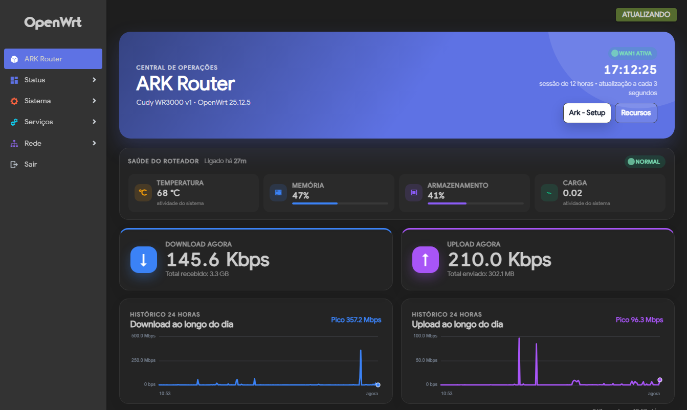
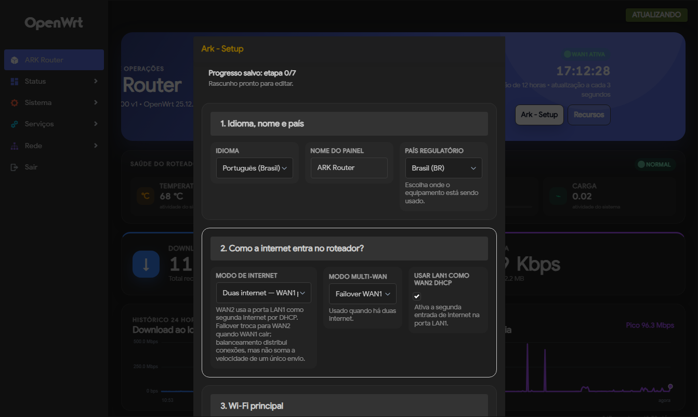
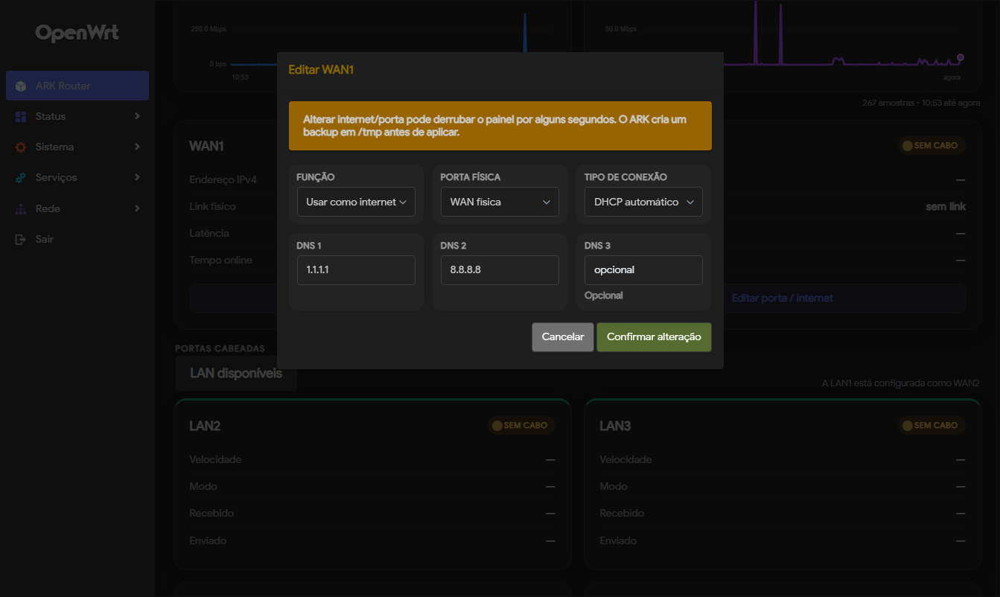
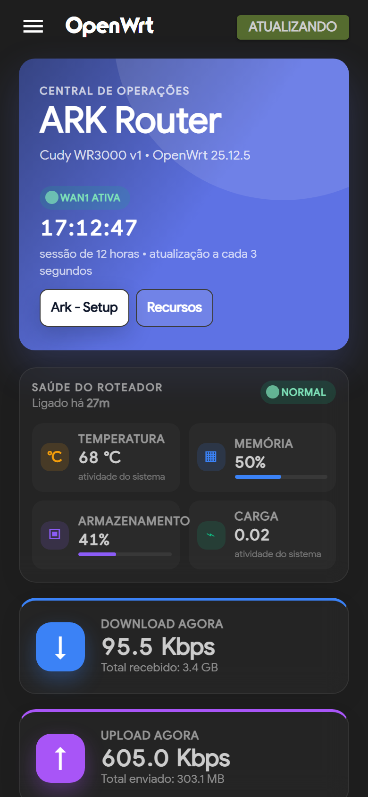
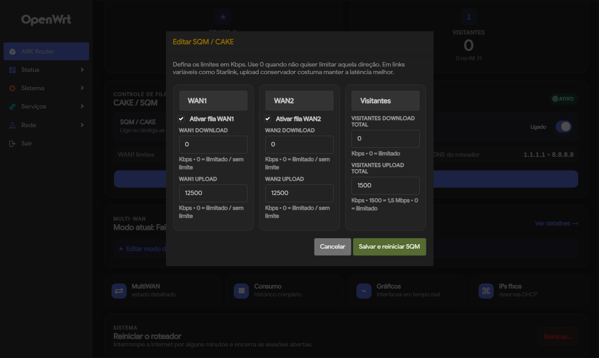
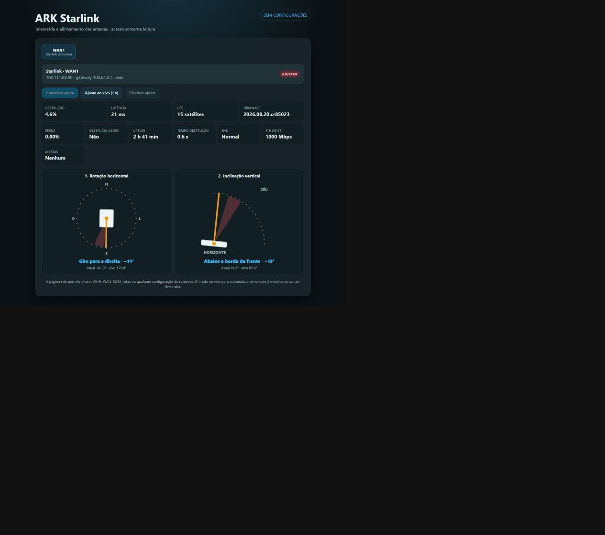

# ARK Router


ARK Router is a responsive, bilingual and modular operational dashboard for OpenWrt/LuCI. It turns the LuCI home screen into a practical control center for home, office, event, field and mobile routers with multiple WAN links, Starlink, guest Wi-Fi limits and SQM/CAKE QoS.

The project does not replace LuCI. It adds a cleaner operations home screen on top of LuCI, with safer shortcuts for common actions.

Keywords: ARK Router, OpenWrt dashboard, LuCI dashboard, OpenWrt plugin, router management, router monitoring, Multi-WAN, mwan3, failover, load balancing, SQM, CAKE QoS, upload shaping, guest Wi-Fi, bandwidth control, per-device traffic, Wi-Fi channel analyzer, Starlink router, Starlink telemetry, Starlink alignment, obstruction monitoring, ZeroTier, Speedify Router, OpenWrt UI, embedded router setup.

The current release is **0.9.36**. ARK Router is an add-on package (`luci-app-ark-router`), not a replacement firmware image or ISO.

## Why Use It

- **Operations view:** See WAN, LAN, Wi-Fi, device, traffic and router-health information on one screen.
- **Modular cards:** Keep Multi-WAN, SQM/CAKE, UPnP, per-device usage and speed calibration visible only when those modules exist.
- **Device handling:** Rename connected devices, reserve DHCP addresses by MAC and prioritize selected main-network devices.
- **Wi-Fi control:** Manage a main network and a guest network from a simpler screen. The SSID names are fully configurable; the pilot names are only examples.
- **Ark - Setup:** Guided first-configuration assistant with saved progress and final confirmation.
- **Channel planning:** Analyze Wi-Fi channels manually, apply suggested channels with confirmation or return to automatic channel selection.
- **SQM calibration:** Run per-WAN speed tests and generate SQM upload suggestions at 85%, 90% and 95%; on weak routers the panel keeps a Fast.com/manual fallback visible.
- **Multi-Starlink telemetry:** Detect compatible WANs separately, inspect obstruction/GPS/alignment for each antenna and move through them one at a time with temporary isolated routes that do not replace the router default route.
- **Optional read-only Starlink page:** The administrator can enable `/starlink/` from the Starlink card for LAN-only, no-login telemetry and alignment. It is GET-only and cannot change router settings; it remains disabled by default.
- **Starlink diagnostics:** Both panels organize packet loss, current obstruction, uptime, obstruction duration, SNR, Ethernet negotiation and hardware alerts when the dish firmware exposes them. The read-only page automatically loads the first detected Starlink and retries transient queries.
- **Small-flash friendly:** Avoid filling router flash by loading `speedtest-go` into temporary RAM when enough space exists.
- **Optional Speedify recovery:** When Speedify is used in RAM or external storage mode, ARK Router can remember the chosen mode and try to reload it automatically after reboot.
- **Bilingual UI:** Use Portuguese (Brazil) or English.
- **Theme aware:** Follow the active LuCI theme automatically, use ARK Router colors or choose custom colors.
- **Safe by design:** Installation writes only ARK Router files; network changes happen only after an administrator confirms an action. Backups, resumable setup checkpoints and rollback-oriented helpers are included.

### What is included in the ARK Router panel

The dashboard covers the operational tasks that are otherwise scattered across LuCI: WAN protocol and port-role editing (DHCP, PPPoE, static IPv4 and MAC clone), per-WAN gateway/mask/DNS/latency/link details, failover or load-balancing controls, LAN port status, main/guest Wi-Fi names/passwords, 2.4/5 GHz separation and channel width, country/channel analysis, IPv6 and WPS switches, CAKE/SQM master and per-WAN limits, guest download/upload caps, device naming/reservation/priority, live and 24-hour traffic, health (load/temperature/RAM/flash), HTTPS redirect/certificate guidance, optional modules, backups and safe restart.

The Starlink module adds dynamic detection of only Starlink-capable WANs, one card per antenna, read-only telemetry/alignment, multi-antenna sequencing, obstruction/alignment diagnostics and a LAN-only `/starlink/` viewer. ZeroTier is the integrated remote-access option; Speedify is an optional licensed bonding runtime and is never silently enabled or bundled with credentials.

## Screenshots

Real screenshots are stored in [`docs/screenshots`](docs/screenshots). The public screenshots are captured from an actual OpenWrt/LuCI router running ARK Router. Sensitive values such as passwords and MAC addresses must be hidden before publishing.

| Dashboard overview | Ark - Setup |
| --- | --- |
|  |  |

| WAN/SQM controls | Mobile layout |
| --- | --- |
|  |  |

| SQM editor | Starlink telemetry and alignment |
| --- | --- |
|  |  |

The Starlink image above is a real capture from the live Cudy/OpenWrt test environment; no generated mock image is used. GitHub will render it inline after the repository page refreshes.

## Tested Device

The current pilot has been tested on:

| Item | Value |
| --- | --- |
| Router | Cudy WR3000 v1; Acer Predator Connect W6x |
| Firmware | OpenWrt 25.12.5 r33051-f5dae5ece4 (pilot builds) |
| Target | `mediatek/filogic` on Cudy; target-specific build on Acer |
| Package manager | `apk` |
| LuCI theme used during testing | Argon and stock LuCI layout |
| Wi-Fi names used in the pilot | Custom, router-local names; not project defaults |

The Wi-Fi names above are not requirements. They document the pilot environment only. ARK Router reads and manages whichever Wi-Fi names are configured on the router. Pilot passwords, private IPs, backups and router-specific secrets are intentionally not included in this repository.

## Compatibility

Known-good baseline:

- OpenWrt 25.12.x with LuCI and `rpcd`.
- `iwinfo` is recommended for Wi-Fi association, scan and channel analysis. If it is missing, those Wi-Fi intelligence features degrade, but the package is no longer blocked from installing.
- BusyBox `ash`.
- Standard LuCI JavaScript view environment.

Expected but not yet fully certified:

- Recent OpenWrt releases with LuCI and either `apk` or `opkg`.
- Routers with enough RAM to temporarily extract `speedtest-go` into `/tmp`.

Not guaranteed:

- Old LuCI versions without the JavaScript view APIs used here.
- Very small devices with too little RAM for temporary speed-test extraction.
- Non-OpenWrt vendor firmware.

The package manager adapter supports both `apk` and `opkg` for optional package detection and installation. The temporary `speedtest-go` preparation is optimized for OpenWrt `apk` repositories because the tested firmware stores package indexes in volatile storage.

## Features

| Area | What ARK Router Adds |
| --- | --- |
| Dashboard | Responsive overview for desktop, tablet and mobile |
| Ark - Setup | Guided first setup with resumable draft, checkpoints and safety backup |
| Traffic | Real-time download/upload counters and 24-hour history |
| Health | Temperature, memory, storage and load strip |
| WAN | WAN1/WAN2 status and Multi-WAN mode controls |
| Internet setup | Dashboard WAN editors for DHCP, PPPoE, static IPv4, DNS and WAN2-to-LAN role changes |
| LAN | Wired LAN port status |
| Wi-Fi | Main and guest cards, password visibility, password editing, country selection and channel analysis |
| Devices | Friendly names, per-device traffic when available and DHCP reservation by MAC |
| QoS | Optional CAKE priority marking for selected main-network devices |
| SQM | Dynamic SQM/CAKE controls for every interface configured as an IPv4 WAN, plus guest download/upload limits; `0` means unlimited for that direction |
| HTTPS | Redirect control and local CA download guidance |
| System | Router restart button with two confirmations and a backend-enforced delay |
| Modules | Optional feature center with install/hide suggestions |

## Optional Integrations

| Feature | Package |
| --- | --- |
| SQM / CAKE | `luci-app-sqm` |
| Multi-WAN | `luci-app-mwan3` |
| Starlink telemetry | Dedicated ARK module embedded in Lite and Full; Lite loads the small architecture-specific client into `/tmp` on demand, while Full keeps it persistently in `/usr/bin` |
| Per-device usage | `nlbwmon`; `luci-app-nlbwmon` is optional if the original LuCI report page is desired |
| Guest network full rate limit | `tc-full` and `kmod-sched-act-police`; pulled by Release package installs |
| IRQ balance | `irqbalance` |
| UPnP / NAT-PMP | `luci-app-upnp` |
| Argon theme | `luci-theme-argon` |
| uHTTPd LuCI manager | `luci-app-uhttpd` |
| Link testing | `speedtest-go`, loaded into temporary memory |
| Tunnel support | `kmod-tun`, required only when Speedify/VPN tunnel interfaces are enabled |
| Real bonding | Speedify Router runtime, optional; can be loaded internally, from external storage or temporarily in RAM when supported |
| Remote access | Tailscale and ZeroTier optional overlays; ARK Router can install/configure them without exposing LuCI/SSH on the WAN |
| Lightweight remote access | ZeroTier, optional; smaller remote-access alternative for constrained routers |

Most optional packages are not hard dependencies. Cards are displayed only when the corresponding capability exists. The dashboard asks for confirmation before installing an optional package. Package installation does not automatically alter network configuration.

See [`docs/PACKAGE_PROFILES.md`](docs/PACKAGE_PROFILES.md) for the Lite and Full package profiles, including measured package sizes, service RAM notes and the tested addon version baseline.

### Tailscale remote access

Tailscale is an optional free personal remote-access overlay for Starlink, mobile links and CGNAT. ARK Router can install the package, start the service, generate the `tailscale up` login flow, show the Tailscale IP and advertise the current LAN subnet route from the dashboard.

If subnet routing is used, approve the route in the Tailscale admin panel. Keep each router LAN on a different subnet, such as `192.168.10.0/24`, `192.168.20.0/24` and `192.168.73.0/24`, to avoid route conflicts. Do not expose LuCI or SSH directly to the WAN.

### ZeroTier remote access

ZeroTier is the lightweight remote-access alternative for routers where Tailscale is too large. ARK Router can install and enable ZeroTier, join a configured Network ID, prepare firewall access from ZeroTier to LAN and show node/network/IP status.

After joining, authorize the router in ZeroTier Central. To access the LAN behind the router, configure a managed route in ZeroTier Central for the router LAN subnet through the router's ZeroTier IP.

`nlbwmon`, `tc-full`, `kmod-sched-act-police` and `irqbalance` are intentional Release package dependencies. `nlbwmon` provides per-device traffic accounting, while `tc-full` plus `kmod-sched-act-police` allow the guest/visitor network to enforce both download and upload limits. `irqbalance` helps multicore routers spread interrupt load. `kmod-tun` is not a mandatory ARK Router dependency; it is checked and installed only when Speedify/VPN tunnel features are used. In source/fallback installs, ARK Router still detects runtime capabilities and degrades gracefully if one is missing.

### Speedify

Speedify is optional and is used only when the administrator wants real WAN bonding through a Speedify Router license. ARK Router can prepare WAN metrics, start the Speedify runtime, generate the official router activation link and expose basic CLI actions, but it does not include a license and does not force traffic through Speedify automatically.

Router sign-in uses Speedify's activation-code flow. The dashboard calls `speedify_cli activationcode`, shows the generated URL and lets the administrator complete login in Speedify's own portal. ARK Router does not ask for, store or publish the Speedify account password. After activation, Speedify stores its router token locally on the router.

On small-flash routers, ARK Router can run Speedify from RAM or from external storage. RAM mode is temporary: after a reboot the executable disappears, but the ARK Router configuration remains. If **auto recovery after reboot** is enabled, `/etc/init.d/ark-speedify` waits for boot/network readiness and attempts to reload the saved Speedify mode. External storage mode starts the already extracted runtime when the mount is available; RAM mode downloads and extracts the runtime again if enough `/tmp` space exists.

Generic Speedify install actions use the same safe order as the dashboard recommendation: internal only when there is enough overlay space, then external storage, then RAM. This prevents the Lite profile from attempting the heavy official internal install on routers where it will not fit.

The live **Speedify active now** switch controls the current daemon state separately from reboot recovery. Turning it on tries to recover the saved runtime mode first, then connects when possible. Turning it off disconnects/stops Speedify without deleting the saved configuration.

If the last desired state was connected, ARK Router also tries `speedify_cli connect` after recovery. If the account is not logged in or licensed, Speedify may remain `LOGGED_OUT`; this is expected and must be resolved in Speedify itself.

For zero-touch or offline-assisted routers, the reduced Speedify runtime can reuse a preloaded package at `/tmp/ark-speedify-cache/speedify.apk`. ARK Router also verifies `/dev/net/tun`/`kmod-tun` and reinforces NAT/MTU on the Speedify firewall zone so LAN clients keep Internet access through the tunnel.

### Language packs

ARK Router does not require OpenWrt `luci-i18n-*` packages. The dashboard keeps its own English fallback and the administrator-selected runtime language. If a selected translation is incomplete or unavailable, ARK Router falls back to English.

For small-flash routers, LuCI application translations such as `luci-i18n-sqm-pt-br`, `luci-i18n-mwan3-pt-br`, `luci-i18n-nlbwmon-pt-br` and `luci-i18n-upnp-pt-br` can be treated as optional. Removing them may make the original LuCI module pages appear in English, but ARK Router remains usable in its selected language.

## First Configuration

Installing ARK Router only adds the dashboard and helper files. It does not automatically create WAN2, guest Wi-Fi limits, SQM queues, Multi-WAN policies or firewall priority rules.

Those changes require administrator action inside LuCI/ARK Router. The easiest path is the **Ark - Setup** button at the top of the dashboard.

Ark - Setup asks for the common first-run choices:

- scenario/profile;
- router and panel name;
- regulatory country;
- language;
- unified or split 2.4/5 GHz Wi-Fi names;
- main Wi-Fi SSID and password;
- optional guest Wi-Fi with download and upload caps; `0` keeps a direction unlimited;
- one WAN, WAN2 on LAN1 with failover, WAN2 on LAN1 with balancing or custom internet mode;
- SQM strategy and optional manual speed limits;
- DNS mode with separate DNS 1, DNS 2 and DNS 3 fields;
- IPv6 and WPS preferences;
- optional modules that the administrator may install separately;
- confirmed installation of selected optional modules, with progress tracking.

The assistant saves a draft in UCI and stores the last applied checkpoint. If the browser disconnects while Wi-Fi or network services reload, the administrator can reconnect and continue from the saved state. Optional modules can be installed from inside Ark - Setup, but only after confirmation. Before applying network changes, it creates a backup under `/tmp/ark-router-ezsetup-backup-*.tar.gz`.

The manual flow remains:

1. Install the dashboard.
2. Install only the optional modules you want, such as SQM, Multi-WAN or per-device usage.
3. Review the current router state in the dashboard.
4. Run speed calibration if SQM limits are needed.
5. Apply confirmed changes, such as guest upload limits, WAN mode, Wi-Fi channel suggestions or device priority.

This keeps public installations safe while still allowing a guided setup similar to the tested pilot scenario.

## Wi-Fi Names And QoS

ARK Router does not require the pilot SSID names. It can be used with the administrator's own Wi-Fi names. The main/guest split is useful when the operator wants a more open trusted network and a limited guest network, but QoS/SQM and device priority remain optional. If SQM or the custom QoS rules are not present, those controls are hidden instead of forcing a configuration.

## Safety Model

Installing ARK Router does not automatically change WAN, LAN, Wi-Fi, firewall, DHCP, SQM or Multi-WAN settings. Monitoring and dashboard views are read-only. Network changes happen only after an administrator uses a confirmed action, such as changing Wi-Fi passwords, applying channel suggestions, changing Multi-WAN mode, applying SQM speed suggestions or restarting the router.

When the LAN router IP is changed from the dashboard, ARK Router also rewrites LuCI/uHTTPd listeners to the new LAN IP instead of leaving HTTP/HTTPS on a stale fixed address. This avoids a project-specific `192.168.x.x` assumption and keeps the behavior portable across routers.

See [`docs/SECURITY.md`](docs/SECURITY.md) for the command validation model.

## Building

For this LuCI-only package, the practical local path is to use the OpenWrt SDK `apk mkpkg` tool without compiling a full firmware target. On Windows, run the script from WSL after syncing the repository to `~/ark-router-work/luci-app-ark-router`:

```sh
scripts/build-apk-wsl.sh
```

It downloads/extracts the matching OpenWrt SDK if needed and writes:

- `dist/sdk/luci-app-ark-router.apk`
- `dist/sdk/luci-app-ark-router-<version>-r1.apk`
- `dist/sdk/luci-app-ark-router-lite.apk`
- `dist/sdk/luci-app-ark-router-lite-<version>-r1.apk`
- `dist/sdk/luci-app-ark-router-full.apk`
- `dist/sdk/luci-app-ark-router-full-<version>-r1.apk`

The generated packages are `noarch` and preserve `/etc/config/equipe_dashboard`, `/etc/config/equipe_devices` and `/etc/config/qos_equipe`. The canonical `luci-app-ark-router.apk` is the Lite profile and keeps the original internal package name for updater compatibility. The Full profile is published as `luci-app-ark-router-full.apk`. Speedify remains an optional external runtime and is not bundled.

For public releases, this repository already includes a GitHub Actions workflow that builds the OpenWrt package when a version tag such as `v0.9.36` is pushed. See [`docs/PUBLISHING.md`](docs/PUBLISHING.md) for the full GitHub publishing flow.

## Installation

Install the generated package using the package manager appropriate for the OpenWrt release. After installation, clear the LuCI cache or restart `rpcd`, then open ARK Router in the LuCI menu.

When release packages are available, the simplest path is the installer script:

```sh
wget -O- https://raw.githubusercontent.com/Despensativo/ark-router/main/scripts/install.sh | sh
```

The same command can be re-run later to update an existing installation. By default the installer uses `auto` mode: it detects `apk` or `opkg`, tries the latest compatible Release package first, and falls back to source installation if the router cannot resolve package dependencies while offline.

By default, the installer auto-selects the profile. It chooses Full when RAM is at least 480000 KB and `/overlay` has at least 35000 KB free; otherwise it chooses Lite. To force Lite:

```sh
wget -O- https://raw.githubusercontent.com/Despensativo/ark-router/main/scripts/install.sh | ARK_ROUTER_PROFILE=lite sh
```

To force Full on larger routers:

```sh
wget -O- https://raw.githubusercontent.com/Despensativo/ark-router/main/scripts/install.sh | ARK_ROUTER_PROFILE=full sh
```

Lite uses `luci-app-ark-router.apk`. Full uses `luci-app-ark-router-full.apk`. The dashboard self-updater uses the same hardware check and keeps Full when Full is already installed.

If a release package has not been published yet, install or update directly from the GitHub source tree:

```sh
wget -O- https://raw.githubusercontent.com/Despensativo/ark-router/main/scripts/install.sh | ARK_ROUTER_INSTALL_MODE=source sh
```

For a friendly first-run command that tries the package first and falls back to source if the release asset is missing:

```sh
wget -O- https://raw.githubusercontent.com/Despensativo/ark-router/main/scripts/install.sh | ARK_ROUTER_INSTALL_MODE=auto sh
```

The source mode creates a temporary backup under `/tmp/ark-router-install-backup-*.tar.gz`, preserves existing ARK Router configuration files and then copies ARK Router files into the router. It restarts LuCI services, but it does not register an `apk`/`opkg` package. For public/stable installs, publishing a release package is still preferred.

ARK Router is not an `.iso` image. It is a LuCI package installed on an existing OpenWrt router. See [`docs/RELEASES.md`](docs/RELEASES.md) for the GitHub Actions release flow.

Manual install with a generated package:

```sh
apk add ./luci-app-ark-router-*.apk
/etc/init.d/rpcd restart
```

On `opkg` based releases, install the generated `.ipk` instead.

## Updating from ARK Router

After ARK Router is installed, open **ARK Router → Recursos → Atualização do ARK Router**.
The dashboard can check the latest GitHub Release and, after administrator confirmation, download and install the matching package:

- Lite APK: `luci-app-ark-router.apk`.
- Full APK: `luci-app-ark-router-full.apk`.
- OPKG equivalents when published: `luci-app-ark-router.ipk` or `luci-app-ark-router-full.ipk`.

The updater creates a temporary configuration backup in `/tmp` before installing and restarts LuCI services afterward. It does not change WAN, LAN, Wi-Fi, firewall, DHCP, SQM or Multi-WAN settings. The updater requires published GitHub Release assets with the names above. It auto-selects Lite/Full from router resources and keeps Full when Full is already installed.

## Uninstall

ARK Router includes a conservative uninstaller:

```sh
wget -O- https://raw.githubusercontent.com/Despensativo/ark-router/main/scripts/uninstall.sh | sh
```

By default it removes only ARK Router files and temporary runtime files. It does not remove optional packages that may have been installed or used with the dashboard, such as SQM, Multi-WAN, nlbwmon, UPnP, Argon, uHTTPd or `speedtest-go`.

Before removing anything, the script creates a small backup in `/tmp` with ARK Router preferences and friendly device names. Download it before rebooting the router if you want to keep a copy:

```sh
scp root@ROUTER_IP:/tmp/ark-router-config-backup-*.tar.gz .
```

Saved dashboard preferences and friendly device names are kept by default. To remove those too:

```sh
wget -O- https://raw.githubusercontent.com/Despensativo/ark-router/main/scripts/uninstall.sh | PURGE=1 sh
```

To restore a saved ARK Router preference backup:

```sh
tar -xzf /tmp/ark-router-config-backup-YYYYMMDD-HHMMSS.tar.gz -C /
/etc/init.d/rpcd restart
```

## Project Status

Version 0.9.36 is the current pilot release. It includes dedicated multi-Starlink telemetry in Lite and Full, automatic first-WAN loading/retry, Starlink-only filtering in the read-only viewer, green/red alignment bands and diagnostic cards (loss, obstruction, uptime, SNR, Ethernet and alerts), in addition to GitHub Release packaging, SSH install/update commands, dashboard self-update validation, ZeroTier remote access, optional Speedify controls, dynamic WAN/LAN port handling, Wi-Fi channel-width/country controls, safer LAN/uHTTPd binding, DHCP DNS editing, one-click lightweight-module installation, per-device traffic accounting, guest rate limiting and detailed WAN protocol/gateway/netmask/DNS/latency/traffic totals. It is suitable for early public testing; additional router models and OpenWrt releases should be tracked through GitHub issues before calling it broadly stable.

## License

This project is released under the MIT License. See [`LICENSE`](LICENSE).
