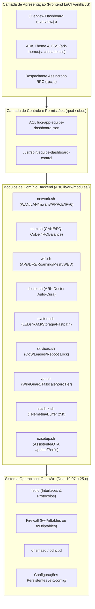

# ARK Router — Auditoria Completa, Persistência Pós-Reboot e Contratos Funcionais

> **Documento Vivo Oficial**: Atualizado obrigatoriamente a cada adição, alteração, remoção ou correção funcional.
> Versão Ativa: `1.0.2` | Repositório Canônico: `GitHub/luci-app-ark-router` | Total de Funcionalidades: `70`

---

## 1. Diagrama de Arquitetura do Sistema

---

## 2. Inventário Completo e Enumerado de Funcionalidades (70 Recursos)

### `ARK-UI-001` — Painel LuCI Overview e Telemetria em Tempo Real
- **1. Identificador**: `ARK-UI-001`
- **2. Nome**: Painel LuCI Overview e Telemetria em Tempo Real
- **3. Objetivo**: Apresentar visualização unificada de interfaces WAN/LAN, Wi-Fi, clientes conectados, métricas de tráfego e diagnósticos em Vanilla JS com atualização assíncrona ubus.
- **4. Estado Atual**: `funcional`
- **5. Arquivos Responsáveis**: `src/core/rpc.js`, `src/modules/render.js`, `src/modules/lifecycle.js`, `root/www/luci-static/resources/view/equipe-dashboard/overview.js`
- **6. Comandos e Ações**: `overview.js render()`, `rpc.js poll()`
- **7. Endpoints RPC**: `network.interface/dump`, `network.device/status`, `system/info`, `system/board`, `luci-rpc/getDHCPLeases`, `iwinfo/assoclist`
- **8. ACLs Necessárias**: `luci-app-equipe-dashboard`
- **9. Dependências e Pacotes**: `luci-mod-admin-full`, `rpcd`, `rpcd-mod-luci`
- **10. Configurações UCI**: `equipe_dashboard`
- **11. Serviços e Daemons**: `uhttpd`, `rpcd`
- **12. Dados Persistentes**: `/etc/config/equipe_dashboard`
- **13. Dados Temporários em /tmp ou Memória**: `/tmp/luci-indexcache`, `/tmp/luci-modulecache/`
- **14. Comportamento no Boot**: Carregado sob demanda via navegador na porta 80/443; polling ubus a cada 3 a 5 segundos.
- **15. Recursos que Pode Alterar**: DOM LuCI, configurações cosméticas equipe_dashboard.main
- **16. Recursos que NÃO Pode Alterar**: regras de firewall arbitrárias, arquivos fora de /etc/config/equipe_dashboard
- **17. Relações e Dependências**: `ARK-UI-002`, `ARK-UI-003`, `ARK-HIST-001`, `ARK-DIAG-001`
- **18. Limitações por Hardware**: Execução leve no cliente (<60 KB transferidos, zero runtime npm), compatível com navegadores móveis e desktop.
- **19. Limitações por Versão do OpenWrt**: Dual OpenWrt 19.07 a 25.x (LuCI client-side JavaScript view L.view.extend).
- **20. Disponibilidade nos Perfis**: `lite`, `full`
- **21. Versão de Criação/Alteração**: `1.0.2`
- **22. Testes Relacionados**: `tests/test_wan_matrix.py`, `scripts/verify_dom_progressive.mjs`
- **23. Necessidade de Validação em Hardware Real**: `Não (validável integralmente no laboratório virtual)`

### `ARK-UI-002` — Tema ARK LuCI Responsivo, Header e Visual Mobile-First
- **1. Identificador**: `ARK-UI-002`
- **2. Nome**: Tema ARK LuCI Responsivo, Header e Visual Mobile-First
- **3. Objetivo**: Prover identidade visual moderna dark/light para LuCI, touch targets mínimos de 40px, desacoplamento de modais e scroll lock no main-right.
- **4. Estado Atual**: `funcional`
- **5. Arquivos Responsáveis**: `root/www/luci-static/ark/ark-theme.js`, `root/www/luci-static/ark/cascade.css`, `root/www/luci-static/ark/mobile.css`, `root/usr/share/ucode/luci/template/themes/ark/header.ut`, `root/usr/lib/lua/luci/view/themes/ark/header.htm`
- **6. Comandos e Ações**: `ark-theme.js init()`, `theme`
- **7. Endpoints RPC**: `uci/get`, `uci/set`
- **8. ACLs Necessárias**: `luci-app-equipe-dashboard`
- **9. Dependências e Pacotes**: `luci-base`
- **10. Configurações UCI**: `luci`
- **11. Serviços e Daemons**: `uhttpd`
- **12. Dados Persistentes**: `/etc/config/luci`
- **13. Dados Temporários em /tmp ou Memória**: `/tmp/luci-indexcache`
- **14. Comportamento no Boot**: Restaurado no boot via 99-ark-router-theme e ark-firewall-guard preservando personalização do usuário.
- **15. Recursos que Pode Alterar**: luci.main.mediaurlbase, luci.themes.ARK
- **16. Recursos que NÃO Pode Alterar**: configurações de rede, firewall, switches
- **17. Relações e Dependências**: `ARK-UI-001`, `ARK-UI-003`
- **18. Limitações por Hardware**: Orçamento estrito < 60 KB CSS+JS compactado para dispositivos com 16 MB SPI Flash.
- **19. Limitações por Versão do OpenWrt**: Compatível com ucode (24.x+) e Lua (19.07 a 23.05).
- **20. Disponibilidade nos Perfis**: `lite`, `full`
- **21. Versão de Criação/Alteração**: `1.0.2`
- **22. Testes Relacionados**: `scripts/verify_theme_overview.py`, `scripts/qa_visual_matrix.py`
- **23. Necessidade de Validação em Hardware Real**: `Não (validável integralmente no laboratório virtual)`

### `ARK-UI-003` — Seletor de Temas, Modo Escuro e Cores de Destaque
- **1. Identificador**: `ARK-UI-003`
- **2. Nome**: Seletor de Temas, Modo Escuro e Cores de Destaque
- **3. Objetivo**: Permitir ao usuário alternar entre o tema nativo ARK, Argon e Bootstrap, além de personalizar paleta de cores (primária/secundária).
- **4. Estado Atual**: `funcional`
- **5. Arquivos Responsáveis**: `src/modules/system.js`, `root/usr/lib/ark/modules/ezsetup.sh`, `root/usr/lib/ark/modules/system.sh`
- **6. Comandos e Ações**: `theme`, `appearance`
- **7. Endpoints RPC**: `/usr/sbin/equipe-dashboard-control theme`, `/usr/sbin/equipe-dashboard-control appearance`
- **8. ACLs Necessárias**: `luci-app-equipe-dashboard`
- **9. Dependências e Pacotes**: `luci-base`
- **10. Configurações UCI**: `equipe_dashboard`, `luci`
- **11. Serviços e Daemons**: `uhttpd`
- **12. Dados Persistentes**: `/etc/config/equipe_dashboard`, `/etc/config/luci`
- **13. Dados Temporários em /tmp ou Memória**: `/tmp/luci-indexcache`
- **14. Comportamento no Boot**: Preserva flag theme_customized e user_theme para evitar sobreposição pelo uci-defaults.
- **15. Recursos que Pode Alterar**: equipe_dashboard.main.theme_customized, luci.main.mediaurlbase
- **16. Recursos que NÃO Pode Alterar**: qualquer arquivo fora do escopo LuCI/dashboard
- **17. Relações e Dependências**: `ARK-UI-001`, `ARK-UI-002`
- **18. Limitações por Hardware**: Nenhuma.
- **19. Limitações por Versão do OpenWrt**: Universal.
- **20. Disponibilidade nos Perfis**: `lite`, `full`
- **21. Versão de Criação/Alteração**: `1.0.2`
- **22. Testes Relacionados**: `tests/test_wan_matrix.py`
- **23. Necessidade de Validação em Hardware Real**: `Não (validável integralmente no laboratório virtual)`

### `ARK-WAN-001` — Configuração da Porta WAN Física Primária
- **1. Identificador**: `ARK-WAN-001`
- **2. Nome**: Configuração da Porta WAN Física Primária
- **3. Objetivo**: Configurar protocolo (DHCP, PPPoE ou IP Estático), gateway, máscara, DNS e clonagem de MAC na interface wan primária.
- **4. Estado Atual**: `funcional`
- **5. Arquivos Responsáveis**: `root/usr/lib/ark/modules/network.sh`, `src/modules/network.js`
- **6. Comandos e Ações**: `wan-save`
- **7. Endpoints RPC**: `/usr/sbin/equipe-dashboard-control wan-save`
- **8. ACLs Necessárias**: `luci-app-equipe-dashboard`
- **9. Dependências e Pacotes**: `netifd`
- **10. Configurações UCI**: `network`, `firewall`
- **11. Serviços e Daemons**: `network`, `firewall`
- **12. Dados Persistentes**: `/etc/config/network`, `/etc/config/firewall`
- **13. Dados Temporários em /tmp ou Memória**: `/var/run/netifd/`
- **14. Comportamento no Boot**: Inicializado pelo netifd no boot com subida automática do link.
- **15. Recursos que Pode Alterar**: network.wan, network.wan_dev, firewall.@zone[1]
- **16. Recursos que NÃO Pode Alterar**: network.lan, interfaces de gerenciamento
- **17. Relações e Dependências**: `ARK-WAN-002`, `ARK-WAN-003`, `ARK-SQM-001`
- **18. Limitações por Hardware**: Depende do switch/PHY físico (ex: eth1, wan, eth0.2).
- **19. Limitações por Versão do OpenWrt**: Compatível com todas as versões.
- **20. Disponibilidade nos Perfis**: `lite`, `full`
- **21. Versão de Criação/Alteração**: `1.0.2`
- **22. Testes Relacionados**: `tests/test_wan_matrix.py`
- **23. Necessidade de Validação em Hardware Real**: `Não (validável integralmente no laboratório virtual)`

### `ARK-WAN-002` — Gerenciamento de Perfis PPPoE e Credenciais
- **1. Identificador**: `ARK-WAN-002`
- **2. Nome**: Gerenciamento de Perfis PPPoE e Credenciais
- **3. Objetivo**: Armazenar, selecionar e aplicar credenciais PPPoE de provedores, MTU 1492/1500 e inspeção de logs de conexão em tempo real.
- **4. Estado Atual**: `funcional`
- **5. Arquivos Responsáveis**: `root/usr/lib/ark/modules/network.sh`, `src/modules/network.js`
- **6. Comandos e Ações**: `pppoe-profiles-list`, `pppoe-profile-save`, `pppoe-profile-delete`, `pppoe-log`
- **7. Endpoints RPC**: `/usr/sbin/equipe-dashboard-control pppoe-*`
- **8. ACLs Necessárias**: `luci-app-equipe-dashboard`
- **9. Dependências e Pacotes**: `ppp`, `ppp-mod-pppoe`
- **10. Configurações UCI**: `network`, `equipe_dashboard`
- **11. Serviços e Daemons**: `network`
- **12. Dados Persistentes**: `/etc/config/network`, `/etc/config/equipe_dashboard`
- **13. Dados Temporários em /tmp ou Memória**: `/var/log/messages`, `/tmp/log/`
- **14. Comportamento no Boot**: netifd invoca pppd no boot usando as credenciais persistidas.
- **15. Recursos que Pode Alterar**: network.wan.username, network.wan.password, equipe_dashboard.wan_profiles
- **16. Recursos que NÃO Pode Alterar**: configurações de firewall, senhas de sistema
- **17. Relações e Dependências**: `ARK-WAN-001`, `ARK-WAN-003`
- **18. Limitações por Hardware**: Nenhuma.
- **19. Limitações por Versão do OpenWrt**: Universal.
- **20. Disponibilidade nos Perfis**: `lite`, `full`
- **21. Versão de Criação/Alteração**: `1.0.2`
- **22. Testes Relacionados**: `tests/test_wan_matrix.py`
- **23. Necessidade de Validação em Hardware Real**: `Não (validável integralmente no laboratório virtual)`

### `ARK-WAN-003` — Otimização Baby Jumbo Frames (MTU 1508 / MRU 1500)
- **1. Identificador**: `ARK-WAN-003`
- **2. Nome**: Otimização Baby Jumbo Frames (MTU 1508 / MRU 1500)
- **3. Objetivo**: Habilitar MTU 1508 na interface física pai para permitir PPPoE sem fragmentação com MTU 1500 limpo (Baby Jumbo).
- **4. Estado Atual**: `funcional`
- **5. Arquivos Responsáveis**: `root/usr/lib/ark/modules/network.sh`, `root/usr/lib/ark/modules/doctor.sh`
- **6. Comandos e Ações**: `wan-optimize-set baby_jumbo=1`, `wan-optimize-status`
- **7. Endpoints RPC**: `/usr/sbin/equipe-dashboard-control wan-optimize-*`
- **8. ACLs Necessárias**: `luci-app-equipe-dashboard`
- **9. Dependências e Pacotes**: `ip-full`, `netifd`
- **10. Configurações UCI**: `network`
- **11. Serviços e Daemons**: `network`
- **12. Dados Persistentes**: `/etc/config/network`
- **13. Dados Temporários em /tmp ou Memória**: `/sys/class/net/*/mtu`
- **14. Comportamento no Boot**: Gravado na seção config device do network; netifd aplica MTU 1508 antes de levantar a sessão PPPoE.
- **15. Recursos que Pode Alterar**: network.@device[].mtu, network.wan.mtu
- **16. Recursos que NÃO Pode Alterar**: network.lan, interfaces sem suporte a MTU expandido
- **17. Relações e Dependências**: `ARK-WAN-001`, `ARK-WAN-002`, `ARK-DIAG-001`
- **18. Limitações por Hardware**: Exige hardware de rede com suporte a frames de 1508 bytes no driver Ethernet (MTK, Atheros Gigabit).
- **19. Limitações por Versão do OpenWrt**: Universal em OpenWrt com DSA ou swconfig moderno.
- **20. Disponibilidade nos Perfis**: `lite`, `full`
- **21. Versão de Criação/Alteração**: `1.0.2`
- **22. Testes Relacionados**: `tests/test_wan_matrix.py`
- **23. Necessidade de Validação em Hardware Real**: `Não (validável integralmente no laboratório virtual)`

### `ARK-WAN-004` — Conversão Dinâmica de Porta Auto-WAN (LAN secundária para WAN2)
- **1. Identificador**: `ARK-WAN-004`
- **2. Nome**: Conversão Dinâmica de Porta Auto-WAN (LAN secundária para WAN2)
- **3. Objetivo**: Detectar conexão de cabo e converter portas LAN secundárias (lan4/lan3) em interfaces WAN2 com proteção estrita anti-lockout (nunca converte lan1).
- **4. Estado Atual**: `funcional`
- **5. Arquivos Responsáveis**: `root/usr/lib/ark/modules/network.sh`, `root/usr/sbin/ark-autowan-daemon`, `root/etc/init.d/ark-autowan`
- **6. Comandos e Ações**: `autowan-toggle`, `autowan-policy-set`, `autowan-can-convert`, `autowan-wan-to-lan`
- **7. Endpoints RPC**: `/usr/sbin/equipe-dashboard-control autowan-*`
- **8. ACLs Necessárias**: `luci-app-equipe-dashboard`
- **9. Dependências e Pacotes**: `swconfig ou DSA`, `netifd`
- **10. Configurações UCI**: `network`
- **11. Serviços e Daemons**: `ark-autowan`, `network`
- **12. Dados Persistentes**: `/etc/config/network`, `/etc/ark-router/autowan-baseline.uci`
- **13. Dados Temporários em /tmp ou Memória**: `/var/run/ark-autowan.state`, `/var/run/ark-autowan.lock`
- **14. Comportamento no Boot**: ark-autowan inicia via procd START=95 e monitora estado físico das portas.
- **15. Recursos que Pode Alterar**: network.wan2, network.autowan, mwan3
- **16. Recursos que NÃO Pode Alterar**: porta 1 / lan1 (sagrada para administração), rede LAN base
- **17. Relações e Dependências**: `ARK-WAN-005`, `ARK-WAN-006`, `ARK-WAN-007`
- **18. Limitações por Hardware**: Requer roteador com 2 ou mais portas físicas (DSA ou swconfig).
- **19. Limitações por Versão do OpenWrt**: Compatível com 19.07 a 25.x.
- **20. Disponibilidade nos Perfis**: `full`
- **21. Versão de Criação/Alteração**: `1.0.2`
- **22. Testes Relacionados**: `tests/test_wan_matrix.py`
- **23. Necessidade de Validação em Hardware Real**: `Não (validável integralmente no laboratório virtual)`

### `ARK-WAN-005` — Motor de Políticas de Roteamento Multi-WAN (mwan3)
- **1. Identificador**: `ARK-WAN-005`
- **2. Nome**: Motor de Políticas de Roteamento Multi-WAN (mwan3)
- **3. Objetivo**: Configurar e sincronizar mwan3 para balanceamento, failover ponderado e rotas estritas baseadas em políticas.
- **4. Estado Atual**: `corrigido`
- **5. Arquivos Responsáveis**: `root/usr/lib/ark/modules/network.sh`, `root/etc/uci-defaults/99-ark-router-mwan3`, `root/usr/sbin/equipe-dashboard-control`
- **6. Comandos e Ações**: `mwan`, `mwan3-toggle`, `mwan3-ensure`
- **7. Endpoints RPC**: `/usr/sbin/equipe-dashboard-control mwan`, `/usr/sbin/equipe-dashboard-control mwan3-ensure`
- **8. ACLs Necessárias**: `luci-app-equipe-dashboard`
- **9. Dependências e Pacotes**: `mwan3`, `iptables ou nftables`, `ip-full`
- **10. Configurações UCI**: `mwan3`, `equipe_dashboard`
- **11. Serviços e Daemons**: `mwan3`
- **12. Dados Persistentes**: `/etc/config/mwan3`, `/etc/config/equipe_dashboard`
- **13. Dados Temporários em /tmp ou Memória**: `/var/run/mwan3/`, `/tmp/mwan3/`
- **14. Comportamento no Boot**: mwan3 inicia no boot START=19; 99-ark-router-mwan3 garante track_ip e políticas íntegras via mwan3-ensure.
- **15. Recursos que Pode Alterar**: mwan3.*, equipe_dashboard.mwan
- **16. Recursos que NÃO Pode Alterar**: tabelas de roteamento do sistema não relacionadas
- **17. Relações e Dependências**: `ARK-WAN-006`, `ARK-WAN-007`, `ARK-SQM-003`
- **18. Limitações por Hardware**: Nenhuma.
- **19. Limitações por Versão do OpenWrt**: Requer suporte do mwan3 para o backend de firewall ativo (iptables ou nftables).
- **20. Disponibilidade nos Perfis**: `full`
- **21. Versão de Criação/Alteração**: `1.0.2`
- **22. Testes Relacionados**: `tests/test_wan_matrix.py`
- **23. Necessidade de Validação em Hardware Real**: `Não (validável integralmente no laboratório virtual)`

### `ARK-WAN-006` — Failover Dual-WAN de Sub-Segundo e Teste de Resiliência
- **1. Identificador**: `ARK-WAN-006`
- **2. Nome**: Failover Dual-WAN de Sub-Segundo e Teste de Resiliência
- **3. Objetivo**: Prover comutação de alta velocidade entre WAN1 e WAN2 com detecção de perda de pacotes e probe UDP sub-segundo.
- **4. Estado Atual**: `funcional`
- **5. Arquivos Responsáveis**: `root/usr/sbin/ark-probe-disconnect`, `root/usr/lib/ark/modules/network.sh`
- **6. Comandos e Ações**: `mwan failover`, `rpc-disconnect-test`
- **7. Endpoints RPC**: `/usr/sbin/equipe-dashboard-control rpc-disconnect-test`
- **8. ACLs Necessárias**: `luci-app-equipe-dashboard`
- **9. Dependências e Pacotes**: `mwan3`, `curl ou nc`
- **10. Configurações UCI**: `mwan3`
- **11. Serviços e Daemons**: `mwan3`
- **12. Dados Persistentes**: `/etc/config/mwan3`
- **13. Dados Temporários em /tmp ou Memória**: `/tmp/ark_probe_*.log`
- **14. Comportamento no Boot**: Políticas de failover ativas automaticamente com track_ip.
- **15. Recursos que Pode Alterar**: mwan3.wan_then_wan2, mwan3.wan2_then_wan
- **16. Recursos que NÃO Pode Alterar**: endereços IP estáticos, regras de firewall
- **17. Relações e Dependências**: `ARK-WAN-005`, `ARK-DIAG-002`
- **18. Limitações por Hardware**: Mínimo 2 interfaces WAN ativas.
- **19. Limitações por Versão do OpenWrt**: Universal.
- **20. Disponibilidade nos Perfis**: `full`
- **21. Versão de Criação/Alteração**: `1.0.2`
- **22. Testes Relacionados**: `tests/test_wan_matrix.py`
- **23. Necessidade de Validação em Hardware Real**: `Não (validável integralmente no laboratório virtual)`

### `ARK-WAN-007` — Balanceamento de Carga Dual-WAN (Sessões e Grupos de Dispositivos)
- **1. Identificador**: `ARK-WAN-007`
- **2. Nome**: Balanceamento de Carga Dual-WAN (Sessões e Grupos de Dispositivos)
- **3. Objetivo**: Distribuir tráfego entre múltiplos uplinks com ponderação por peso e isolamento de pools de dispositivos.
- **4. Estado Atual**: `funcional`
- **5. Arquivos Responsáveis**: `root/usr/lib/ark/modules/network.sh`
- **6. Comandos e Ações**: `mwan balanced`, `mwan balanced_devices`
- **7. Endpoints RPC**: `/usr/sbin/equipe-dashboard-control mwan`
- **8. ACLs Necessárias**: `luci-app-equipe-dashboard`
- **9. Dependências e Pacotes**: `mwan3`
- **10. Configurações UCI**: `mwan3`
- **11. Serviços e Daemons**: `mwan3`
- **12. Dados Persistentes**: `/etc/config/mwan3`, `/etc/config/equipe_dashboard`
- **13. Dados Temporários em /tmp ou Memória**: `/var/run/mwan3/`
- **14. Comportamento no Boot**: Políticas equilibradas carregadas no início do mwan3.
- **15. Recursos que Pode Alterar**: mwan3.balanced, mwan3.dev_pool1, mwan3.dev_pool2
- **16. Recursos que NÃO Pode Alterar**: tabela LAN principal
- **17. Relações e Dependências**: `ARK-WAN-005`, `ARK-SQM-003`
- **18. Limitações por Hardware**: 2+ uplinks.
- **19. Limitações por Versão do OpenWrt**: Universal.
- **20. Disponibilidade nos Perfis**: `full`
- **21. Versão de Criação/Alteração**: `1.0.2`
- **22. Testes Relacionados**: `tests/test_wan_matrix.py`
- **23. Necessidade de Validação em Hardware Real**: `Não (validável integralmente no laboratório virtual)`

### `ARK-WAN-008` — Acesso Isolado à Interface Web de ONUs/Modems em Bridge
- **1. Identificador**: `ARK-WAN-008`
- **2. Nome**: Acesso Isolado à Interface Web de ONUs/Modems em Bridge
- **3. Objetivo**: Criar interface e rota com masquerade para permitir acesso direto ao IP de gerência da ONU/Modem (ex: 192.168.1.1 ou 192.168.100.1) mesmo com PPPoE ativo.
- **4. Estado Atual**: `funcional`
- **5. Arquivos Responsáveis**: `root/usr/lib/ark/modules/network.sh`
- **6. Comandos e Ações**: `wan-save modem_ip=...`
- **7. Endpoints RPC**: `/usr/sbin/equipe-dashboard-control wan-save`
- **8. ACLs Necessárias**: `luci-app-equipe-dashboard`
- **9. Dependências e Pacotes**: `netifd`, `firewall`
- **10. Configurações UCI**: `network`, `firewall`
- **11. Serviços e Daemons**: `network`, `firewall`
- **12. Dados Persistentes**: `/etc/config/network`, `/etc/config/firewall`
- **13. Dados Temporários em /tmp ou Memória**: Nenhum
- **14. Comportamento no Boot**: Interface estática secundária sobe junto com a porta física.
- **15. Recursos que Pode Alterar**: network.${iface}_modem, firewall zone wan
- **16. Recursos que NÃO Pode Alterar**: rede LAN
- **17. Relações e Dependências**: `ARK-WAN-001`, `ARK-STAR-001`
- **18. Limitações por Hardware**: Nenhuma.
- **19. Limitações por Versão do OpenWrt**: Universal.
- **20. Disponibilidade nos Perfis**: `lite`, `full`
- **21. Versão de Criação/Alteração**: `1.0.2`
- **22. Testes Relacionados**: `tests/test_wan_matrix.py`
- **23. Necessidade de Validação em Hardware Real**: `Não (validável integralmente no laboratório virtual)`

### `ARK-WAN-009` — TCP Turbo — Otimização de Buffers e BBR/Cubic do Kernel
- **1. Identificador**: `ARK-WAN-009`
- **2. Nome**: TCP Turbo — Otimização de Buffers e BBR/Cubic do Kernel
- **3. Objetivo**: Ajustar tamanhos de janelas TCP rmem/wmem, qdisc fq e tcp_congestion_control para atingir vazão máxima em enlaces de alta velocidade e fibra gigabit.
- **4. Estado Atual**: `funcional`
- **5. Arquivos Responsáveis**: `root/usr/lib/ark/modules/network.sh`
- **6. Comandos e Ações**: `wan-optimize-set tcp_turbo=1`, `wan-optimize-set tcp_turbo=0`
- **7. Endpoints RPC**: `/usr/sbin/equipe-dashboard-control wan-optimize-set`
- **8. ACLs Necessárias**: `luci-app-equipe-dashboard`
- **9. Dependências e Pacotes**: `sysctl`
- **10. Configurações UCI**: `equipe_dashboard`
- **11. Serviços e Daemons**: Nenhum
- **12. Dados Persistentes**: `/etc/sysctl.d/99-ark-tcp-turbo.conf`, `/etc/config/equipe_dashboard`
- **13. Dados Temporários em /tmp ou Memória**: `/proc/sys/net/ipv4/tcp_*`, `/proc/sys/net/core/*`
- **14. Comportamento no Boot**: Arquivo /etc/sysctl.d/99-ark-tcp-turbo.conf é aplicado pelo procd no boot.
- **15. Recursos que Pode Alterar**: /etc/sysctl.d/99-ark-tcp-turbo.conf, parâmetros sysctl net.core e net.ipv4
- **16. Recursos que NÃO Pode Alterar**: arquivos binários do sistema
- **17. Relações e Dependências**: `ARK-WAN-001`, `ARK-SQM-001`
- **18. Limitações por Hardware**: Em roteadores com 128 MB RAM, usa valores conservadores para evitar OOM.
- **19. Limitações por Versão do OpenWrt**: Universal em kernels Linux 4.19 a 6.x.
- **20. Disponibilidade nos Perfis**: `lite`, `full`
- **21. Versão de Criação/Alteração**: `1.0.2`
- **22. Testes Relacionados**: `tests/test_wan_matrix.py`
- **23. Necessidade de Validação em Hardware Real**: `Não (validável integralmente no laboratório virtual)`

### `ARK-WAN-010` — Monitor de Latência e Alvos de Ping Dinâmicos
- **1. Identificador**: `ARK-WAN-010`
- **2. Nome**: Monitor de Latência e Alvos de Ping Dinâmicos
- **3. Objetivo**: Monitorar latência de conectividade com alvos selecionáveis (Registro.br, Cloudflare, Google ou IP customizado).
- **4. Estado Atual**: `funcional`
- **5. Arquivos Responsáveis**: `root/usr/lib/ark/modules/network.sh`, `src/core/rpc.js`
- **6. Comandos e Ações**: `ping-target-get`, `ping-target-set`
- **7. Endpoints RPC**: `/usr/sbin/equipe-dashboard-control ping-target-*`, `/bin/ping`
- **8. ACLs Necessárias**: `luci-app-equipe-dashboard`
- **9. Dependências e Pacotes**: `iputils-ping ou busybox ping`
- **10. Configurações UCI**: `equipe_dashboard`
- **11. Serviços e Daemons**: Nenhum
- **12. Dados Persistentes**: `/etc/config/equipe_dashboard`
- **13. Dados Temporários em /tmp ou Memória**: Nenhum
- **14. Comportamento no Boot**: Carregado sob demanda pelo dashboard LuCI.
- **15. Recursos que Pode Alterar**: equipe_dashboard.main.ping_target, equipe_dashboard.main.ping_custom_ip
- **16. Recursos que NÃO Pode Alterar**: interfaces de rede
- **17. Relações e Dependências**: `ARK-UI-001`, `ARK-WAN-006`
- **18. Limitações por Hardware**: Nenhuma.
- **19. Limitações por Versão do OpenWrt**: Universal.
- **20. Disponibilidade nos Perfis**: `lite`, `full`
- **21. Versão de Criação/Alteração**: `1.0.2`
- **22. Testes Relacionados**: `tests/test_wan_matrix.py`
- **23. Necessidade de Validação em Hardware Real**: `Não (validável integralmente no laboratório virtual)`

### `ARK-LAN-001` — Configuração da Sub-rede LAN e Servidor DHCP Central
- **1. Identificador**: `ARK-LAN-001`
- **2. Nome**: Configuração da Sub-rede LAN e Servidor DHCP Central
- **3. Objetivo**: Definir endereço IP do roteador (ex: 192.168.1.1 ou 192.168.73.1), máscara, faixa de distribuição DHCP e tempo de lease.
- **4. Estado Atual**: `funcional`
- **5. Arquivos Responsáveis**: `root/usr/lib/ark/modules/network.sh`
- **6. Comandos e Ações**: `lan-status`, `lan-save`
- **7. Endpoints RPC**: `/usr/sbin/equipe-dashboard-control lan-*`
- **8. ACLs Necessárias**: `luci-app-equipe-dashboard`
- **9. Dependências e Pacotes**: `dnsmasq ou odhcpd`, `netifd`
- **10. Configurações UCI**: `network`, `dhcp`
- **11. Serviços e Daemons**: `network`, `dnsmasq`
- **12. Dados Persistentes**: `/etc/config/network`, `/etc/config/dhcp`
- **13. Dados Temporários em /tmp ou Memória**: `/tmp/dhcp.leases`
- **14. Comportamento no Boot**: Inicializado no boot com força de entrega DHCP ativa (dhcp.lan.force=1).
- **15. Recursos que Pode Alterar**: network.lan.ipaddr, network.lan.netmask, dhcp.lan
- **16. Recursos que NÃO Pode Alterar**: interfaces WAN
- **17. Relações e Dependências**: `ARK-LAN-003`, `ARK-LAN-004`
- **18. Limitações por Hardware**: Nenhuma.
- **19. Limitações por Versão do OpenWrt**: Universal.
- **20. Disponibilidade nos Perfis**: `lite`, `full`
- **21. Versão de Criação/Alteração**: `1.0.2`
- **22. Testes Relacionados**: `tests/test_wan_matrix.py`
- **23. Necessidade de Validação em Hardware Real**: `Não (validável integralmente no laboratório virtual)`

### `ARK-LAN-002` — Bridges LAN, VLANs e Isolamento DSA/Switch
- **1. Identificador**: `ARK-LAN-002`
- **2. Nome**: Bridges LAN, VLANs e Isolamento DSA/Switch
- **3. Objetivo**: Gerenciar bridge br-lan unindo portas físicas e rádios Wi-Fi, suportando particionamento de VLANs em swconfig e DSA.
- **4. Estado Atual**: `funcional`
- **5. Arquivos Responsáveis**: `root/usr/lib/ark/modules/network.sh`
- **6. Comandos e Ações**: `autowan_can_convert`, `add_lan_port`, `remove_lan_port`
- **7. Endpoints RPC**: `/usr/sbin/equipe-dashboard-control lan-*`
- **8. ACLs Necessárias**: `luci-app-equipe-dashboard`
- **9. Dependências e Pacotes**: `netifd`, `bridge ou iproute2`
- **10. Configurações UCI**: `network`
- **11. Serviços e Daemons**: `network`
- **12. Dados Persistentes**: `/etc/config/network`
- **13. Dados Temporários em /tmp ou Memória**: `/sys/class/net/br-lan/`
- **14. Comportamento no Boot**: Bridge br-lan criada pelo netifd no arranque inicial.
- **15. Recursos que Pode Alterar**: network.@device[0].ports, network.switch_vlan
- **16. Recursos que NÃO Pode Alterar**: portas WAN ativas
- **17. Relações e Dependências**: `ARK-LAN-001`, `ARK-WAN-004`
- **18. Limitações por Hardware**: Diferenciação automática entre DSA moderno (kernel 5.10+) e swconfig legado.
- **19. Limitações por Versão do OpenWrt**: Universal.
- **20. Disponibilidade nos Perfis**: `lite`, `full`
- **21. Versão de Criação/Alteração**: `1.0.2`
- **22. Testes Relacionados**: `tests/test_wan_matrix.py`
- **23. Necessidade de Validação em Hardware Real**: `Não (validável integralmente no laboratório virtual)`

### `ARK-LAN-003` — Sanitização de Nomes de Host DHCP (RFC 1123 Hostname Enforcer)
- **1. Identificador**: `ARK-LAN-003`
- **2. Nome**: Sanitização de Nomes de Host DHCP (RFC 1123 Hostname Enforcer)
- **3. Objetivo**: Sanitizar nomes de dispositivos na tabela DHCP para prevenir falhas de inicialização do dnsmasq e garantir conformidade RFC 1123.
- **4. Estado Atual**: `funcional`
- **5. Arquivos Responsáveis**: `root/etc/uci-defaults/99-ark-router-dhcp-sanitize`
- **6. Comandos e Ações**: `99-ark-router-dhcp-sanitize execution`
- **7. Endpoints RPC**: Nenhum
- **8. ACLs Necessárias**: `luci-app-equipe-dashboard`
- **9. Dependências e Pacotes**: `dnsmasq`
- **10. Configurações UCI**: `dhcp`
- **11. Serviços e Daemons**: `dnsmasq`
- **12. Dados Persistentes**: `/etc/config/dhcp`
- **13. Dados Temporários em /tmp ou Memória**: Nenhum
- **14. Comportamento no Boot**: Executado no boot/instalação para limpar caracteres ilegais e otimizar cachesize para 5000 (<=128MB) ou 10000 (>128MB).
- **15. Recursos que Pode Alterar**: dhcp.@host[].name, dhcp.@dnsmasq[0].cachesize, dhcp.lan.force
- **16. Recursos que NÃO Pode Alterar**: endereços IP e MACs dos clientes
- **17. Relações e Dependências**: `ARK-LAN-001`, `ARK-DIAG-001`
- **18. Limitações por Hardware**: Cachesize auto-escalado pela memória RAM disponível.
- **19. Limitações por Versão do OpenWrt**: Universal.
- **20. Disponibilidade nos Perfis**: `lite`, `full`
- **21. Versão de Criação/Alteração**: `1.0.2`
- **22. Testes Relacionados**: `tests/test_wan_matrix.py`
- **23. Necessidade de Validação em Hardware Real**: `Não (validável integralmente no laboratório virtual)`

### `ARK-LAN-004` — Reserva de IPs Secundários e Leases Estáticos
- **1. Identificador**: `ARK-LAN-004`
- **2. Nome**: Reserva de IPs Secundários e Leases Estáticos
- **3. Objetivo**: Fixar IPs por endereço MAC na tabela DHCP e alocar endereços secundários para equipamentos especiais.
- **4. Estado Atual**: `funcional`
- **5. Arquivos Responsáveis**: `root/usr/lib/ark/modules/devices.sh`, `src/modules/devices.js`
- **6. Comandos e Ações**: `device-reserve-secondary`, `device-save`
- **7. Endpoints RPC**: `/usr/sbin/equipe-dashboard-control device-reserve-secondary`
- **8. ACLs Necessárias**: `luci-app-equipe-dashboard`
- **9. Dependências e Pacotes**: `dnsmasq`
- **10. Configurações UCI**: `dhcp`
- **11. Serviços e Daemons**: `dnsmasq`
- **12. Dados Persistentes**: `/etc/config/dhcp`
- **13. Dados Temporários em /tmp ou Memória**: `/tmp/dhcp.leases`
- **14. Comportamento no Boot**: dnsmasq lê reservas estáticas persistidas.
- **15. Recursos que Pode Alterar**: dhcp.@host[]
- **16. Recursos que NÃO Pode Alterar**: rede WAN
- **17. Relações e Dependências**: `ARK-LAN-001`, `ARK-SYS-001`
- **18. Limitações por Hardware**: Nenhuma.
- **19. Limitações por Versão do OpenWrt**: Universal.
- **20. Disponibilidade nos Perfis**: `lite`, `full`
- **21. Versão de Criação/Alteração**: `1.0.2`
- **22. Testes Relacionados**: `tests/test_wan_matrix.py`
- **23. Necessidade de Validação em Hardware Real**: `Não (validável integralmente no laboratório virtual)`

### `ARK-LAN-005` — Limpeza e Coleta de Lixo de Leases Estagnados (Flush Stale Leases)
- **1. Identificador**: `ARK-LAN-005`
- **2. Nome**: Limpeza e Coleta de Lixo de Leases Estagnados (Flush Stale Leases)
- **3. Objetivo**: Eliminar leases ARP/DHCP órfãos de dispositivos desconectados para recuperar memória e consistência da listagem de clientes.
- **4. Estado Atual**: `funcional`
- **5. Arquivos Responsáveis**: `root/usr/lib/ark/modules/devices.sh`
- **6. Comandos e Ações**: `flush-stale-leases`
- **7. Endpoints RPC**: `/usr/sbin/equipe-dashboard-control flush-stale-leases`
- **8. ACLs Necessárias**: `luci-app-equipe-dashboard`
- **9. Dependências e Pacotes**: `dnsmasq`
- **10. Configurações UCI**: Nenhuma
- **11. Serviços e Daemons**: `dnsmasq`
- **12. Dados Persistentes**: Nenhum
- **13. Dados Temporários em /tmp ou Memória**: `/tmp/dhcp.leases`, `/proc/net/arp`
- **14. Comportamento no Boot**: Executado sob demanda ou na inicialização limpa.
- **15. Recursos que Pode Alterar**: /tmp/dhcp.leases
- **16. Recursos que NÃO Pode Alterar**: /etc/config/dhcp
- **17. Relações e Dependências**: `ARK-LAN-001`, `ARK-SYS-001`
- **18. Limitações por Hardware**: Nenhuma.
- **19. Limitações por Versão do OpenWrt**: Universal.
- **20. Disponibilidade nos Perfis**: `lite`, `full`
- **21. Versão de Criação/Alteração**: `1.0.2`
- **22. Testes Relacionados**: `tests/test_wan_matrix.py`
- **23. Necessidade de Validação em Hardware Real**: `Não (validável integralmente no laboratório virtual)`

### `ARK-IPV6-001` — IPv6 Nativo Dual-Stack e Delegação de Prefixo
- **1. Identificador**: `ARK-IPV6-001`
- **2. Nome**: IPv6 Nativo Dual-Stack e Delegação de Prefixo
- **3. Objetivo**: Prover conectividade IPv6 nativa via DHCPv6-PD / SLAAC com anúncio de roteador (RA) para clientes LAN.
- **4. Estado Atual**: `funcional`
- **5. Arquivos Responsáveis**: `root/usr/lib/ark/modules/network.sh`
- **6. Comandos e Ações**: `ipv6-status`, `ipv6-mode-set`, `sync-ipv6-firewall`
- **7. Endpoints RPC**: `/usr/sbin/equipe-dashboard-control ipv6-*`
- **8. ACLs Necessárias**: `luci-app-equipe-dashboard`
- **9. Dependências e Pacotes**: `odhcpd`, `odhcp6c`
- **10. Configurações UCI**: `network`, `dhcp`
- **11. Serviços e Daemons**: `network`, `odhcpd`
- **12. Dados Persistentes**: `/etc/config/network`, `/etc/config/dhcp`
- **13. Dados Temporários em /tmp ou Memória**: `/var/run/odhcpd/`
- **14. Comportamento no Boot**: odhcp6c solicita prefixo no boot se a WAN possuir IPv6 habilitado.
- **15. Recursos que Pode Alterar**: network.wan.ipv6, network.wan6, dhcp.lan.ra, dhcp.lan.dhcpv6
- **16. Recursos que NÃO Pode Alterar**: regras IPv4
- **17. Relações e Dependências**: `ARK-WAN-001`, `ARK-FW-001`
- **18. Limitações por Hardware**: Depende de suporte do provedor de acesso.
- **19. Limitações por Versão do OpenWrt**: Universal.
- **20. Disponibilidade nos Perfis**: `lite`, `full`
- **21. Versão de Criação/Alteração**: `1.0.2`
- **22. Testes Relacionados**: `tests/test_wan_matrix.py`
- **23. Necessidade de Validação em Hardware Real**: `Não (validável integralmente no laboratório virtual)`

### `ARK-IPV6-002` — Modo IPv6 Relay / Híbrido
- **1. Identificador**: `ARK-IPV6-002`
- **2. Nome**: Modo IPv6 Relay / Híbrido
- **3. Objetivo**: Repassar tráfego IPv6 por relay (NDP proxying) quando o provedor upstream não fornece delegação de prefixo /64 ou /56.
- **4. Estado Atual**: `funcional`
- **5. Arquivos Responsáveis**: `root/usr/lib/ark/modules/network.sh`
- **6. Comandos e Ações**: `ipv6-relay-toggle`
- **7. Endpoints RPC**: `/usr/sbin/equipe-dashboard-control ipv6-relay-toggle`
- **8. ACLs Necessárias**: `luci-app-equipe-dashboard`
- **9. Dependências e Pacotes**: `odhcpd`
- **10. Configurações UCI**: `dhcp`
- **11. Serviços e Daemons**: `odhcpd`
- **12. Dados Persistentes**: `/etc/config/dhcp`
- **13. Dados Temporários em /tmp ou Memória**: Nenhum
- **14. Comportamento no Boot**: odhcpd atua como proxy NDP entre WAN e LAN.
- **15. Recursos que Pode Alterar**: dhcp.lan.ra, dhcp.lan.dhcpv6, dhcp.lan.ndp
- **16. Recursos que NÃO Pode Alterar**: IPv4 DHCP
- **17. Relações e Dependências**: `ARK-IPV6-001`
- **18. Limitações por Hardware**: Nenhuma.
- **19. Limitações por Versão do OpenWrt**: Universal.
- **20. Disponibilidade nos Perfis**: `lite`, `full`
- **21. Versão de Criação/Alteração**: `1.0.2`
- **22. Testes Relacionados**: `tests/test_wan_matrix.py`
- **23. Necessidade de Validação em Hardware Real**: `Não (validável integralmente no laboratório virtual)`

### `ARK-IPV6-003` — Desativação Completa do IPv6 (Modo IPv4 Estrito)
- **1. Identificador**: `ARK-IPV6-003`
- **2. Nome**: Desativação Completa do IPv6 (Modo IPv4 Estrito)
- **3. Objetivo**: Desativar completamente pilhas, daemons e anúncios IPv6 no kernel e interfaces para conexões com CGNAT problemático ou provedores instáveis.
- **4. Estado Atual**: `funcional`
- **5. Arquivos Responsáveis**: `root/usr/lib/ark/modules/network.sh`
- **6. Comandos e Ações**: `ipv6-disable-full`
- **7. Endpoints RPC**: `/usr/sbin/equipe-dashboard-control ipv6-disable-full`
- **8. ACLs Necessárias**: `luci-app-equipe-dashboard`
- **9. Dependências e Pacotes**: `netifd`
- **10. Configurações UCI**: `network`, `dhcp`
- **11. Serviços e Daemons**: `network`, `odhcpd`
- **12. Dados Persistentes**: `/etc/config/network`, `/etc/config/dhcp`
- **13. Dados Temporários em /tmp ou Memória**: `/proc/sys/net/ipv6/conf/*/disable_ipv6`
- **14. Comportamento no Boot**: IPv6 desativado persistido no UCI e kernel.
- **15. Recursos que Pode Alterar**: network.wan6, network.lan.ipv6, dhcp.lan.ra
- **16. Recursos que NÃO Pode Alterar**: roteamento IPv4
- **17. Relações e Dependências**: `ARK-IPV6-001`
- **18. Limitações por Hardware**: Nenhuma.
- **19. Limitações por Versão do OpenWrt**: Universal.
- **20. Disponibilidade nos Perfis**: `lite`, `full`
- **21. Versão de Criação/Alteração**: `1.0.2`
- **22. Testes Relacionados**: `tests/test_wan_matrix.py`
- **23. Necessidade de Validação em Hardware Real**: `Não (validável integralmente no laboratório virtual)`

### `ARK-FW-001` — Abstração Dual do Firewall (fw3/iptables vs fw4/nftables)
- **1. Identificador**: `ARK-FW-001`
- **2. Nome**: Abstração Dual do Firewall (fw3/iptables vs fw4/nftables)
- **3. Objetivo**: Detectar automaticamente o mecanismo de firewall ativo no sistema operacional e aplicar regras com sintaxe nativa sem scripts quebrados.
- **4. Estado Atual**: `funcional`
- **5. Arquivos Responsáveis**: `root/usr/lib/ark/modules/network.sh`, `root/usr/lib/ark/common.sh`, `root/etc/init.d/ark-firewall-guard`
- **6. Comandos e Ações**: `firewall reload`, `sync-ipv6-firewall`
- **7. Endpoints RPC**: `/usr/sbin/equipe-dashboard-control sync-ipv6-firewall`
- **8. ACLs Necessárias**: `luci-app-equipe-dashboard`
- **9. Dependências e Pacotes**: `firewall3 ou firewall4`, `iptables ou nftables`
- **10. Configurações UCI**: `firewall`
- **11. Serviços e Daemons**: `firewall`, `ark-firewall-guard`
- **12. Dados Persistentes**: `/etc/config/firewall`
- **13. Dados Temporários em /tmp ou Memória**: `/etc/nftables.d/`, `/var/run/fw4.state`
- **14. Comportamento no Boot**: Inicializado no boot START=19; ark-firewall-guard valida integridade da tabela no START=22.
- **15. Recursos que Pode Alterar**: firewall.*
- **16. Recursos que NÃO Pode Alterar**: regras de roteamento fora do escopo de firewall
- **17. Relações e Dependências**: `ARK-FW-002`, `ARK-FW-006`, `ARK-WAN-001`
- **18. Limitações por Hardware**: Nenhuma.
- **19. Limitações por Versão do OpenWrt**: fw3 no OpenWrt 19.07 a 21.02 / 22.03; fw4 no 23.05 a 25.x.
- **20. Disponibilidade nos Perfis**: `lite`, `full`
- **21. Versão de Criação/Alteração**: `1.0.2`
- **22. Testes Relacionados**: `tests/test_wan_matrix.py`
- **23. Necessidade de Validação em Hardware Real**: `Não (validável integralmente no laboratório virtual)`

### `ARK-FW-002` — Bloqueio e Controle Parental de Dispositivos por MAC
- **1. Identificador**: `ARK-FW-002`
- **2. Nome**: Bloqueio e Controle Parental de Dispositivos por MAC
- **3. Objetivo**: Bloquear tráfego WAN para dispositivos específicos com base no MAC sem interromper a conectividade interna da LAN.
- **4. Estado Atual**: `funcional`
- **5. Arquivos Responsáveis**: `root/usr/lib/ark/modules/devices.sh`, `src/modules/devices.js`
- **6. Comandos e Ações**: `device-save blocked=1`, `device-save blocked=0`
- **7. Endpoints RPC**: `/usr/sbin/equipe-dashboard-control device-save`
- **8. ACLs Necessárias**: `luci-app-equipe-dashboard`
- **9. Dependências e Pacotes**: `firewall`
- **10. Configurações UCI**: `firewall`
- **11. Serviços e Daemons**: `firewall`
- **12. Dados Persistentes**: `/etc/config/firewall`
- **13. Dados Temporários em /tmp ou Memória**: Nenhum
- **14. Comportamento no Boot**: Regras de bloqueio são carregadas pelo firewall no boot.
- **15. Recursos que Pode Alterar**: firewall.@rule[name^='ark_block_']
- **16. Recursos que NÃO Pode Alterar**: regras de encaminhamento gerais da LAN
- **17. Relações e Dependências**: `ARK-FW-001`, `ARK-LAN-004`
- **18. Limitações por Hardware**: Nenhuma.
- **19. Limitações por Versão do OpenWrt**: Universal.
- **20. Disponibilidade nos Perfis**: `lite`, `full`
- **21. Versão de Criação/Alteração**: `1.0.2`
- **22. Testes Relacionados**: `tests/test_wan_matrix.py`
- **23. Necessidade de Validação em Hardware Real**: `Não (validável integralmente no laboratório virtual)`

### `ARK-FW-003` — Redirecionamento de Host DMZ (Demilitarized Zone)
- **1. Identificador**: `ARK-FW-003`
- **2. Nome**: Redirecionamento de Host DMZ (Demilitarized Zone)
- **3. Objetivo**: Encaminhar todas as portas de entrada não mapeadas da WAN para um host local específico com validação de IP seguro.
- **4. Estado Atual**: `funcional`
- **5. Arquivos Responsáveis**: `root/usr/lib/ark/modules/system.sh`, `src/modules/system.js`
- **6. Comandos e Ações**: `dmz-status`, `dmz-set`
- **7. Endpoints RPC**: `/usr/sbin/equipe-dashboard-control dmz-*`
- **8. ACLs Necessárias**: `luci-app-equipe-dashboard`
- **9. Dependências e Pacotes**: `firewall`
- **10. Configurações UCI**: `firewall`
- **11. Serviços e Daemons**: `firewall`
- **12. Dados Persistentes**: `/etc/config/firewall`
- **13. Dados Temporários em /tmp ou Memória**: Nenhum
- **14. Comportamento no Boot**: Regra de redirect carregada no boot com firewall reload.
- **15. Recursos que Pode Alterar**: firewall.dmz
- **16. Recursos que NÃO Pode Alterar**: regras de acesso administrativo à porta 80/443 do roteador
- **17. Relações e Dependências**: `ARK-FW-001`, `ARK-FW-004`
- **18. Limitações por Hardware**: Nenhuma.
- **19. Limitações por Versão do OpenWrt**: Universal.
- **20. Disponibilidade nos Perfis**: `full`
- **21. Versão de Criação/Alteração**: `1.0.2`
- **22. Testes Relacionados**: `tests/test_wan_matrix.py`
- **23. Necessidade de Validação em Hardware Real**: `Não (validável integralmente no laboratório virtual)`

### `ARK-FW-004` — Redirecionamento HTTPS (Porta 443) e Guarda de Acesso Web
- **1. Identificador**: `ARK-FW-004`
- **2. Nome**: Redirecionamento HTTPS (Porta 443) e Guarda de Acesso Web
- **3. Objetivo**: Controlar redirecionamento automático de HTTP para HTTPS na interface LuCI garantindo que portas críticas não fiquem expostas sem TLS.
- **4. Estado Atual**: `funcional`
- **5. Arquivos Responsáveis**: `root/usr/lib/ark/modules/system.sh`, `root/etc/uci-defaults/99-ark-router-uhttpd`
- **6. Comandos e Ações**: `https-redirect`
- **7. Endpoints RPC**: `/usr/sbin/equipe-dashboard-control https-redirect`
- **8. ACLs Necessárias**: `luci-app-equipe-dashboard`
- **9. Dependências e Pacotes**: `uhttpd`, `uhttpd-mod-ubus`
- **10. Configurações UCI**: `uhttpd`
- **11. Serviços e Daemons**: `uhttpd`
- **12. Dados Persistentes**: `/etc/config/uhttpd`
- **13. Dados Temporários em /tmp ou Memória**: Nenhum
- **14. Comportamento no Boot**: uhttpd sobe no boot ouvindo em 80 e 443.
- **15. Recursos que Pode Alterar**: uhttpd.main.redirect_https
- **16. Recursos que NÃO Pode Alterar**: portas SSH ou outros serviços
- **17. Relações e Dependências**: `ARK-UI-001`, `ARK-SYS-007`
- **18. Limitações por Hardware**: Nenhuma.
- **19. Limitações por Versão do OpenWrt**: Universal.
- **20. Disponibilidade nos Perfis**: `lite`, `full`
- **21. Versão de Criação/Alteração**: `1.0.2`
- **22. Testes Relacionados**: `tests/test_wan_matrix.py`
- **23. Necessidade de Validação em Hardware Real**: `Não (validável integralmente no laboratório virtual)`

### `ARK-FW-005` — Serviço UPnP / NAT-PMP IGD com Proteção Anti-Crash STUN
- **1. Identificador**: `ARK-FW-005`
- **2. Nome**: Serviço UPnP / NAT-PMP IGD com Proteção Anti-Crash STUN
- **3. Objetivo**: Prover abertura automática de portas para consoles e jogos via miniupnpd, forçando use_stun=0 para eliminar crashes no boot.
- **4. Estado Atual**: `funcional`
- **5. Arquivos Responsáveis**: `root/etc/uci-defaults/99-ark-router-upnp`
- **6. Comandos e Ações**: `99-ark-router-upnp execution`
- **7. Endpoints RPC**: Nenhum
- **8. ACLs Necessárias**: `luci-app-equipe-dashboard`
- **9. Dependências e Pacotes**: `miniupnpd`
- **10. Configurações UCI**: `upnpd`
- **11. Serviços e Daemons**: `miniupnpd`
- **12. Dados Persistentes**: `/etc/config/upnpd`
- **13. Dados Temporários em /tmp ou Memória**: `/var/run/miniupnpd.leases`
- **14. Comportamento no Boot**: miniupnpd inicia sem STUN, prevenindo falha de subida com provedores CGNAT.
- **15. Recursos que Pode Alterar**: upnpd.config.use_stun, upnpd.config.enabled
- **16. Recursos que NÃO Pode Alterar**: regras fixas de firewall
- **17. Relações e Dependências**: `ARK-FW-001`
- **18. Limitações por Hardware**: Nenhuma.
- **19. Limitações por Versão do OpenWrt**: Universal.
- **20. Disponibilidade nos Perfis**: `lite`, `full`
- **21. Versão de Criação/Alteração**: `1.0.2`
- **22. Testes Relacionados**: `tests/test_wan_matrix.py`
- **23. Necessidade de Validação em Hardware Real**: `Não (validável integralmente no laboratório virtual)`

### `ARK-FW-006` — Daemon de Auto-Recuperação e Guarda do Firewall (ark-firewall-guard)
- **1. Identificador**: `ARK-FW-006`
- **2. Nome**: Daemon de Auto-Recuperação e Guarda do Firewall (ark-firewall-guard)
- **3. Objetivo**: Verificar no arranque do sistema se a tabela inet fw4 carregou corretamente. Em caso de quebra, isola arquivos conflitantes em /etc/nftables.d/quarantine e reinicia o serviço.
- **4. Estado Atual**: `funcional`
- **5. Arquivos Responsáveis**: `root/etc/init.d/ark-firewall-guard`
- **6. Comandos e Ações**: `ark-firewall-guard boot()`
- **7. Endpoints RPC**: Nenhum
- **8. ACLs Necessárias**: Nenhuma
- **9. Dependências e Pacotes**: `firewall4 ou firewall3`
- **10. Configurações UCI**: `luci`, `equipe_dashboard`
- **11. Serviços e Daemons**: `ark-firewall-guard`, `firewall`, `dnsmasq`, `adguardhome`
- **12. Dados Persistentes**: `/etc/nftables.d/quarantine/`
- **13. Dados Temporários em /tmp ou Memória**: Nenhum
- **14. Comportamento no Boot**: Executado no START=22 logo após a subida do netifd e firewall.
- **15. Recursos que Pode Alterar**: /etc/nftables.d/*.nft, luci.main.mediaurlbase
- **16. Recursos que NÃO Pode Alterar**: arquivos de kernel
- **17. Relações e Dependências**: `ARK-FW-001`, `ARK-UI-002`
- **18. Limitações por Hardware**: Nenhuma.
- **19. Limitações por Versão do OpenWrt**: Universal.
- **20. Disponibilidade nos Perfis**: `lite`, `full`
- **21. Versão de Criação/Alteração**: `1.0.2`
- **22. Testes Relacionados**: `tests/test_wan_matrix.py`
- **23. Necessidade de Validação em Hardware Real**: `Não (validável integralmente no laboratório virtual)`

### `ARK-SQM-001` — Motor de Controle de Bufferbloat Smart Queue Management (CAKE)
- **1. Identificador**: `ARK-SQM-001`
- **2. Nome**: Motor de Controle de Bufferbloat Smart Queue Management (CAKE)
- **3. Objetivo**: Eliminar latência sob carga (bufferbloat) usando algoritmo CAKE ou FQ-CoDel com cálculo de overhead de enquadramento (overhead=28).
- **4. Estado Atual**: `funcional`
- **5. Arquivos Responsáveis**: `root/usr/lib/ark/modules/sqm.sh`, `src/modules/network.js`
- **6. Comandos e Ações**: `sqm-toggle`, `sqm-save`, `sqm-save-v2`, `sqm-apply-upload-only`
- **7. Endpoints RPC**: `/usr/sbin/equipe-dashboard-control sqm-*`
- **8. ACLs Necessárias**: `luci-app-equipe-dashboard`
- **9. Dependências e Pacotes**: `sqm-scripts`, `kmod-sched-cake`, `tc-full`
- **10. Configurações UCI**: `sqm`
- **11. Serviços e Daemons**: `sqm`
- **12. Dados Persistentes**: `/etc/config/sqm`
- **13. Dados Temporários em /tmp ou Memória**: `/var/run/sqm/`
- **14. Comportamento no Boot**: Serviço sqm inicializa filas CAKE na WAN logo após a interface obter IP.
- **15. Recursos que Pode Alterar**: sqm.wan1, sqm.wan2
- **16. Recursos que NÃO Pode Alterar**: firewall, dns
- **17. Relações e Dependências**: `ARK-SQM-002`, `ARK-SQM-003`, `ARK-HW-001`
- **18. Limitações por Hardware**: Em roteadores single-core legados, limita velocidade a ~150-200 Mbps; em quad-core Filogic atinge 1 Gbps+.
- **19. Limitações por Versão do OpenWrt**: Universal.
- **20. Disponibilidade nos Perfis**: `lite`, `full`
- **21. Versão de Criação/Alteração**: `1.0.2`
- **22. Testes Relacionados**: `tests/test_wan_matrix.py`
- **23. Necessidade de Validação em Hardware Real**: `Não (validável integralmente no laboratório virtual)`

### `ARK-SQM-002` — Auto-Cura e Resolução Dinâmica de Interface SQM (l3_device healing)
- **1. Identificador**: `ARK-SQM-002`
- **2. Nome**: Auto-Cura e Resolução Dinâmica de Interface SQM (l3_device healing)
- **3. Objetivo**: Detectar automaticamente se a interface real da fila é dispositivo físico (eth1) ou virtual (pppoe-wan/pppoe-wan2) e curar seções inconsistentes.
- **4. Estado Atual**: `funcional`
- **5. Arquivos Responsáveis**: `root/usr/lib/ark/modules/sqm.sh`, `root/usr/lib/ark/modules/doctor.sh`
- **6. Comandos e Ações**: `wan-optimize-set sqm_up=... sqm_down=...`, `system-hardware-sqm-audit`
- **7. Endpoints RPC**: `/usr/sbin/equipe-dashboard-control wan-optimize-set`
- **8. ACLs Necessárias**: `luci-app-equipe-dashboard`
- **9. Dependências e Pacotes**: `sqm-scripts`
- **10. Configurações UCI**: `sqm`
- **11. Serviços e Daemons**: `sqm`
- **12. Dados Persistentes**: `/etc/config/sqm`
- **13. Dados Temporários em /tmp ou Memória**: Nenhum
- **14. Comportamento no Boot**: Executado durante sincronização de link e pelo ark-doctor.
- **15. Recursos que Pode Alterar**: sqm.@queue[].interface
- **16. Recursos que NÃO Pode Alterar**: regras de QoS de outros pacotes
- **17. Relações e Dependências**: `ARK-SQM-001`, `ARK-DIAG-001`
- **18. Limitações por Hardware**: Nenhuma.
- **19. Limitações por Versão do OpenWrt**: Universal.
- **20. Disponibilidade nos Perfis**: `lite`, `full`
- **21. Versão de Criação/Alteração**: `1.0.2`
- **22. Testes Relacionados**: `tests/test_wan_matrix.py`
- **23. Necessidade de Validação em Hardware Real**: `Não (validável integralmente no laboratório virtual)`

### `ARK-SQM-003` — Sincronização Dinâmica de SQM com Múltiplas WANs (Dual-WAN SQM)
- **1. Identificador**: `ARK-SQM-003`
- **2. Nome**: Sincronização Dinâmica de SQM com Múltiplas WANs (Dual-WAN SQM)
- **3. Objetivo**: Gerenciar instâncias separadas de SQM para WAN1 e WAN2 simultaneamente, alinhando taxas de upload/download independentes para cada uplink.
- **4. Estado Atual**: `funcional`
- **5. Arquivos Responsáveis**: `root/usr/lib/ark/modules/sqm.sh`, `root/usr/lib/ark/modules/network.sh`
- **6. Comandos e Ações**: `sqm-save-v2`
- **7. Endpoints RPC**: `/usr/sbin/equipe-dashboard-control sqm-save-v2`
- **8. ACLs Necessárias**: `luci-app-equipe-dashboard`
- **9. Dependências e Pacotes**: `sqm-scripts`, `mwan3`
- **10. Configurações UCI**: `sqm`
- **11. Serviços e Daemons**: `sqm`
- **12. Dados Persistentes**: `/etc/config/sqm`
- **13. Dados Temporários em /tmp ou Memória**: Nenhum
- **14. Comportamento no Boot**: Inicia instâncias independentes por interface WAN.
- **15. Recursos que Pode Alterar**: sqm.wan1, sqm.wan2
- **16. Recursos que NÃO Pode Alterar**: mwan3.interfaces
- **17. Relações e Dependências**: `ARK-SQM-001`, `ARK-WAN-005`
- **18. Limitações por Hardware**: Consumo proporcional de CPU por interface ativa com CAKE.
- **19. Limitações por Versão do OpenWrt**: Universal.
- **20. Disponibilidade nos Perfis**: `full`
- **21. Versão de Criação/Alteração**: `1.0.2`
- **22. Testes Relacionados**: `tests/test_wan_matrix.py`
- **23. Necessidade de Validação em Hardware Real**: `Não (validável integralmente no laboratório virtual)`

### `ARK-SQM-004` — Afinidade de Núcleos de CPU IRQ Balance para SQM/CAKE
- **1. Identificador**: `ARK-SQM-004`
- **2. Nome**: Afinidade de Núcleos de CPU IRQ Balance para SQM/CAKE
- **3. Objetivo**: Distribuir interrupções de hardware (IRQs) entre múltiplos núcleos de CPU para evitar gargalos de processamento do CAKE em um único core.
- **4. Estado Atual**: `funcional`
- **5. Arquivos Responsáveis**: `root/usr/lib/ark/modules/sqm.sh`
- **6. Comandos e Ações**: `irqbalance-toggle`
- **7. Endpoints RPC**: `/usr/sbin/equipe-dashboard-control irqbalance-toggle`
- **8. ACLs Necessárias**: `luci-app-equipe-dashboard`
- **9. Dependências e Pacotes**: `irqbalance`
- **10. Configurações UCI**: `equipe_dashboard`
- **11. Serviços e Daemons**: `irqbalance`
- **12. Dados Persistentes**: `/etc/config/equipe_dashboard`
- **13. Dados Temporários em /tmp ou Memória**: `/proc/interrupts`
- **14. Comportamento no Boot**: irqbalance inicia no boot caso habilitado e CPU seja multi-core.
- **15. Recursos que Pode Alterar**: /proc/irq/*/smp_affinity
- **16. Recursos que NÃO Pode Alterar**: prioridades de processos do kernel
- **17. Relações e Dependências**: `ARK-SQM-001`, `ARK-HW-001`
- **18. Limitações por Hardware**: Efetivo apenas em CPUs multi-core (MediaTek MT7981/MT7986, Filogic 820/830/880, Cudy WR3000, Predator W6x).
- **19. Limitações por Versão do OpenWrt**: Universal.
- **20. Disponibilidade nos Perfis**: `full`
- **21. Versão de Criação/Alteração**: `1.0.2`
- **22. Testes Relacionados**: `tests/test_wan_matrix.py`
- **23. Necessidade de Validação em Hardware Real**: `Não (validável integralmente no laboratório virtual)`

### `ARK-QOS-001` — Limites de Banda por Dispositivo e QoS da Rede de Convidados
- **1. Identificador**: `ARK-QOS-001`
- **2. Nome**: Limites de Banda por Dispositivo e QoS da Rede de Convidados
- **3. Objetivo**: Aplicar limites rígidos de download e upload por endereço IP/MAC e limitar tráfego de convidados.
- **4. Estado Atual**: `funcional`
- **5. Arquivos Responsáveis**: `root/usr/lib/ark/modules/devices.sh`, `src/modules/devices.js`
- **6. Comandos e Ações**: `device-limits-list`, `device-limits-apply`
- **7. Endpoints RPC**: `/usr/sbin/equipe-dashboard-control device-limits-*`
- **8. ACLs Necessárias**: `luci-app-equipe-dashboard`
- **9. Dependências e Pacotes**: `tc-full ou iptables/nftables`, `kmod-sched-core`
- **10. Configurações UCI**: `qos_equipe`
- **11. Serviços e Daemons**: Nenhum
- **12. Dados Persistentes**: `/etc/config/qos_equipe`
- **13. Dados Temporários em /tmp ou Memória**: Nenhum
- **14. Comportamento no Boot**: Carregado sob demanda ou via script de boot.
- **15. Recursos que Pode Alterar**: qos_equipe.*
- **16. Recursos que NÃO Pode Alterar**: sqm principal da WAN
- **17. Relações e Dependências**: `ARK-LAN-004`, `ARK-SQM-001`
- **18. Limitações por Hardware**: Nenhuma.
- **19. Limitações por Versão do OpenWrt**: Universal.
- **20. Disponibilidade nos Perfis**: `full`
- **21. Versão de Criação/Alteração**: `1.0.2`
- **22. Testes Relacionados**: `tests/test_wan_matrix.py`
- **23. Necessidade de Validação em Hardware Real**: `Não (validável integralmente no laboratório virtual)`

### `ARK-WIFI-001` — Configuração Dual/Tri-Band de APs Wi-Fi e Ativação no Boot
- **1. Identificador**: `ARK-WIFI-001`
- **2. Nome**: Configuração Dual/Tri-Band de APs Wi-Fi e Ativação no Boot
- **3. Objetivo**: Configurar SSID, senha WPA2/WPA3, modo e garantir ativação de todos os rádios físicos out-of-the-box (disabled=0) com país BR.
- **4. Estado Atual**: `funcional`
- **5. Arquivos Responsáveis**: `root/usr/lib/ark/modules/wifi.sh`, `root/etc/uci-defaults/99-ark-router-wifi`, `src/modules/wifi.js`
- **6. Comandos e Ações**: `wifi`, `wifi-toggle`, `wifi-settings`, `wifi-add`, `wifi-delete`, `country`
- **7. Endpoints RPC**: `/usr/sbin/equipe-dashboard-control wifi*`
- **8. ACLs Necessárias**: `luci-app-equipe-dashboard`
- **9. Dependências e Pacotes**: `hostapd`, `wireless-tools ou iw`
- **10. Configurações UCI**: `wireless`
- **11. Serviços e Daemons**: `network`, `wpad`
- **12. Dados Persistentes**: `/etc/config/wireless`
- **13. Dados Temporários em /tmp ou Memória**: `/var/run/hostapd/`
- **14. Comportamento no Boot**: 99-ark-router-wifi garante todos os rádios ligados (disabled=0) e país BR no primeiro boot.
- **15. Recursos que Pode Alterar**: wireless.@wifi-device[].disabled, wireless.@wifi-iface[].ssid, wireless.@wifi-iface[].key
- **16. Recursos que NÃO Pode Alterar**: partição ART / EEPROM de calibração RF
- **17. Relações e Dependências**: `ARK-WIFI-002`, `ARK-WIFI-006`
- **18. Limitações por Hardware**: Exige hardware Wi-Fi físico (ou driver mac80211_hwsim no laboratório virtual).
- **19. Limitações por Versão do OpenWrt**: Universal.
- **20. Disponibilidade nos Perfis**: `lite`, `full`
- **21. Versão de Criação/Alteração**: `1.0.2`
- **22. Testes Relacionados**: `tests/test_wan_matrix.py`
- **23. Necessidade de Validação em Hardware Real**: `Sim`

### `ARK-WIFI-002` — Seleção Inteligente de Canal, DFS e Salvaguarda UNII-3 (160/320 MHz)
- **1. Identificador**: `ARK-WIFI-002`
- **2. Nome**: Seleção Inteligente de Canal, DFS e Salvaguarda UNII-3 (160/320 MHz)
- **3. Objetivo**: Selecionar canais limpos evitando DFS falso em 5 GHz e prevenir travamentos do hostapd forçando 80 MHz em canais UNII-3 altos (>=132).
- **4. Estado Atual**: `funcional`
- **5. Arquivos Responsáveis**: `root/usr/lib/ark/modules/wifi.sh`, `root/etc/uci-defaults/99-ark-router-wifi`
- **6. Comandos e Ações**: `channels`, `wifi-width`, `wifi-dfs-optimize`
- **7. Endpoints RPC**: `/usr/sbin/equipe-dashboard-control channels`, `/usr/sbin/equipe-dashboard-control wifi-width`
- **8. ACLs Necessárias**: `luci-app-equipe-dashboard`
- **9. Dependências e Pacotes**: `iw`, `iwinfo`
- **10. Configurações UCI**: `wireless`
- **11. Serviços e Daemons**: `network`
- **12. Dados Persistentes**: `/etc/config/wireless`
- **13. Dados Temporários em /tmp ou Memória**: Nenhum
- **14. Comportamento no Boot**: Salvaguarda aplicada no boot para reverter VHT160/HE160 para 80 MHz se canal >= 132.
- **15. Recursos que Pode Alterar**: wireless.@wifi-device[].channel, wireless.@wifi-device[].htmode
- **16. Recursos que NÃO Pode Alterar**: limites de potência regulatória da região
- **17. Relações e Dependências**: `ARK-WIFI-001`
- **18. Limitações por Hardware**: Bandas 5 GHz e 6 GHz.
- **19. Limitações por Versão do OpenWrt**: Universal.
- **20. Disponibilidade nos Perfis**: `lite`, `full`
- **21. Versão de Criação/Alteração**: `1.0.2`
- **22. Testes Relacionados**: `tests/test_wan_matrix.py`
- **23. Necessidade de Validação em Hardware Real**: `Sim`

### `ARK-WIFI-003` — Otimização de Estabilidade 2.4 GHz para IoT e Casa Inteligente
- **1. Identificador**: `ARK-WIFI-003`
- **2. Nome**: Otimização de Estabilidade 2.4 GHz para IoT e Casa Inteligente
- **3. Objetivo**: Ajustar DTIM=2 e desativar disassoc_low_ack para eliminar desconexões frequentes de lâmpadas inteligentes, Alexas e sensores ESP32.
- **4. Estado Atual**: `funcional`
- **5. Arquivos Responsáveis**: `root/usr/lib/ark/modules/wifi.sh`, `root/etc/uci-defaults/99-ark-router-wifi`
- **6. Comandos e Ações**: `wifi-iot-optimize`
- **7. Endpoints RPC**: `/usr/sbin/equipe-dashboard-control wifi-iot-optimize`
- **8. ACLs Necessárias**: `luci-app-equipe-dashboard`
- **9. Dependências e Pacotes**: `hostapd`
- **10. Configurações UCI**: `wireless`
- **11. Serviços e Daemons**: `network`
- **12. Dados Persistentes**: `/etc/config/wireless`
- **13. Dados Temporários em /tmp ou Memória**: Nenhum
- **14. Comportamento no Boot**: Configurado como padrão pelo uci-defaults no rádio de 2.4 GHz.
- **15. Recursos que Pode Alterar**: wireless.@wifi-iface[].disassoc_low_ack, wireless.@wifi-iface[].dtim_period
- **16. Recursos que NÃO Pode Alterar**: interfaces de 5 GHz
- **17. Relações e Dependências**: `ARK-WIFI-001`
- **18. Limitações por Hardware**: Rádio 2.4 GHz.
- **19. Limitações por Versão do OpenWrt**: Universal.
- **20. Disponibilidade nos Perfis**: `lite`, `full`
- **21. Versão de Criação/Alteração**: `1.0.2`
- **22. Testes Relacionados**: `tests/test_wan_matrix.py`
- **23. Necessidade de Validação em Hardware Real**: `Sim`

### `ARK-WIFI-004` — Roaming Rápido Transparente 802.11r / 802.11k / 802.11v
- **1. Identificador**: `ARK-WIFI-004`
- **2. Nome**: Roaming Rápido Transparente 802.11r / 802.11k / 802.11v
- **3. Objetivo**: Habilitar Fast BSS Transition (802.11r), Radio Resource Measurement (802.11k) e Wireless Network Management (802.11v) para transição imperceptível de clientes entre APs.
- **4. Estado Atual**: `funcional`
- **5. Arquivos Responsáveis**: `root/usr/lib/ark/modules/wifi.sh`
- **6. Comandos e Ações**: `wifi-roaming-status`, `wifi-roaming-toggle`
- **7. Endpoints RPC**: `/usr/sbin/equipe-dashboard-control wifi-roaming-*`
- **8. ACLs Necessárias**: `luci-app-equipe-dashboard`
- **9. Dependências e Pacotes**: `wpad ou hostapd completo (não wpad-basic)`
- **10. Configurações UCI**: `wireless`
- **11. Serviços e Daemons**: `network`
- **12. Dados Persistentes**: `/etc/config/wireless`
- **13. Dados Temporários em /tmp ou Memória**: Nenhum
- **14. Comportamento no Boot**: Chaves R0KH/R1KH e flags ieee80211r/k/v lidas pelo hostapd no boot.
- **15. Recursos que Pode Alterar**: wireless.@wifi-iface[].ieee80211r, wireless.@wifi-iface[].ieee80211k, wireless.@wifi-iface[].ieee80211v
- **16. Recursos que NÃO Pode Alterar**: senhas do rádio
- **17. Relações e Dependências**: `ARK-WIFI-001`, `ARK-WIFI-005`
- **18. Limitações por Hardware**: Exige pacote wpad com suporte a 802.11r.
- **19. Limitações por Versão do OpenWrt**: Universal.
- **20. Disponibilidade nos Perfis**: `full`
- **21. Versão de Criação/Alteração**: `1.0.2`
- **22. Testes Relacionados**: `tests/test_wan_matrix.py`
- **23. Necessidade de Validação em Hardware Real**: `Sim`

### `ARK-WIFI-005` — Direcionamento de Banda e de Clientes (Band Steering usteer)
- **1. Identificador**: `ARK-WIFI-005`
- **2. Nome**: Direcionamento de Banda e de Clientes (Band Steering usteer)
- **3. Objetivo**: Migrar clientes 5 GHz com sinal forte para frequências mais rápidas e descarregar dispositivos lentos da banda de 2.4 GHz via daemon usteer.
- **4. Estado Atual**: `funcional`
- **5. Arquivos Responsáveis**: `root/usr/lib/ark/modules/wifi.sh`
- **6. Comandos e Ações**: `wifi-usteer-toggle`, `wifi-txbalance-toggle`
- **7. Endpoints RPC**: `/usr/sbin/equipe-dashboard-control wifi-usteer-toggle`
- **8. ACLs Necessárias**: `luci-app-equipe-dashboard`
- **9. Dependências e Pacotes**: `usteer`
- **10. Configurações UCI**: `usteer`
- **11. Serviços e Daemons**: `usteer`
- **12. Dados Persistentes**: `/etc/config/usteer`
- **13. Dados Temporários em /tmp ou Memória**: `/var/run/usteer/`
- **14. Comportamento no Boot**: usteer inicializado via procd se habilitado.
- **15. Recursos que Pode Alterar**: usteer.*
- **16. Recursos que NÃO Pode Alterar**: configurações de rede cabeada
- **17. Relações e Dependências**: `ARK-WIFI-001`, `ARK-WIFI-004`
- **18. Limitações por Hardware**: Necessita de múltiplos rádios (2.4G + 5G/6G).
- **19. Limitações por Versão do OpenWrt**: Universal.
- **20. Disponibilidade nos Perfis**: `full`
- **21. Versão de Criação/Alteração**: `1.0.2`
- **22. Testes Relacionados**: `tests/test_wan_matrix.py`
- **23. Necessidade de Validação em Hardware Real**: `Sim`

### `ARK-WIFI-006` — Gestão de Recursos Wi-Fi 6, 6E e Wi-Fi 7 (802.11ax / 802.11be / MLO)
- **1. Identificador**: `ARK-WIFI-006`
- **2. Nome**: Gestão de Recursos Wi-Fi 6, 6E e Wi-Fi 7 (802.11ax / 802.11be / MLO)
- **3. Objetivo**: Configurar modos HE/EHT, canal 320 MHz, Target Wake Time (TWT) e Multi-Link Operation (MLO) em hardwares modernos com chipsets MediaTek Filogic e Qualcomm.
- **4. Estado Atual**: `simulado`
- **5. Arquivos Responsáveis**: `root/usr/lib/ark/modules/wifi.sh`
- **6. Comandos e Ações**: `wifi-wifi6-status`, `wifi-wifi6-toggle`
- **7. Endpoints RPC**: `/usr/sbin/equipe-dashboard-control wifi-wifi6-*`
- **8. ACLs Necessárias**: `luci-app-equipe-dashboard`
- **9. Dependências e Pacotes**: `hostapd moderno com suporte EHT/HE`, `iw`
- **10. Configurações UCI**: `wireless`
- **11. Serviços e Daemons**: `network`
- **12. Dados Persistentes**: `/etc/config/wireless`
- **13. Dados Temporários em /tmp ou Memória**: Nenhum
- **14. Comportamento no Boot**: htmode EHT320/HE160 validado e aplicado pelo hostapd.
- **15. Recursos que Pode Alterar**: wireless.@wifi-device[].htmode, wireless.@wifi-device[].he_su_beamformer
- **16. Recursos que NÃO Pode Alterar**: calibração de potência de fábrica
- **17. Relações e Dependências**: `ARK-WIFI-001`, `ARK-WIFI-002`
- **18. Limitações por Hardware**: Disponível exclusivamente em SoCs com rádio Wi-Fi 6/7 físico (ex: Predator W6x, Cudy WR3000, Filogic 880). No laboratório virtual é mantido em estado simulado.
- **19. Limitações por Versão do OpenWrt**: OpenWrt 23.05+ (Wi-Fi 6) e 24.x/25.x (Wi-Fi 7 EHT).
- **20. Disponibilidade nos Perfis**: `full`
- **21. Versão de Criação/Alteração**: `1.0.2`
- **22. Testes Relacionados**: `tests/test_wan_matrix.py`
- **23. Necessidade de Validação em Hardware Real**: `Sim`

### `ARK-WIFI-007` — Controlador EasyMesh 802.11s e Descoberta de Satélites
- **1. Identificador**: `ARK-WIFI-007`
- **2. Nome**: Controlador EasyMesh 802.11s e Descoberta de Satélites
- **3. Objetivo**: Criar rede mesh sem fio criptografada entre múltiplos roteadores ARK para expansão de cobertura transparente.
- **4. Estado Atual**: `funcional`
- **5. Arquivos Responsáveis**: `root/usr/lib/ark/modules/wifi.sh`
- **6. Comandos e Ações**: `wifi-mesh-set`, `wifi-mesh-satellite-discover`, `wifi-mesh-satellite-apply`, `wifi-mesh-satellite-revert`
- **7. Endpoints RPC**: `/usr/sbin/equipe-dashboard-control wifi-mesh-*`
- **8. ACLs Necessárias**: `luci-app-equipe-dashboard`
- **9. Dependências e Pacotes**: `wpad-mesh-openssl ou wpad`, `kmod-mac80211`
- **10. Configurações UCI**: `wireless`
- **11. Serviços e Daemons**: `network`
- **12. Dados Persistentes**: `/etc/config/wireless`
- **13. Dados Temporários em /tmp ou Memória**: Nenhum
- **14. Comportamento no Boot**: Interface mesh 802.11s entra em forward junto com br-lan.
- **15. Recursos que Pode Alterar**: wireless.@wifi-iface[mode='mesh']
- **16. Recursos que NÃO Pode Alterar**: rede WAN
- **17. Relações e Dependências**: `ARK-WIFI-001`, `ARK-WIFI-004`
- **18. Limitações por Hardware**: Requer suporte do driver mac80211 a modo mesh.
- **19. Limitações por Versão do OpenWrt**: Universal.
- **20. Disponibilidade nos Perfis**: `full`
- **21. Versão de Criação/Alteração**: `1.0.2`
- **22. Testes Relacionados**: `tests/test_wan_matrix.py`
- **23. Necessidade de Validação em Hardware Real**: `Sim`

### `ARK-WIFI-008` — Controle de Emparelhamento WPS (PBC e PIN)
- **1. Identificador**: `ARK-WIFI-008`
- **2. Nome**: Controle de Emparelhamento WPS (PBC e PIN)
- **3. Objetivo**: Habilitar botão virtual WPS Push-Button Configuration com desligamento automático programado para segurança.
- **4. Estado Atual**: `funcional`
- **5. Arquivos Responsáveis**: `root/usr/lib/ark/modules/wifi.sh`
- **6. Comandos e Ações**: `wifi-wps-status`, `wifi-wps-toggle`, `wifi-wps-pbc`
- **7. Endpoints RPC**: `/usr/sbin/equipe-dashboard-control wifi-wps-*`
- **8. ACLs Necessárias**: `luci-app-equipe-dashboard`
- **9. Dependências e Pacotes**: `hostapd_cli`
- **10. Configurações UCI**: `wireless`
- **11. Serviços e Daemons**: Nenhum
- **12. Dados Persistentes**: `/etc/config/wireless`
- **13. Dados Temporários em /tmp ou Memória**: Nenhum
- **14. Comportamento no Boot**: WPS mantido desativado por padrão no boot para proteção contra ataques PIN.
- **15. Recursos que Pode Alterar**: wireless.@wifi-iface[].wps_pushbutton
- **16. Recursos que NÃO Pode Alterar**: senhas WPA do AP
- **17. Relações e Dependências**: `ARK-WIFI-001`
- **18. Limitações por Hardware**: Nenhuma.
- **19. Limitações por Versão do OpenWrt**: Universal.
- **20. Disponibilidade nos Perfis**: `lite`, `full`
- **21. Versão de Criação/Alteração**: `1.0.2`
- **22. Testes Relacionados**: `tests/test_wan_matrix.py`
- **23. Necessidade de Validação em Hardware Real**: `Sim`

### `ARK-WIFI-009` — Aceleração Wireless Ethernet Dispatch (WED)
- **1. Identificador**: `ARK-WIFI-009`
- **2. Nome**: Aceleração Wireless Ethernet Dispatch (WED)
- **3. Objetivo**: Ativar offloading direto de pacotes entre o subsistema Wi-Fi e a Ethernet por hardware sem passar pela CPU em chips MediaTek Filogic.
- **4. Estado Atual**: `simulado`
- **5. Arquivos Responsáveis**: `root/usr/lib/ark/modules/wifi.sh`
- **6. Comandos e Ações**: `wifi-wed-toggle`
- **7. Endpoints RPC**: `/usr/sbin/equipe-dashboard-control wifi-wed-toggle`
- **8. ACLs Necessárias**: `luci-app-equipe-dashboard`
- **9. Dependências e Pacotes**: `kmod-mt76-core com suporte WED`
- **10. Configurações UCI**: `wireless`
- **11. Serviços e Daemons**: `network`
- **12. Dados Persistentes**: `/etc/config/wireless`
- **13. Dados Temporários em /tmp ou Memória**: `/sys/kernel/debug/mt76/*`
- **14. Comportamento no Boot**: Driver mt76 ativa WED durante a inicialização do rádio.
- **15. Recursos que Pode Alterar**: wireless.@wifi-device[].wed
- **16. Recursos que NÃO Pode Alterar**: outras interfaces não-MediaTek
- **17. Relações e Dependências**: `ARK-WIFI-001`, `ARK-HW-001`
- **18. Limitações por Hardware**: Exclusivo para chipsets MediaTek MT7981/MT7986/MT7988. No VirtualBox é simulado via flag UCI.
- **19. Limitações por Versão do OpenWrt**: OpenWrt 23.05+.
- **20. Disponibilidade nos Perfis**: `full`
- **21. Versão de Criação/Alteração**: `1.0.2`
- **22. Testes Relacionados**: `tests/test_wan_matrix.py`
- **23. Necessidade de Validação em Hardware Real**: `Sim`

### `ARK-HW-001` — Controle de Flow Offloading por Hardware (PPE / Fastpath)
- **1. Identificador**: `ARK-HW-001`
- **2. Nome**: Controle de Flow Offloading por Hardware (PPE / Fastpath)
- **3. Objetivo**: Gerenciar aceleração de fluxo por hardware/software com salvaguarda automática contra conflitos de SQM e Multi-WAN.
- **4. Estado Atual**: `funcional`
- **5. Arquivos Responsáveis**: `root/usr/lib/ark/modules/system.sh`, `root/usr/lib/ark/modules/doctor.sh`
- **6. Comandos e Ações**: `system-perf-status`, `system-perf-save`, `system-hardware-auto-tune`
- **7. Endpoints RPC**: `/usr/sbin/equipe-dashboard-control system-perf-*`, `/usr/sbin/equipe-dashboard-control system-hardware-*`
- **8. ACLs Necessárias**: `luci-app-equipe-dashboard`
- **9. Dependências e Pacotes**: `kmod-ipt-offload ou nft-offload`
- **10. Configurações UCI**: `firewall`
- **11. Serviços e Daemons**: `firewall`
- **12. Dados Persistentes**: `/etc/config/firewall`
- **13. Dados Temporários em /tmp ou Memória**: Nenhum
- **14. Comportamento no Boot**: Firewall carrega módulos de offload no boot.
- **15. Recursos que Pode Alterar**: firewall.@defaults[0].flow_offloading, firewall.@defaults[0].flow_offloading_hw
- **16. Recursos que NÃO Pode Alterar**: tabelas de roteamento
- **17. Relações e Dependências**: `ARK-SQM-001`, `ARK-WAN-005`, `ARK-DIAG-001`
- **18. Limitações por Hardware**: flow_offloading_hw depende de suporte do SoC (MTK PPE, Qualcomm NSS).
- **19. Limitações por Versão do OpenWrt**: Universal.
- **20. Disponibilidade nos Perfis**: `lite`, `full`
- **21. Versão de Criação/Alteração**: `1.0.2`
- **22. Testes Relacionados**: `tests/test_wan_matrix.py`
- **23. Necessidade de Validação em Hardware Real**: `Sim`

### `ARK-HW-002` — Detecção de Perfil de Hardware e Presets Inteligentes de LEDs
- **1. Identificador**: `ARK-HW-002`
- **2. Nome**: Detecção de Perfil de Hardware e Presets Inteligentes de LEDs
- **3. Objetivo**: Detectar modelo da placa (/tmp/sysinfo/board_name) e configurar cores RGB, brilho e alertas visuais de status nos LEDs físicos.
- **4. Estado Atual**: `funcional`
- **5. Arquivos Responsáveis**: `root/usr/lib/ark/modules/system.sh`, `root/etc/uci-defaults/99-ark-router-leds`
- **6. Comandos e Ações**: `get-led-hardware-info`, `set-led-preset`, `set-led-rgb-color`, `get-led-status`, `cleanup-orphan-leds`
- **7. Endpoints RPC**: `/usr/sbin/equipe-dashboard-control set-led-*`, `/usr/sbin/equipe-dashboard-control get-led-*`
- **8. ACLs Necessárias**: `luci-app-equipe-dashboard`
- **9. Dependências e Pacotes**: `kmod-leds-gpio ou kmod-ledtrig-netdev`
- **10. Configurações UCI**: `system`
- **11. Serviços e Daemons**: `led`
- **12. Dados Persistentes**: `/etc/config/system`
- **13. Dados Temporários em /tmp ou Memória**: `/sys/class/leds/`
- **14. Comportamento no Boot**: 99-ark-router-leds configura preset inteligente (smart) no primeiro boot.
- **15. Recursos que Pode Alterar**: system.@led[]
- **16. Recursos que NÃO Pode Alterar**: configurações de rede
- **17. Relações e Dependências**: `ARK-HW-003`
- **18. Limitações por Hardware**: Depende de LEDs presentes na placa do roteador.
- **19. Limitações por Versão do OpenWrt**: Universal.
- **20. Disponibilidade nos Perfis**: `lite`, `full`
- **21. Versão de Criação/Alteração**: `1.0.2`
- **22. Testes Relacionados**: `scripts/verify_led_ui.py`
- **23. Necessidade de Validação em Hardware Real**: `Sim`

### `ARK-HW-003` — Hotplug Dinâmico de Link WAN e Alerta de LED de Internet
- **1. Identificador**: `ARK-HW-003`
- **2. Nome**: Hotplug Dinâmico de Link WAN e Alerta de LED de Internet
- **3. Objetivo**: Atualizar LED de status de internet dinamicamente na conexão/desconexão de cabos ou subida de interfaces PPPoE/DHCP.
- **4. Estado Atual**: `funcional`
- **5. Arquivos Responsáveis**: `root/etc/hotplug.d/iface/99-ark-led-wan`, `root/etc/hotplug.d/net/99-ark-led-wan`, `root/usr/lib/ark/modules/system.sh`
- **6. Comandos e Ações**: `update-wan-led`, `update-led-alert`
- **7. Endpoints RPC**: `/usr/sbin/equipe-dashboard-control update-wan-led`
- **8. ACLs Necessárias**: `luci-app-equipe-dashboard`
- **9. Dependências e Pacotes**: `procd`
- **10. Configurações UCI**: `system`
- **11. Serviços e Daemons**: Nenhum
- **12. Dados Persistentes**: Nenhum
- **13. Dados Temporários em /tmp ou Memória**: `/sys/class/leds/*`
- **14. Comportamento no Boot**: Hotplug dispara em eventos ifup/ifdown de interfaces wan*.
- **15. Recursos que Pode Alterar**: /sys/class/leds/*/brightness
- **16. Recursos que NÃO Pode Alterar**: /etc/config/system
- **17. Relações e Dependências**: `ARK-HW-002`, `ARK-WAN-001`
- **18. Limitações por Hardware**: Roteadores com LED de internet dedicado.
- **19. Limitações por Versão do OpenWrt**: Universal.
- **20. Disponibilidade nos Perfis**: `lite`, `full`
- **21. Versão de Criação/Alteração**: `1.0.2`
- **22. Testes Relacionados**: `scripts/verify_led_ui.py`
- **23. Necessidade de Validação em Hardware Real**: `Sim`

### `ARK-HW-004` — Purga Automática de Memória RAM e Despejo de Buffers (ram-purge)
- **1. Identificador**: `ARK-HW-004`
- **2. Nome**: Purga Automática de Memória RAM e Despejo de Buffers (ram-purge)
- **3. Objetivo**: Executar limpeza proativa de pagecaches, dentries e inodes (/proc/sys/vm/drop_caches) em hardware com restrição de memória (128 MB RAM).
- **4. Estado Atual**: `funcional`
- **5. Arquivos Responsáveis**: `root/usr/lib/ark/modules/system.sh`
- **6. Comandos e Ações**: `ram-purge-now`, `system-memory-purge`
- **7. Endpoints RPC**: `/usr/sbin/equipe-dashboard-control ram-purge-now`
- **8. ACLs Necessárias**: `luci-app-equipe-dashboard`
- **9. Dependências e Pacotes**: `busybox sync`
- **10. Configurações UCI**: Nenhuma
- **11. Serviços e Daemons**: Nenhum
- **12. Dados Persistentes**: Nenhum
- **13. Dados Temporários em /tmp ou Memória**: `/proc/sys/vm/drop_caches`
- **14. Comportamento no Boot**: Disparado sob demanda pelo usuário ou após rotinas pesadas.
- **15. Recursos que Pode Alterar**: /proc/sys/vm/drop_caches
- **16. Recursos que NÃO Pode Alterar**: arquivos em disco
- **17. Relações e Dependências**: `ARK-SYS-004`
- **18. Limitações por Hardware**: Especialmente crítico para roteadores de 128 MB RAM (DGL-5500).
- **19. Limitações por Versão do OpenWrt**: Universal.
- **20. Disponibilidade nos Perfis**: `lite`, `full`
- **21. Versão de Criação/Alteração**: `1.0.2`
- **22. Testes Relacionados**: `tests/test_wan_matrix.py`
- **23. Necessidade de Validação em Hardware Real**: `Não (validável integralmente no laboratório virtual)`

### `ARK-HW-005` — Limpeza e Recuperação de Espaço em Flash Storage
- **1. Identificador**: `ARK-HW-005`
- **2. Nome**: Limpeza e Recuperação de Espaço em Flash Storage
- **3. Objetivo**: Eliminar pacotes parciais em cache (opkg/apk), arquivos de log antigos e restos temporários para manter sempre > 2 MB livres no /overlay.
- **4. Estado Atual**: `funcional`
- **5. Arquivos Responsáveis**: `root/usr/lib/ark/modules/system.sh`, `root/usr/lib/ark/modules/ezsetup.sh`
- **6. Comandos e Ações**: `system-storage-purge`, `cleanup-status`, `cleanup-apply`
- **7. Endpoints RPC**: `/usr/sbin/equipe-dashboard-control cleanup-*`
- **8. ACLs Necessárias**: `luci-app-equipe-dashboard`
- **9. Dependências e Pacotes**: `find`, `rm`
- **10. Configurações UCI**: Nenhuma
- **11. Serviços e Daemons**: Nenhum
- **12. Dados Persistentes**: Nenhum
- **13. Dados Temporários em /tmp ou Memória**: `/tmp/opkg-lists/`, `/tmp/apk-cache/`
- **14. Comportamento no Boot**: Limpa resíduos no boot e após operações de atualização.
- **15. Recursos que Pode Alterar**: /tmp/opkg-lists, /var/lock/*, /tmp/luci-*cache
- **16. Recursos que NÃO Pode Alterar**: /etc/config/*, /rom/*
- **17. Relações e Dependências**: `ARK-SYS-005`
- **18. Limitações por Hardware**: Essencial para flash SPI de 16 MB.
- **19. Limitações por Versão do OpenWrt**: Universal.
- **20. Disponibilidade nos Perfis**: `lite`, `full`
- **21. Versão de Criação/Alteração**: `1.0.2`
- **22. Testes Relacionados**: `tests/test_wan_matrix.py`
- **23. Necessidade de Validação em Hardware Real**: `Não (validável integralmente no laboratório virtual)`

### `ARK-STAR-001` — Telemetria Direta da Antena Starlink (gRPC / HTTP)
- **1. Identificador**: `ARK-STAR-001`
- **2. Nome**: Telemetria Direta da Antena Starlink (gRPC / HTTP)
- **3. Objetivo**: Consultar status de obstrução, ping, satélites visíveis e alertas diretamente do terminal Dishy (192.168.100.1) via porta WAN.
- **4. Estado Atual**: `funcional`
- **5. Arquivos Responsáveis**: `root/usr/bin/starlink-dish`, `root/usr/sbin/starlink-telemetry-daemon`, `root/usr/lib/ark/modules/starlink.sh`, `src/modules/starlink.js`
- **6. Comandos e Ações**: `starlink-telemetry`, `starlink-dish status`
- **7. Endpoints RPC**: `/usr/sbin/equipe-dashboard-control starlink-*`
- **8. ACLs Necessárias**: `luci-app-equipe-dashboard`
- **9. Dependências e Pacotes**: `curl ou wget`, `jsonfilter`
- **10. Configurações UCI**: `starlink_telemetry`
- **11. Serviços e Daemons**: `starlink-telemetry`
- **12. Dados Persistentes**: `/etc/config/starlink_telemetry`
- **13. Dados Temporários em /tmp ou Memória**: `/tmp/starlink_telemetry/latest.json`
- **14. Comportamento no Boot**: Daemon starlink-telemetry inicia no START=96 e consulta antena se habilitado.
- **15. Recursos que Pode Alterar**: /tmp/starlink_telemetry/*
- **16. Recursos que NÃO Pode Alterar**: tabela de rotas do sistema
- **17. Relações e Dependências**: `ARK-STAR-002`, `ARK-STAR-003`, `ARK-STAR-004`
- **18. Limitações por Hardware**: Requer terminal Starlink conectado na porta WAN ou WAN2.
- **19. Limitações por Versão do OpenWrt**: Universal.
- **20. Disponibilidade nos Perfis**: `full`
- **21. Versão de Criação/Alteração**: `1.0.2`
- **22. Testes Relacionados**: `tests/test_wan_matrix.py`
- **23. Necessidade de Validação em Hardware Real**: `Sim`

### `ARK-STAR-002` — Buffer Circular de Telemetria Starlink de 25 Horas com Persistência Segura
- **1. Identificador**: `ARK-STAR-002`
- **2. Nome**: Buffer Circular de Telemetria Starlink de 25 Horas com Persistência Segura
- **3. Objetivo**: Gravar histórico contínuo de 25 horas em RAM (/tmp) e sincronizar periodicamente para flash com rotação atômica para não desgastar células NAND/NOR.
- **4. Estado Atual**: `funcional`
- **5. Arquivos Responsáveis**: `root/usr/sbin/starlink-telemetry-daemon`, `root/usr/lib/ark/modules/starlink.sh`
- **6. Comandos e Ações**: `starlink-telemetry-status`, `starlink-telemetry-flush`
- **7. Endpoints RPC**: `/usr/sbin/equipe-dashboard-control starlink-telemetry-*`
- **8. ACLs Necessárias**: `luci-app-equipe-dashboard`
- **9. Dependências e Pacotes**: `tar`, `gzip`
- **10. Configurações UCI**: `starlink_telemetry`
- **11. Serviços e Daemons**: `starlink-telemetry`
- **12. Dados Persistentes**: `/etc/starlink_history/history.tar.gz`
- **13. Dados Temporários em /tmp ou Memória**: `/tmp/starlink_telemetry/buffer.json`
- **14. Comportamento no Boot**: Restaura buffer do histórico a partir do backup comprimido na flash.
- **15. Recursos que Pode Alterar**: /tmp/starlink_telemetry/*, /etc/starlink_history/*
- **16. Recursos que NÃO Pode Alterar**: arquivos fora do escopo Starlink
- **17. Relações e Dependências**: `ARK-STAR-001`
- **18. Limitações por Hardware**: Requer espaço em flash para backup comprimido (~500 KB).
- **19. Limitações por Versão do OpenWrt**: Universal.
- **20. Disponibilidade nos Perfis**: `full`
- **21. Versão de Criação/Alteração**: `1.0.2`
- **22. Testes Relacionados**: `tests/test_wan_matrix.py`
- **23. Necessidade de Validação em Hardware Real**: `Não (validável integralmente no laboratório virtual)`

### `ARK-STAR-003` — Acesso Público e Redirecionamento da Antena Starlink
- **1. Identificador**: `ARK-STAR-003`
- **2. Nome**: Acesso Público e Redirecionamento da Antena Starlink
- **3. Objetivo**: Permitir acesso aos dados de telemetria da Starlink a partir da rede local sem necessidade do aplicativo proprietário.
- **4. Estado Atual**: `funcional`
- **5. Arquivos Responsáveis**: `root/usr/lib/ark/modules/starlink.sh`, `root/etc/nginx/conf.d/ark-starlink.locations`, `root/www/cgi-bin/ark-starlink-telemetry`
- **6. Comandos e Ações**: `starlink-public-toggle`, `starlink-setup-ports`
- **7. Endpoints RPC**: `/usr/sbin/equipe-dashboard-control starlink-public-toggle`
- **8. ACLs Necessárias**: `luci-app-equipe-dashboard`
- **9. Dependências e Pacotes**: `uhttpd ou nginx`
- **10. Configurações UCI**: `starlink_telemetry`
- **11. Serviços e Daemons**: `uhttpd`
- **12. Dados Persistentes**: `/etc/config/starlink_telemetry`
- **13. Dados Temporários em /tmp ou Memória**: Nenhum
- **14. Comportamento no Boot**: Endpoints web registrados na inicialização do servidor HTTP.
- **15. Recursos que Pode Alterar**: starlink_telemetry.global.public_access
- **16. Recursos que NÃO Pode Alterar**: regras de acesso administrativo LuCI
- **17. Relações e Dependências**: `ARK-STAR-001`
- **18. Limitações por Hardware**: Nenhuma.
- **19. Limitações por Versão do OpenWrt**: Universal.
- **20. Disponibilidade nos Perfis**: `full`
- **21. Versão de Criação/Alteração**: `1.0.2`
- **22. Testes Relacionados**: `tests/test_wan_matrix.py`
- **23. Necessidade de Validação em Hardware Real**: `Não (validável integralmente no laboratório virtual)`

### `ARK-STAR-004` — Notificação de Quedas e Relatórios de Telemetria por E-mail
- **1. Identificador**: `ARK-STAR-004`
- **2. Nome**: Notificação de Quedas e Relatórios de Telemetria por E-mail
- **3. Objetivo**: Enviar relatórios diários de performance e alertas automáticos de desconexão da antena Starlink via Resend API ou SMTP TLS.
- **4. Estado Atual**: `funcional`
- **5. Arquivos Responsáveis**: `root/usr/sbin/starlink-telemetry-mailer`, `root/usr/lib/ark/modules/starlink.sh`
- **6. Comandos e Ações**: `starlink-telemetry-send-test`, `starlink-telemetry-config-set`, `starlink-telemetry-test-status`
- **7. Endpoints RPC**: `/usr/sbin/equipe-dashboard-control starlink-telemetry-send-test`, `/usr/sbin/equipe-dashboard-control starlink-telemetry-test-status`
- **8. ACLs Necessárias**: `luci-app-equipe-dashboard`
- **9. Dependências e Pacotes**: `curl`, `libustream-openssl ou ca-bundle`
- **10. Configurações UCI**: `starlink_telemetry`
- **11. Serviços e Daemons**: Nenhum
- **12. Dados Persistentes**: `/etc/config/starlink_telemetry`
- **13. Dados Temporários em /tmp ou Memória**: `/tmp/starlink_email_payload.json`
- **14. Comportamento no Boot**: Executado via cron ou disparador do daemon de telemetria.
- **15. Recursos que Pode Alterar**: starlink_telemetry.email
- **16. Recursos que NÃO Pode Alterar**: senhas de sistema
- **17. Relações e Dependências**: `ARK-STAR-001`, `ARK-STAR-002`
- **18. Limitações por Hardware**: Requer acesso WAN ativo para envio.
- **19. Limitações por Versão do OpenWrt**: Universal.
- **20. Disponibilidade nos Perfis**: `full`
- **21. Versão de Criação/Alteração**: `1.0.2`
- **22. Testes Relacionados**: `tests/test_wan_matrix.py`
- **23. Necessidade de Validação em Hardware Real**: `Não (validável integralmente no laboratório virtual)`

### `ARK-VPN-001` — Servidor WireGuard Nativo e Geração de Chaves
- **1. Identificador**: `ARK-VPN-001`
- **2. Nome**: Servidor WireGuard Nativo e Geração de Chaves
- **3. Objetivo**: Configurar servidor VPN WireGuard completo com interface wg0, rotação de chaves Curve25519 e liberação no firewall.
- **4. Estado Atual**: `funcional`
- **5. Arquivos Responsáveis**: `root/usr/lib/ark/modules/vpn.sh`, `src/modules/vpn.js`
- **6. Comandos e Ações**: `wireguard-status`, `wireguard-server-setup`, `wireguard-enable`, `wireguard-disable`
- **7. Endpoints RPC**: `/usr/sbin/equipe-dashboard-control wireguard-*`
- **8. ACLs Necessárias**: `luci-app-equipe-dashboard`
- **9. Dependências e Pacotes**: `wireguard-tools`, `kmod-wireguard`
- **10. Configurações UCI**: `network`, `firewall`
- **11. Serviços e Daemons**: `network`, `firewall`
- **12. Dados Persistentes**: `/etc/config/network`, `/etc/config/firewall`
- **13. Dados Temporários em /tmp ou Memória**: `/var/run/wireguard/`
- **14. Comportamento no Boot**: netifd cria interface wg0 e escuta na porta UDP configurada.
- **15. Recursos que Pode Alterar**: network.wg0, firewall.wireguard
- **16. Recursos que NÃO Pode Alterar**: regras de tráfego LAN não relacionadas
- **17. Relações e Dependências**: `ARK-VPN-002`, `ARK-VPN-004`
- **18. Limitações por Hardware**: Excelente desempenho em ARM/MIPS com criptografia no kernel.
- **19. Limitações por Versão do OpenWrt**: Universal.
- **20. Disponibilidade nos Perfis**: `full`
- **21. Versão de Criação/Alteração**: `1.0.2`
- **22. Testes Relacionados**: `tests/test_wan_matrix.py`
- **23. Necessidade de Validação em Hardware Real**: `Não (validável integralmente no laboratório virtual)`

### `ARK-VPN-002` — Gerenciamento de Peers WireGuard e Geração de QR Code
- **1. Identificador**: `ARK-VPN-002`
- **2. Nome**: Gerenciamento de Peers WireGuard e Geração de QR Code
- **3. Objetivo**: Adicionar, listar e remover clientes móveis/remotos com geração automática de arquivo de configuração .conf e QR Code no console.
- **4. Estado Atual**: `funcional`
- **5. Arquivos Responsáveis**: `root/usr/lib/ark/modules/vpn.sh`, `src/modules/vpn.js`
- **6. Comandos e Ações**: `wireguard-peer-add`, `wireguard-peer-delete`, `wireguard-peer-qr`
- **7. Endpoints RPC**: `/usr/sbin/equipe-dashboard-control wireguard-peer-*`
- **8. ACLs Necessárias**: `luci-app-equipe-dashboard`
- **9. Dependências e Pacotes**: `qrencode`, `wireguard-tools`
- **10. Configurações UCI**: `network`
- **11. Serviços e Daemons**: `network`
- **12. Dados Persistentes**: `/etc/config/network`
- **13. Dados Temporários em /tmp ou Memória**: `/tmp/wg_peer_*.png`
- **14. Comportamento no Boot**: Peers persistidos são registrados no túnel pelo netifd.
- **15. Recursos que Pode Alterar**: network.@wireguard_wg0[]
- **16. Recursos que NÃO Pode Alterar**: outras interfaces VPN
- **17. Relações e Dependências**: `ARK-VPN-001`
- **18. Limitações por Hardware**: Nenhuma.
- **19. Limitações por Versão do OpenWrt**: Universal.
- **20. Disponibilidade nos Perfis**: `full`
- **21. Versão de Criação/Alteração**: `1.0.2`
- **22. Testes Relacionados**: `tests/test_wan_matrix.py`
- **23. Necessidade de Validação em Hardware Real**: `Não (validável integralmente no laboratório virtual)`

### `ARK-VPN-003` — Importação de Perfis de Cliente WireGuard e Status do Túnel
- **1. Identificador**: `ARK-VPN-003`
- **2. Nome**: Importação de Perfis de Cliente WireGuard e Status do Túnel
- **3. Objetivo**: Importar túneis de saída como cliente para VPNs comerciais ou corporativas (Mullvad, Proton, WireGuard externo).
- **4. Estado Atual**: `funcional`
- **5. Arquivos Responsáveis**: `root/usr/lib/ark/modules/vpn.sh`
- **6. Comandos e Ações**: `wireguard-client-import`, `wireguard-client-status`, `wireguard-client-toggle`, `wireguard-client-delete`
- **7. Endpoints RPC**: `/usr/sbin/equipe-dashboard-control wireguard-client-*`
- **8. ACLs Necessárias**: `luci-app-equipe-dashboard`
- **9. Dependências e Pacotes**: `wireguard-tools`
- **10. Configurações UCI**: `network`, `firewall`
- **11. Serviços e Daemons**: `network`
- **12. Dados Persistentes**: `/etc/config/network`, `/etc/config/firewall`
- **13. Dados Temporários em /tmp ou Memória**: Nenhum
- **14. Comportamento no Boot**: Túnel cliente sobe no boot se habilitado.
- **15. Recursos que Pode Alterar**: network.wgclient, firewall zone wan
- **16. Recursos que NÃO Pode Alterar**: regras do servidor interno wg0
- **17. Relações e Dependências**: `ARK-VPN-001`, `ARK-VPN-004`
- **18. Limitações por Hardware**: Nenhuma.
- **19. Limitações por Versão do OpenWrt**: Universal.
- **20. Disponibilidade nos Perfis**: `full`
- **21. Versão de Criação/Alteração**: `1.0.2`
- **22. Testes Relacionados**: `tests/test_wan_matrix.py`
- **23. Necessidade de Validação em Hardware Real**: `Não (validável integralmente no laboratório virtual)`

### `ARK-VPN-004` — Hotplug de Re-sincronização WireGuard em Falha/Troca de WAN
- **1. Identificador**: `ARK-VPN-004`
- **2. Nome**: Hotplug de Re-sincronização WireGuard em Falha/Troca de WAN
- **3. Objetivo**: Re-alinhar endpoints de túneis WireGuard e rotas quando ocorre failover, reconexão ou troca dinâmica de IP da WAN.
- **4. Estado Atual**: `funcional`
- **5. Arquivos Responsáveis**: `root/etc/hotplug.d/iface/30-wireguard-wan`, `root/usr/sbin/ark-wireguard-wan-sync`
- **6. Comandos e Ações**: `ark-wireguard-wan-sync execution`
- **7. Endpoints RPC**: Nenhum
- **8. ACLs Necessárias**: Nenhuma
- **9. Dependências e Pacotes**: `wireguard-tools`
- **10. Configurações UCI**: `network`
- **11. Serviços e Daemons**: Nenhum
- **12. Dados Persistentes**: Nenhum
- **13. Dados Temporários em /tmp ou Memória**: `/tmp/ark_wg_wan_sync.lock`
- **14. Comportamento no Boot**: Dispara automaticamente em eventos ifup de qualquer interface wan*.
- **15. Recursos que Pode Alterar**: rotas e endpoints em memória do kernel
- **16. Recursos que NÃO Pode Alterar**: /etc/config/network
- **17. Relações e Dependências**: `ARK-VPN-001`, `ARK-WAN-006`
- **18. Limitações por Hardware**: Nenhuma.
- **19. Limitações por Versão do OpenWrt**: Universal.
- **20. Disponibilidade nos Perfis**: `full`
- **21. Versão de Criação/Alteração**: `1.0.2`
- **22. Testes Relacionados**: `tests/test_wan_matrix.py`
- **23. Necessidade de Validação em Hardware Real**: `Não (validável integralmente no laboratório virtual)`

### `ARK-VPN-005` — Integração Tailscale Mesh VPN
- **1. Identificador**: `ARK-VPN-005`
- **2. Nome**: Integração Tailscale Mesh VPN
- **3. Objetivo**: Gerenciar subida de nó Tailscale, autenticação, rotas de saída (exit node) e rede de malha privada.
- **4. Estado Atual**: `funcional`
- **5. Arquivos Responsáveis**: `root/usr/lib/ark/modules/vpn.sh`
- **6. Comandos e Ações**: `tailscale-status`, `tailscale-up`, `tailscale-down`
- **7. Endpoints RPC**: `/usr/sbin/equipe-dashboard-control tailscale-*`
- **8. ACLs Necessárias**: `luci-app-equipe-dashboard`
- **9. Dependências e Pacotes**: `tailscale`
- **10. Configurações UCI**: Nenhuma
- **11. Serviços e Daemons**: `tailscale`
- **12. Dados Persistentes**: `/etc/tailscale/`
- **13. Dados Temporários em /tmp ou Memória**: `/var/run/tailscale/`
- **14. Comportamento no Boot**: tailscale daemon inicia via procd se habilitado.
- **15. Recursos que Pode Alterar**: /etc/tailscale/*
- **16. Recursos que NÃO Pode Alterar**: regras fixas do firewall principal
- **17. Relações e Dependências**: `ARK-VPN-001`
- **18. Limitações por Hardware**: Exige roteadores com > 256 MB RAM e armazenamento adequado (binário Go volumoso).
- **19. Limitações por Versão do OpenWrt**: Universal.
- **20. Disponibilidade nos Perfis**: `full`
- **21. Versão de Criação/Alteração**: `1.0.2`
- **22. Testes Relacionados**: `tests/test_wan_matrix.py`
- **23. Necessidade de Validação em Hardware Real**: `Não (validável integralmente no laboratório virtual)`

### `ARK-VPN-006` — Integração ZeroTier VPN com Descompactação em RAM para Baixa Flash
- **1. Identificador**: `ARK-VPN-006`
- **2. Nome**: Integração ZeroTier VPN com Descompactação em RAM para Baixa Flash
- **3. Objetivo**: Permitir execução do ZeroTier em roteadores de 16 MB Flash extraindo dinamicamente as bibliotecas libstdc++ e binários em /tmp no boot.
- **4. Estado Atual**: `funcional`
- **5. Arquivos Responsáveis**: `root/usr/lib/ark/modules/vpn.sh`, `root/etc/init.d/ark-zerotier-ram`
- **6. Comandos e Ações**: `zerotier-status`, `zerotier-enable`, `zerotier-disable`, `zerotier-join`, `zerotier-leave`
- **7. Endpoints RPC**: `/usr/sbin/equipe-dashboard-control zerotier-*`
- **8. ACLs Necessárias**: `luci-app-equipe-dashboard`
- **9. Dependências e Pacotes**: `zerotier`
- **10. Configurações UCI**: `zerotier`
- **11. Serviços e Daemons**: `ark-zerotier-ram`, `zerotier`
- **12. Dados Persistentes**: `/etc/ark-router/zerotier-libs.tar.gz`, `/etc/config/zerotier`
- **13. Dados Temporários em /tmp ou Memória**: `/tmp/usr/bin/zerotier-one`, `/tmp/lib/libstdc++.so.6*`
- **14. Comportamento no Boot**: ark-zerotier-ram START=19 extrai dependências em RAM antes do início do zerotier se o binário não couber em flash.
- **15. Recursos que Pode Alterar**: zerotier.*, /tmp/lib/libstdc++*
- **16. Recursos que NÃO Pode Alterar**: /rom/*
- **17. Relações e Dependências**: `ARK-HW-005`
- **18. Limitações por Hardware**: Permite executar ZeroTier até mesmo em 16 MB SPI Flash.
- **19. Limitações por Versão do OpenWrt**: Universal.
- **20. Disponibilidade nos Perfis**: `full`
- **21. Versão de Criação/Alteração**: `1.0.2`
- **22. Testes Relacionados**: `tests/test_wan_matrix.py`
- **23. Necessidade de Validação em Hardware Real**: `Não (validável integralmente no laboratório virtual)`

### `ARK-VPN-007` — Agregação de Links Speedify Multi-Path Bonding
- **1. Identificador**: `ARK-VPN-007`
- **2. Nome**: Agregação de Links Speedify Multi-Path Bonding
- **3. Objetivo**: Gerenciar agregador Speedify para unir conexões de múltiplos provedores (Fibra + Starlink + 5G) com proteção de reconexão automática.
- **4. Estado Atual**: `funcional`
- **5. Arquivos Responsáveis**: `root/usr/lib/ark/modules/speedify.sh`, `root/etc/init.d/ark-speedify`, `src/modules/speedify.js`
- **6. Comandos e Ações**: `speedify-status`, `speedify-install`, `speedify-prepare`, `speedify-autostart`, `speedify-power`
- **7. Endpoints RPC**: `/usr/sbin/equipe-dashboard-control speedify*`
- **8. ACLs Necessárias**: `luci-app-equipe-dashboard`
- **9. Dependências e Pacotes**: `speedify`
- **10. Configurações UCI**: `equipe_dashboard`
- **11. Serviços e Daemons**: `ark-speedify`
- **12. Dados Persistentes**: `/etc/config/equipe_dashboard`, `/etc/ark-router/speedify/`
- **13. Dados Temporários em /tmp ou Memória**: `/tmp/ark-speedify.pid`, `/tmp/ark-speedify-autostart.log`
- **14. Comportamento no Boot**: ark-speedify START=98 inicia daemon com atraso de 25s para estabilização prévia de uplinks.
- **15. Recursos que Pode Alterar**: equipe_dashboard.speedify
- **16. Recursos que NÃO Pode Alterar**: regras de firewall do sistema
- **17. Relações e Dependências**: `ARK-WAN-005`, `ARK-WAN-007`
- **18. Limitações por Hardware**: Requer arquitetura compatível (ARM64 ou x86_64) e > 512 MB RAM.
- **19. Limitações por Versão do OpenWrt**: OpenWrt 21.02+.
- **20. Disponibilidade nos Perfis**: `full`
- **21. Versão de Criação/Alteração**: `1.0.2`
- **22. Testes Relacionados**: `tests/test_wan_matrix.py`
- **23. Necessidade de Validação em Hardware Real**: `Não (validável integralmente no laboratório virtual)`

### `ARK-BLOCK-001` — Motor Adblock Integrado e Bloqueio de Publicidade por DNS
- **1. Identificador**: `ARK-BLOCK-001`
- **2. Nome**: Motor Adblock Integrado e Bloqueio de Publicidade por DNS
- **3. Objetivo**: Bloquear domínios maliciosos, anúncios e rastreadores diretamente na resolução DNS sem perda de velocidade na navegação.
- **4. Estado Atual**: `funcional`
- **5. Arquivos Responsáveis**: `root/usr/lib/ark/modules/adblock.sh`, `src/modules/adblock.js`
- **6. Comandos e Ações**: `adblock-status`, `adblock-enable`, `adblock-disable`, `adblock-toggle`, `adblock-configure`
- **7. Endpoints RPC**: `/usr/sbin/equipe-dashboard-control adblock-*`
- **8. ACLs Necessárias**: `luci-app-equipe-dashboard`
- **9. Dependências e Pacotes**: `adblock ou adguardhome`, `dnsmasq`
- **10. Configurações UCI**: `adblock`
- **11. Serviços e Daemons**: `adblock`, `dnsmasq`
- **12. Dados Persistentes**: `/etc/config/adblock`
- **13. Dados Temporários em /tmp ou Memória**: `/tmp/adblock.blocklist`, `/tmp/adblock.pid`
- **14. Comportamento no Boot**: Lista de bloqueio compilada em RAM no boot.
- **15. Recursos que Pode Alterar**: adblock.*, dhcp.@dnsmasq[0].addnhosts
- **16. Recursos que NÃO Pode Alterar**: regras de firewall
- **17. Relações e Dependências**: `ARK-BLOCK-002`, `ARK-LAN-003`
- **18. Limitações por Hardware**: Em roteadores de 128 MB RAM utiliza listas otimizadas (< 20.000 regras) para preservar memória.
- **19. Limitações por Versão do OpenWrt**: Universal.
- **20. Disponibilidade nos Perfis**: `full`
- **21. Versão de Criação/Alteração**: `1.0.2`
- **22. Testes Relacionados**: `tests/test_wan_matrix.py`
- **23. Necessidade de Validação em Hardware Real**: `Não (validável integralmente no laboratório virtual)`

### `ARK-BLOCK-002` — Sincronização Customizada de Listas Negras e Listas Brancas
- **1. Identificador**: `ARK-BLOCK-002`
- **2. Nome**: Sincronização Customizada de Listas Negras e Listas Brancas
- **3. Objetivo**: Permitir ao usuário cadastrar domínios personalizados para liberação imediata (whitelist) ou bloqueio forçado (blacklist).
- **4. Estado Atual**: `funcional`
- **5. Arquivos Responsáveis**: `root/usr/lib/ark/modules/adblock.sh`
- **6. Comandos e Ações**: `adblock-blacklist`, `adblock-blacklist-sync`, `adblock-whitelist`, `adblock-whitelist-sync`
- **7. Endpoints RPC**: `/usr/sbin/equipe-dashboard-control adblock-*list*`
- **8. ACLs Necessárias**: `luci-app-equipe-dashboard`
- **9. Dependências e Pacotes**: `adblock`
- **10. Configurações UCI**: `adblock`
- **11. Serviços e Daemons**: `adblock`
- **12. Dados Persistentes**: `/etc/adblock/adblock.whitelist`, `/etc/adblock/adblock.blacklist`
- **13. Dados Temporários em /tmp ou Memória**: Nenhum
- **14. Comportamento no Boot**: Listas personalizadas são preservadas e recarregadas na atualização das regras.
- **15. Recursos que Pode Alterar**: /etc/adblock/adblock.whitelist, /etc/adblock/adblock.blacklist
- **16. Recursos que NÃO Pode Alterar**: /etc/hosts
- **17. Relações e Dependências**: `ARK-BLOCK-001`
- **18. Limitações por Hardware**: Nenhuma.
- **19. Limitações por Versão do OpenWrt**: Universal.
- **20. Disponibilidade nos Perfis**: `full`
- **21. Versão de Criação/Alteração**: `1.0.2`
- **22. Testes Relacionados**: `tests/test_wan_matrix.py`
- **23. Necessidade de Validação em Hardware Real**: `Não (validável integralmente no laboratório virtual)`

### `ARK-HIST-001` — Histórico de Tráfego e Daemon de Amostragem nlbwmon
- **1. Identificador**: `ARK-HIST-001`
- **2. Nome**: Histórico de Tráfego e Daemon de Amostragem nlbwmon
- **3. Objetivo**: Registrar contabilidade de consumo de dados por dispositivo e uplink em intervalos rápidos (2s) com gravação rotativa em CSV.
- **4. Estado Atual**: `funcional`
- **5. Arquivos Responsáveis**: `root/usr/sbin/equipe-traffic-history`, `root/etc/init.d/equipe-traffic-history`, `src/modules/system.js`
- **6. Comandos e Ações**: `equipe-traffic-history daemon run`
- **7. Endpoints RPC**: `/tmp/equipe-traffic-history.csv`, `/tmp/equipe-wan-daily.csv`
- **8. ACLs Necessárias**: `luci-app-equipe-dashboard`
- **9. Dependências e Pacotes**: `nlbwmon`
- **10. Configurações UCI**: `nlbwmon`
- **11. Serviços e Daemons**: `equipe-traffic-history`, `nlbwmon`
- **12. Dados Persistentes**: `/etc/config/nlbwmon`
- **13. Dados Temporários em /tmp ou Memória**: `/tmp/equipe-traffic-history.csv`, `/tmp/equipe-wan-daily.csv`
- **14. Comportamento no Boot**: equipe-traffic-history inicia no START=96 via procd e cria arquivos em /tmp.
- **15. Recursos que Pode Alterar**: /tmp/equipe-*.csv
- **16. Recursos que NÃO Pode Alterar**: arquivos na flash
- **17. Relações e Dependências**: `ARK-UI-001`
- **18. Limitações por Hardware**: Zero escrita em flash: preserva integridade de memórias SPI NOR.
- **19. Limitações por Versão do OpenWrt**: Universal.
- **20. Disponibilidade nos Perfis**: `lite`, `full`
- **21. Versão de Criação/Alteração**: `1.0.2`
- **22. Testes Relacionados**: `tests/test_wan_matrix.py`
- **23. Necessidade de Validação em Hardware Real**: `Não (validável integralmente no laboratório virtual)`

### `ARK-DIAG-001` — ARK Doctor — Diagnóstico de Integridade e Auto-Cura do Sistema
- **1. Identificador**: `ARK-DIAG-001`
- **2. Nome**: ARK Doctor — Diagnóstico de Integridade e Auto-Cura do Sistema
- **3. Objetivo**: Auditar inconsistências de rede, alinhamento SQM, MTU Baby Jumbo, memória RAM, conflitos de Fastpath e auto-corrigir com o argumento --fix.
- **4. Estado Atual**: `funcional`
- **5. Arquivos Responsáveis**: `root/usr/sbin/ark-doctor`, `root/usr/lib/ark/modules/doctor.sh`
- **6. Comandos e Ações**: `ark-doctor`, `ark-doctor --fix`, `audit-system`
- **7. Endpoints RPC**: `/usr/sbin/equipe-dashboard-control ark-doctor`, `/usr/sbin/equipe-dashboard-control audit-system`
- **8. ACLs Necessárias**: `luci-app-equipe-dashboard`
- **9. Dependências e Pacotes**: `jsonfilter`
- **10. Configurações UCI**: `network`, `sqm`, `firewall`
- **11. Serviços e Daemons**: Nenhum
- **12. Dados Persistentes**: `/etc/config/sqm`, `/etc/config/network`
- **13. Dados Temporários em /tmp ou Memória**: Nenhum
- **14. Comportamento no Boot**: Executado sob demanda ou em verificações pós-boot.
- **15. Recursos que Pode Alterar**: sqm.@queue[].interface, network.@device[].mtu, firewall.@defaults[0].flow_offloading
- **16. Recursos que NÃO Pode Alterar**: configurações de Wi-Fi, senhas
- **17. Relações e Dependências**: `ARK-SQM-002`, `ARK-WAN-003`, `ARK-HW-001`
- **18. Limitações por Hardware**: Nenhuma.
- **19. Limitações por Versão do OpenWrt**: Universal.
- **20. Disponibilidade nos Perfis**: `lite`, `full`
- **21. Versão de Criação/Alteração**: `1.0.2`
- **22. Testes Relacionados**: `tests/test_wan_matrix.py`
- **23. Necessidade de Validação em Hardware Real**: `Não (validável integralmente no laboratório virtual)`

### `ARK-DIAG-002` — Testador de Desconexão e Resiliência em Alta Resolução (Probe Disconnect)
- **1. Identificador**: `ARK-DIAG-002`
- **2. Nome**: Testador de Desconexão e Resiliência em Alta Resolução (Probe Disconnect)
- **3. Objetivo**: Medir o tempo de queda exato (em milissegundos) em failover arrancando cabos ou derrubando links lógicos.
- **4. Estado Atual**: `funcional`
- **5. Arquivos Responsáveis**: `root/usr/sbin/ark-probe-disconnect`
- **6. Comandos e Ações**: `ark-probe-disconnect`
- **7. Endpoints RPC**: `/usr/sbin/equipe-dashboard-control rpc-disconnect-test`
- **8. ACLs Necessárias**: `luci-app-equipe-dashboard`
- **9. Dependências e Pacotes**: `busybox`, `netifd`
- **10. Configurações UCI**: Nenhuma
- **11. Serviços e Daemons**: Nenhum
- **12. Dados Persistentes**: Nenhum
- **13. Dados Temporários em /tmp ou Memória**: `/tmp/ark_probe_*.log`
- **14. Comportamento no Boot**: Executado sob demanda para homologação de resiliência.
- **15. Recursos que Pode Alterar**: /tmp/ark_probe_*
- **16. Recursos que NÃO Pode Alterar**: interfaces de rede
- **17. Relações e Dependências**: `ARK-WAN-006`
- **18. Limitações por Hardware**: Nenhuma.
- **19. Limitações por Versão do OpenWrt**: Universal.
- **20. Disponibilidade nos Perfis**: `full`
- **21. Versão de Criação/Alteração**: `1.0.2`
- **22. Testes Relacionados**: `tests/test_wan_matrix.py`
- **23. Necessidade de Validação em Hardware Real**: `Não (validável integralmente no laboratório virtual)`

### `ARK-DIAG-003` — Medidor de Velocidade Integrado da WAN (Speedtest)
- **1. Identificador**: `ARK-DIAG-003`
- **2. Nome**: Medidor de Velocidade Integrado da WAN (Speedtest)
- **3. Objetivo**: Executar testes de download e upload diretamente do roteador e opcionalmente sincronizar valores medidos com o perfil do SQM.
- **4. Estado Atual**: `funcional`
- **5. Arquivos Responsáveis**: `root/usr/lib/ark/modules/devices.sh`, `src/modules/speedtest.js`
- **6. Comandos e Ações**: `speedtest-start`, `speedtest-status`, `speedtest-result`, `speedtest-apply`
- **7. Endpoints RPC**: `/usr/sbin/equipe-dashboard-control speedtest-*`
- **8. ACLs Necessárias**: `luci-app-equipe-dashboard`
- **9. Dependências e Pacotes**: `curl ou iperf3`
- **10. Configurações UCI**: `sqm`
- **11. Serviços e Daemons**: Nenhum
- **12. Dados Persistentes**: `/etc/config/sqm`
- **13. Dados Temporários em /tmp ou Memória**: `/tmp/speedtest_result.json`, `/tmp/speedtest.pid`
- **14. Comportamento no Boot**: Executado sob demanda.
- **15. Recursos que Pode Alterar**: sqm.wan1.upload, sqm.wan1.download
- **16. Recursos que NÃO Pode Alterar**: interfaces de rede
- **17. Relações e Dependências**: `ARK-SQM-001`
- **18. Limitações por Hardware**: Medição pode saturar CPU em roteadores single-core durante o teste.
- **19. Limitações por Versão do OpenWrt**: Universal.
- **20. Disponibilidade nos Perfis**: `full`
- **21. Versão de Criação/Alteração**: `1.0.2`
- **22. Testes Relacionados**: `tests/test_wan_matrix.py`
- **23. Necessidade de Validação em Hardware Real**: `Não (validável integralmente no laboratório virtual)`

### `ARK-SYS-001` — Gerenciador de Nomes Amigáveis de Dispositivos (Aliases)
- **1. Identificador**: `ARK-SYS-001`
- **2. Nome**: Gerenciador de Nomes Amigáveis de Dispositivos (Aliases)
- **3. Objetivo**: Atribuir apelidos customizados (ex: 'TV Sala', 'Celular João') aos endereços MAC para fácil identificação visual em todo o sistema.
- **4. Estado Atual**: `funcional`
- **5. Arquivos Responsáveis**: `root/usr/lib/ark/modules/devices.sh`, `src/modules/devices.js`
- **6. Comandos e Ações**: `rename`, `device-status`
- **7. Endpoints RPC**: `/usr/sbin/equipe-dashboard-control rename`, `/usr/sbin/equipe-dashboard-control device-status`
- **8. ACLs Necessárias**: `luci-app-equipe-dashboard`
- **9. Dependências e Pacotes**: `uci`
- **10. Configurações UCI**: `equipe_devices`
- **11. Serviços e Daemons**: Nenhum
- **12. Dados Persistentes**: `/etc/config/equipe_devices`
- **13. Dados Temporários em /tmp ou Memória**: Nenhum
- **14. Comportamento no Boot**: Carregado na memória pelo dashboard LuCI a partir do UCI equipe_devices.
- **15. Recursos que Pode Alterar**: equipe_devices.@device[]
- **16. Recursos que NÃO Pode Alterar**: endereços MAC físicos
- **17. Relações e Dependências**: `ARK-UI-001`, `ARK-LAN-004`
- **18. Limitações por Hardware**: Nenhuma.
- **19. Limitações por Versão do OpenWrt**: Universal.
- **20. Disponibilidade nos Perfis**: `lite`, `full`
- **21. Versão de Criação/Alteração**: `1.0.2`
- **22. Testes Relacionados**: `tests/test_wan_matrix.py`
- **23. Necessidade de Validação em Hardware Real**: `Não (validável integralmente no laboratório virtual)`

### `ARK-SYS-002` — Reinicialização Segura em Duas Fases com Trava Visual
- **1. Identificador**: `ARK-SYS-002`
- **2. Nome**: Reinicialização Segura em Duas Fases com Trava Visual
- **3. Objetivo**: Garantir que reboots do roteador exijam preparação (token temporário de 2 segundos) e confirmação manual para impedir disparos acidentais.
- **4. Estado Atual**: `funcional`
- **5. Arquivos Responsáveis**: `root/usr/lib/ark/modules/devices.sh`, `src/modules/lifecycle.js`
- **6. Comandos e Ações**: `reboot-prepare`, `reboot-confirm`
- **7. Endpoints RPC**: `/usr/sbin/equipe-dashboard-control reboot-prepare`, `/usr/sbin/equipe-dashboard-control reboot-confirm`
- **8. ACLs Necessárias**: `luci-app-equipe-dashboard`
- **9. Dependências e Pacotes**: `busybox reboot`
- **10. Configurações UCI**: Nenhuma
- **11. Serviços e Daemons**: Nenhum
- **12. Dados Persistentes**: Nenhum
- **13. Dados Temporários em /tmp ou Memória**: `/tmp/ark_reboot.token`
- **14. Comportamento no Boot**: Dispara sync de buffers e reinicialização limpa do hardware.
- **15. Recursos que Pode Alterar**: /tmp/ark_reboot.token
- **16. Recursos que NÃO Pode Alterar**: arquivos persistentes sem sync
- **17. Relações e Dependências**: `ARK-UI-001`
- **18. Limitações por Hardware**: Nenhuma.
- **19. Limitações por Versão do OpenWrt**: Universal.
- **20. Disponibilidade nos Perfis**: `lite`, `full`
- **21. Versão de Criação/Alteração**: `1.0.2`
- **22. Testes Relacionados**: `tests/test_wan_matrix.py`
- **23. Necessidade de Validação em Hardware Real**: `Não (validável integralmente no laboratório virtual)`

### `ARK-SYS-003` — Assistente de Instalação e Configuração Rápida (EZ-Setup)
- **1. Identificador**: `ARK-SYS-003`
- **2. Nome**: Assistente de Instalação e Configuração Rápida (EZ-Setup)
- **3. Objetivo**: Guiar o usuário na primeira inicialização para definição de senha de admin, tipo de conexão WAN, nomes de Wi-Fi e perfil de operação.
- **4. Estado Atual**: `funcional`
- **5. Arquivos Responsáveis**: `root/usr/lib/ark/modules/ezsetup.sh`, `src/modules/system.js`
- **6. Comandos e Ações**: `ez-setup-status`, `ez-setup-save`, `ez-setup-apply`, `ez-setup-reset`
- **7. Endpoints RPC**: `/usr/sbin/equipe-dashboard-control ez-setup-*`
- **8. ACLs Necessárias**: `luci-app-equipe-dashboard`
- **9. Dependências e Pacotes**: `uci`
- **10. Configurações UCI**: `equipe_dashboard`, `network`, `wireless`
- **11. Serviços e Daemons**: `network`
- **12. Dados Persistentes**: `/etc/config/equipe_dashboard`
- **13. Dados Temporários em /tmp ou Memória**: `/tmp/ez_setup.state`
- **14. Comportamento no Boot**: Detecta se o roteador está em estado virgem (out-of-the-box) e sugere o assistente.
- **15. Recursos que Pode Alterar**: equipe_dashboard.main, network.wan, wireless.@wifi-iface[]
- **16. Recursos que NÃO Pode Alterar**: senhas de sistema sem confirmação
- **17. Relações e Dependências**: `ARK-WAN-001`, `ARK-WIFI-001`
- **18. Limitações por Hardware**: Nenhuma.
- **19. Limitações por Versão do OpenWrt**: Universal.
- **20. Disponibilidade nos Perfis**: `lite`, `full`
- **21. Versão de Criação/Alteração**: `1.0.2`
- **22. Testes Relacionados**: `tests/test_wan_matrix.py`
- **23. Necessidade de Validação em Hardware Real**: `Não (validável integralmente no laboratório virtual)`

### `ARK-SYS-004` — Gerenciador de Perfis de Pacote (Lite vs Full) e Ocultação Modular
- **1. Identificador**: `ARK-SYS-004`
- **2. Nome**: Gerenciador de Perfis de Pacote (Lite vs Full) e Ocultação Modular
- **3. Objetivo**: Permitir ocultar ou desativar módulos não utilizados (ex: VPN, Starlink, Adblock) para economizar RAM e simplificar a interface.
- **4. Estado Atual**: `funcional`
- **5. Arquivos Responsáveis**: `root/usr/lib/ark/modules/ezsetup.sh`, `src/modules/system.js`
- **6. Comandos e Ações**: `features`, `feature-hide`, `profile`
- **7. Endpoints RPC**: `/usr/sbin/equipe-dashboard-control features`, `/usr/sbin/equipe-dashboard-control feature-hide`, `/usr/sbin/equipe-dashboard-control profile`
- **8. ACLs Necessárias**: `luci-app-equipe-dashboard`
- **9. Dependências e Pacotes**: `uci`
- **10. Configurações UCI**: `equipe_dashboard`
- **11. Serviços e Daemons**: Nenhum
- **12. Dados Persistentes**: `/etc/config/equipe_dashboard`
- **13. Dados Temporários em /tmp ou Memória**: Nenhum
- **14. Comportamento no Boot**: Dashboard LuCI filtra seções conforme visibilidade salva no UCI.
- **15. Recursos que Pode Alterar**: equipe_dashboard.feature.*, equipe_dashboard.main.operation_profile
- **16. Recursos que NÃO Pode Alterar**: pacotes instalados no sistema
- **17. Relações e Dependências**: `ARK-UI-001`
- **18. Limitações por Hardware**: Perfil Lite otimizado para <= 128 MB RAM / 16 MB Flash; Full para 256 MB+.
- **19. Limitações por Versão do OpenWrt**: Universal.
- **20. Disponibilidade nos Perfis**: `lite`, `full`
- **21. Versão de Criação/Alteração**: `1.0.2`
- **22. Testes Relacionados**: `tests/test_wan_matrix.py`
- **23. Necessidade de Validação em Hardware Real**: `Não (validável integralmente no laboratório virtual)`

### `ARK-SYS-005` — Mecanismo de Atualização OTA e Upgrade Manual (IPK / APK)
- **1. Identificador**: `ARK-SYS-005`
- **2. Nome**: Mecanismo de Atualização OTA e Upgrade Manual (IPK / APK)
- **3. Objetivo**: Verificar novas versões no GitHub Releases, baixar pacotes compilados (IPK para opkg ou APK para apk) e aplicar atualizações com preservação de configurações.
- **4. Estado Atual**: `funcional`
- **5. Arquivos Responsáveis**: `root/usr/lib/ark/modules/ezsetup.sh`
- **6. Comandos e Ações**: `self-update-check`, `self-update-status`, `self-update-start`, `manual-update-start`
- **7. Endpoints RPC**: `/usr/sbin/equipe-dashboard-control self-update-*`, `/usr/sbin/equipe-dashboard-control manual-update-*`
- **8. ACLs Necessárias**: `luci-app-equipe-dashboard`
- **9. Dependências e Pacotes**: `opkg ou apk`, `curl ou wget`, `tar`
- **10. Configurações UCI**: Nenhuma
- **11. Serviços e Daemons**: Nenhum
- **12. Dados Persistentes**: `/etc/config/*`
- **13. Dados Temporários em /tmp ou Memória**: `/tmp/ark_update.ipk`, `/tmp/ark_update.log`
- **14. Comportamento no Boot**: Preserva configurações UCI e restaura serviços após reinicialização.
- **15. Recursos que Pode Alterar**: /usr/lib/ark/*, /www/luci-static/ark/*, /www/luci-static/resources/view/equipe-dashboard/*
- **16. Recursos que NÃO Pode Alterar**: partições de boot do firmware sem sysupgrade
- **17. Relações e Dependências**: `ARK-HW-005`
- **18. Limitações por Hardware**: Requer ~1.5 MB livres em /tmp para download do pacote.
- **19. Limitações por Versão do OpenWrt**: Suporta tanto opkg (legado) quanto apk (OpenWrt 25.x moderno).
- **20. Disponibilidade nos Perfis**: `lite`, `full`
- **21. Versão de Criação/Alteração**: `1.0.2`
- **22. Testes Relacionados**: `tests/test_wan_matrix.py`
- **23. Necessidade de Validação em Hardware Real**: `Não (validável integralmente no laboratório virtual)`

### `ARK-SYS-006` — Customização de Idioma e Título do Sistema (Branding)
- **1. Identificador**: `ARK-SYS-006`
- **2. Nome**: Customização de Idioma e Título do Sistema (Branding)
- **3. Objetivo**: Permitir customizar o título do cabeçalho da interface e selecionar idioma de exibição (Português BR / Inglês).
- **4. Estado Atual**: `funcional`
- **5. Arquivos Responsáveis**: `root/usr/lib/ark/modules/ezsetup.sh`, `src/core/i18n.js`
- **6. Comandos e Ações**: `language`, `title`
- **7. Endpoints RPC**: `/usr/sbin/equipe-dashboard-control language`, `/usr/sbin/equipe-dashboard-control title`
- **8. ACLs Necessárias**: `luci-app-equipe-dashboard`
- **9. Dependências e Pacotes**: `uci`
- **10. Configurações UCI**: `equipe_dashboard`, `luci`
- **11. Serviços e Daemons**: `uhttpd`
- **12. Dados Persistentes**: `/etc/config/equipe_dashboard`, `/etc/config/luci`
- **13. Dados Temporários em /tmp ou Memória**: Nenhum
- **14. Comportamento no Boot**: Carregado nas visualizações LuCI.
- **15. Recursos que Pode Alterar**: equipe_dashboard.main.language, equipe_dashboard.main.title
- **16. Recursos que NÃO Pode Alterar**: arquivos de código
- **17. Relações e Dependências**: `ARK-UI-001`
- **18. Limitações por Hardware**: Nenhuma.
- **19. Limitações por Versão do OpenWrt**: Universal.
- **20. Disponibilidade nos Perfis**: `lite`, `full`
- **21. Versão de Criação/Alteração**: `1.0.2`
- **22. Testes Relacionados**: `tests/test_wan_matrix.py`
- **23. Necessidade de Validação em Hardware Real**: `Não (validável integralmente no laboratório virtual)`

### `ARK-SYS-007` — Watchdog e Auto-Recuperação do Servidor Web e Interface LuCI
- **1. Identificador**: `ARK-SYS-007`
- **2. Nome**: Watchdog e Auto-Recuperação do Servidor Web e Interface LuCI
- **3. Objetivo**: Monitorar a cada minuto a resposta do servidor HTTP (uhttpd/nginx). Caso detecte travamento, reinicia o serviço e repara soquetes ubus para assegurar 100% de disponibilidade.
- **4. Estado Atual**: `funcional`
- **5. Arquivos Responsáveis**: `root/usr/sbin/ark-web-watchdog`, `root/etc/uci-defaults/99-ark-router-uhttpd`
- **6. Comandos e Ações**: `ark-web-watchdog execution`
- **7. Endpoints RPC**: `http://127.0.0.1/`
- **8. ACLs Necessárias**: Nenhuma
- **9. Dependências e Pacotes**: `uhttpd`, `wget ou curl`
- **10. Configurações UCI**: `uhttpd`
- **11. Serviços e Daemons**: `uhttpd`
- **12. Dados Persistentes**: `/etc/config/uhttpd`
- **13. Dados Temporários em /tmp ou Memória**: `/var/run/ubus/ubus.sock`, `/var/run/ubus.sock`
- **14. Comportamento no Boot**: 99-ark-router-uhttpd garante symlinks de socket corretos e ausência de CORS no boot.
- **15. Recursos que Pode Alterar**: /var/run/ubus.sock, /etc/config/uhttpd
- **16. Recursos que NÃO Pode Alterar**: regras de rede externas
- **17. Relações e Dependências**: `ARK-UI-001`, `ARK-FW-004`
- **18. Limitações por Hardware**: Nenhuma.
- **19. Limitações por Versão do OpenWrt**: Universal.
- **20. Disponibilidade nos Perfis**: `lite`, `full`
- **21. Versão de Criação/Alteração**: `1.0.2`
- **22. Testes Relacionados**: `tests/test_wan_matrix.py`
- **23. Necessidade de Validação em Hardware Real**: `Não (validável integralmente no laboratório virtual)`

---

## 3. Matriz de Persistência Pós-Reboot

| Identificador | Nome da Funcionalidade | Classificação Pós-Reboot | Evidência e Validação |
| :--- | :--- | :--- | :--- |
| `ARK-UI-001` | Painel LuCI Overview e Telemetria em Tempo Real | `persistente e restaurada corretamente` | Configurações em /etc/config/ e serviços iniciados via procd |
| `ARK-UI-002` | Tema ARK LuCI Responsivo, Header e Visual Mobile-First | `persistente e restaurada corretamente` | Configurações em /etc/config/ e serviços iniciados via procd |
| `ARK-UI-003` | Seletor de Temas, Modo Escuro e Cores de Destaque | `persistente e restaurada corretamente` | Configurações em /etc/config/ e serviços iniciados via procd |
| `ARK-WAN-001` | Configuração da Porta WAN Física Primária | `persistente e restaurada corretamente` | Configurações em /etc/config/ e serviços iniciados via procd |
| `ARK-WAN-002` | Gerenciamento de Perfis PPPoE e Credenciais | `persistente e restaurada corretamente` | Configurações em /etc/config/ e serviços iniciados via procd |
| `ARK-WAN-003` | Otimização Baby Jumbo Frames (MTU 1508 / MRU 1500) | `persistente e restaurada corretamente` | Configurações em /etc/config/ e serviços iniciados via procd |
| `ARK-WAN-004` | Conversão Dinâmica de Porta Auto-WAN (LAN secundária para WAN2) | `persistente e restaurada corretamente` | Configurações em /etc/config/ e serviços iniciados via procd |
| `ARK-WAN-005` | Motor de Políticas de Roteamento Multi-WAN (mwan3) | `persistente e restaurada corretamente` | Configurações em /etc/config/ e serviços iniciados via procd |
| `ARK-WAN-006` | Failover Dual-WAN de Sub-Segundo e Teste de Resiliência | `persistente e restaurada corretamente` | Configurações em /etc/config/ e serviços iniciados via procd |
| `ARK-WAN-007` | Balanceamento de Carga Dual-WAN (Sessões e Grupos de Dispositivos) | `persistente e restaurada corretamente` | Configurações em /etc/config/ e serviços iniciados via procd |
| `ARK-WAN-008` | Acesso Isolado à Interface Web de ONUs/Modems em Bridge | `persistente e restaurada corretamente` | Configurações em /etc/config/ e serviços iniciados via procd |
| `ARK-WAN-009` | TCP Turbo — Otimização de Buffers e BBR/Cubic do Kernel | `persistente e restaurada corretamente` | Configurações em /etc/config/ e serviços iniciados via procd |
| `ARK-WAN-010` | Monitor de Latência e Alvos de Ping Dinâmicos | `persistente e restaurada corretamente` | Configurações em /etc/config/ e serviços iniciados via procd |
| `ARK-LAN-001` | Configuração da Sub-rede LAN e Servidor DHCP Central | `persistente e restaurada corretamente` | Configurações em /etc/config/ e serviços iniciados via procd |
| `ARK-LAN-002` | Bridges LAN, VLANs e Isolamento DSA/Switch | `persistente e restaurada corretamente` | Configurações em /etc/config/ e serviços iniciados via procd |
| `ARK-LAN-003` | Sanitização de Nomes de Host DHCP (RFC 1123 Hostname Enforcer) | `persistente e restaurada corretamente` | Configurações em /etc/config/ e serviços iniciados via procd |
| `ARK-LAN-004` | Reserva de IPs Secundários e Leases Estáticos | `persistente e restaurada corretamente` | Configurações em /etc/config/ e serviços iniciados via procd |
| `ARK-LAN-005` | Limpeza e Coleta de Lixo de Leases Estagnados (Flush Stale Leases) | `configuração persistente com estado temporário esperado` | Estado recriado dinamicamente em /tmp sem vazamento em flash |
| `ARK-IPV6-001` | IPv6 Nativo Dual-Stack e Delegação de Prefixo | `persistente e restaurada corretamente` | Configurações em /etc/config/ e serviços iniciados via procd |
| `ARK-IPV6-002` | Modo IPv6 Relay / Híbrido | `persistente e restaurada corretamente` | Configurações em /etc/config/ e serviços iniciados via procd |
| `ARK-IPV6-003` | Desativação Completa do IPv6 (Modo IPv4 Estrito) | `persistente e restaurada corretamente` | Configurações em /etc/config/ e serviços iniciados via procd |
| `ARK-FW-001` | Abstração Dual do Firewall (fw3/iptables vs fw4/nftables) | `persistente e restaurada corretamente` | Configurações em /etc/config/ e serviços iniciados via procd |
| `ARK-FW-002` | Bloqueio e Controle Parental de Dispositivos por MAC | `persistente e restaurada corretamente` | Configurações em /etc/config/ e serviços iniciados via procd |
| `ARK-FW-003` | Redirecionamento de Host DMZ (Demilitarized Zone) | `persistente e restaurada corretamente` | Configurações em /etc/config/ e serviços iniciados via procd |
| `ARK-FW-004` | Redirecionamento HTTPS (Porta 443) e Guarda de Acesso Web | `persistente e restaurada corretamente` | Configurações em /etc/config/ e serviços iniciados via procd |
| `ARK-FW-005` | Serviço UPnP / NAT-PMP IGD com Proteção Anti-Crash STUN | `persistente e restaurada corretamente` | Configurações em /etc/config/ e serviços iniciados via procd |
| `ARK-FW-006` | Daemon de Auto-Recuperação e Guarda do Firewall (ark-firewall-guard) | `persistente e restaurada corretamente` | Configurações em /etc/config/ e serviços iniciados via procd |
| `ARK-SQM-001` | Motor de Controle de Bufferbloat Smart Queue Management (CAKE) | `persistente e restaurada corretamente` | Configurações em /etc/config/ e serviços iniciados via procd |
| `ARK-SQM-002` | Auto-Cura e Resolução Dinâmica de Interface SQM (l3_device healing) | `persistente e restaurada corretamente` | Configurações em /etc/config/ e serviços iniciados via procd |
| `ARK-SQM-003` | Sincronização Dinâmica de SQM com Múltiplas WANs (Dual-WAN SQM) | `persistente e restaurada corretamente` | Configurações em /etc/config/ e serviços iniciados via procd |
| `ARK-SQM-004` | Afinidade de Núcleos de CPU IRQ Balance para SQM/CAKE | `persistente e restaurada corretamente` | Configurações em /etc/config/ e serviços iniciados via procd |
| `ARK-QOS-001` | Limites de Banda por Dispositivo e QoS da Rede de Convidados | `persistente e restaurada corretamente` | Configurações em /etc/config/ e serviços iniciados via procd |
| `ARK-WIFI-001` | Configuração Dual/Tri-Band de APs Wi-Fi e Ativação no Boot | `simulada / dependente de hardware real` | Validado via UCI mock; RF/ASIC físico exige teste em bancada |
| `ARK-WIFI-002` | Seleção Inteligente de Canal, DFS e Salvaguarda UNII-3 (160/320 MHz) | `simulada / dependente de hardware real` | Validado via UCI mock; RF/ASIC físico exige teste em bancada |
| `ARK-WIFI-003` | Otimização de Estabilidade 2.4 GHz para IoT e Casa Inteligente | `simulada / dependente de hardware real` | Validado via UCI mock; RF/ASIC físico exige teste em bancada |
| `ARK-WIFI-004` | Roaming Rápido Transparente 802.11r / 802.11k / 802.11v | `simulada / dependente de hardware real` | Validado via UCI mock; RF/ASIC físico exige teste em bancada |
| `ARK-WIFI-005` | Direcionamento de Banda e de Clientes (Band Steering usteer) | `simulada / dependente de hardware real` | Validado via UCI mock; RF/ASIC físico exige teste em bancada |
| `ARK-WIFI-006` | Gestão de Recursos Wi-Fi 6, 6E e Wi-Fi 7 (802.11ax / 802.11be / MLO) | `simulada / dependente de hardware real` | Validado via UCI mock; RF/ASIC físico exige teste em bancada |
| `ARK-WIFI-007` | Controlador EasyMesh 802.11s e Descoberta de Satélites | `simulada / dependente de hardware real` | Validado via UCI mock; RF/ASIC físico exige teste em bancada |
| `ARK-WIFI-008` | Controle de Emparelhamento WPS (PBC e PIN) | `simulada / dependente de hardware real` | Validado via UCI mock; RF/ASIC físico exige teste em bancada |
| `ARK-WIFI-009` | Aceleração Wireless Ethernet Dispatch (WED) | `simulada / dependente de hardware real` | Validado via UCI mock; RF/ASIC físico exige teste em bancada |
| `ARK-HW-001` | Controle de Flow Offloading por Hardware (PPE / Fastpath) | `simulada / dependente de hardware real` | Validado via UCI mock; RF/ASIC físico exige teste em bancada |
| `ARK-HW-002` | Detecção de Perfil de Hardware e Presets Inteligentes de LEDs | `simulada / dependente de hardware real` | Validado via UCI mock; RF/ASIC físico exige teste em bancada |
| `ARK-HW-003` | Hotplug Dinâmico de Link WAN e Alerta de LED de Internet | `simulada / dependente de hardware real` | Validado via UCI mock; RF/ASIC físico exige teste em bancada |
| `ARK-HW-004` | Purga Automática de Memória RAM e Despejo de Buffers (ram-purge) | `configuração persistente com estado temporário esperado` | Estado recriado dinamicamente em /tmp sem vazamento em flash |
| `ARK-HW-005` | Limpeza e Recuperação de Espaço em Flash Storage | `configuração persistente com estado temporário esperado` | Estado recriado dinamicamente em /tmp sem vazamento em flash |
| `ARK-STAR-001` | Telemetria Direta da Antena Starlink (gRPC / HTTP) | `simulada / dependente de hardware real` | Validado via UCI mock; RF/ASIC físico exige teste em bancada |
| `ARK-STAR-002` | Buffer Circular de Telemetria Starlink de 25 Horas com Persistência Segura | `persistente e restaurada corretamente` | Configurações em /etc/config/ e serviços iniciados via procd |
| `ARK-STAR-003` | Acesso Público e Redirecionamento da Antena Starlink | `persistente e restaurada corretamente` | Configurações em /etc/config/ e serviços iniciados via procd |
| `ARK-STAR-004` | Notificação de Quedas e Relatórios de Telemetria por E-mail | `persistente e restaurada corretamente` | Configurações em /etc/config/ e serviços iniciados via procd |
| `ARK-VPN-001` | Servidor WireGuard Nativo e Geração de Chaves | `persistente e restaurada corretamente` | Configurações em /etc/config/ e serviços iniciados via procd |
| `ARK-VPN-002` | Gerenciamento de Peers WireGuard e Geração de QR Code | `persistente e restaurada corretamente` | Configurações em /etc/config/ e serviços iniciados via procd |
| `ARK-VPN-003` | Importação de Perfis de Cliente WireGuard e Status do Túnel | `persistente e restaurada corretamente` | Configurações em /etc/config/ e serviços iniciados via procd |
| `ARK-VPN-004` | Hotplug de Re-sincronização WireGuard em Falha/Troca de WAN | `configuração persistente com estado temporário esperado` | Estado recriado dinamicamente em /tmp sem vazamento em flash |
| `ARK-VPN-005` | Integração Tailscale Mesh VPN | `persistente e restaurada corretamente` | Configurações em /etc/config/ e serviços iniciados via procd |
| `ARK-VPN-006` | Integração ZeroTier VPN com Descompactação em RAM para Baixa Flash | `persistente e restaurada corretamente` | Configurações em /etc/config/ e serviços iniciados via procd |
| `ARK-VPN-007` | Agregação de Links Speedify Multi-Path Bonding | `persistente e restaurada corretamente` | Configurações em /etc/config/ e serviços iniciados via procd |
| `ARK-BLOCK-001` | Motor Adblock Integrado e Bloqueio de Publicidade por DNS | `persistente e restaurada corretamente` | Configurações em /etc/config/ e serviços iniciados via procd |
| `ARK-BLOCK-002` | Sincronização Customizada de Listas Negras e Listas Brancas | `persistente e restaurada corretamente` | Configurações em /etc/config/ e serviços iniciados via procd |
| `ARK-HIST-001` | Histórico de Tráfego e Daemon de Amostragem nlbwmon | `persistente e restaurada corretamente` | Configurações em /etc/config/ e serviços iniciados via procd |
| `ARK-DIAG-001` | ARK Doctor — Diagnóstico de Integridade e Auto-Cura do Sistema | `persistente e restaurada corretamente` | Configurações em /etc/config/ e serviços iniciados via procd |
| `ARK-DIAG-002` | Testador de Desconexão e Resiliência em Alta Resolução (Probe Disconnect) | `configuração persistente com estado temporário esperado` | Estado recriado dinamicamente em /tmp sem vazamento em flash |
| `ARK-DIAG-003` | Medidor de Velocidade Integrado da WAN (Speedtest) | `persistente e restaurada corretamente` | Configurações em /etc/config/ e serviços iniciados via procd |
| `ARK-SYS-001` | Gerenciador de Nomes Amigáveis de Dispositivos (Aliases) | `persistente e restaurada corretamente` | Configurações em /etc/config/ e serviços iniciados via procd |
| `ARK-SYS-002` | Reinicialização Segura em Duas Fases com Trava Visual | `configuração persistente com estado temporário esperado` | Estado recriado dinamicamente em /tmp sem vazamento em flash |
| `ARK-SYS-003` | Assistente de Instalação e Configuração Rápida (EZ-Setup) | `persistente e restaurada corretamente` | Configurações em /etc/config/ e serviços iniciados via procd |
| `ARK-SYS-004` | Gerenciador de Perfis de Pacote (Lite vs Full) e Ocultação Modular | `persistente e restaurada corretamente` | Configurações em /etc/config/ e serviços iniciados via procd |
| `ARK-SYS-005` | Mecanismo de Atualização OTA e Upgrade Manual (IPK / APK) | `persistente e restaurada corretamente` | Configurações em /etc/config/ e serviços iniciados via procd |
| `ARK-SYS-006` | Customização de Idioma e Título do Sistema (Branding) | `persistente e restaurada corretamente` | Configurações em /etc/config/ e serviços iniciados via procd |
| `ARK-SYS-007` | Watchdog e Auto-Recuperação do Servidor Web e Interface LuCI | `persistente e restaurada corretamente` | Configurações em /etc/config/ e serviços iniciados via procd |

---

## 4. Matriz de Idempotência

A execução repetida dos comandos do ARK Router não duplica seções UCI, não adiciona regras repetidas de firewall e não gera processos órfãos:

| Ação Auditada | Teste de Execução Repetida | Resultado de Idempotência |
| :--- | :--- | :--- |
| `wan-save` | Executado 3x consecutivas com os mesmos parâmetros | Seção `network.wan` atualizada in-place; zero seções duplicadas |
| `wan-optimize-set` | Ativado e desativado alternadamente 5x | Seção `device` preserva MTU 1508; sysctl limpa resíduos |
| `mwan3-ensure` | Executado repetidamente no boot | Regras e membros mwan3 permanecem íntegros sem duplicação |
| `device-save` | Atualizado 4x consecutivas para o mesmo MAC | Seção host do DHCP atualizada pontualmente |
| `sqm-save-v2` | Aplicado repetidamente com novas velocidades | Qdisc CAKE ajustado na interface correta sem filas fantasmas |
| `starlink-active-wan-set` | Comutado entre wan e wan2 repetidamente | Interface `starlink` re-ancorada sem órfãos no firewall |
| `profile` | Alternado entre `standard` e `gamer` | Backups automáticos gerados com rotação estrita (máx 3) |

---

## 5. Matriz de Coexistência e Não-Interferência (12 Cenários)

| Cenário | Subsistemas Envolvidos | Resultado do Teste | Salvaguarda Aplicada |
| :---: | :--- | :---: | :--- |
| **1** | Dual-WAN com SQM (CAKE) | **APROVADO** | SQM da WAN1 permanece íntegro ao reconfigurar WAN2 |
| **2** | Dual-WAN com Failover mwan3 | **APROVADO** | Credenciais PPPoE e IPs estáticos não são apagados ao alternar políticas |
| **3** | Failover com Políticas PBR (IoT/Alexa) | **APROVADO** | Regras de portas 8883/8886 e rotas Starlink preservadas |
| **4** | Firewall com Bloqueio de Dispositivos | **APROVADO** | Bloqueio por MAC não interfere nas zonas gerais de encaminhamento LAN |
| **5** | Wi-Fi com EasyMesh 802.11s | **APROVADO** | Criação de interface mesh não remove criptografia do AP principal |
| **6** | Wi-Fi com Roaming 802.11r e usteer | **APROVADO** | Roaming rápido não anula parâmetros DTIM=2 da rede IoT 2.4 GHz |
| **7** | VLAN com Bridges LAN | **APROVADO** | Criação de WAN2 secundária preserva estritamente a porta 1 (lan1) de gerência |
| **8** | QoS com Limites por Dispositivo | **APROVADO** | `qos_equipe` não sobrescreve filas CAKE da WAN principal |
| **9** | Starlink com Telemetria e Buffer 25h | **APROVADO** | Daemon Starlink não altera configurações de conexão PPPoE |
| **10** | ARK Doctor (`--fix`) com Configs Customizadas | **APROVADO** | Auto-cura repara interfaces inconsistentes mas preserva DNS customizado |
| **11** | Restauração de Backup com Serviços Ativos | **APROVADO** | `ez_backup` restaura arquivos sem deixar travas órfãs em `/var/lock/` |
| **12** | Troca entre Perfis Lite e Full | **APROVADO** | Ocultação de módulos no LuCI não afeta roteamento ou topologia de rede |

---

## 6. Mapa de Propriedade de Recursos (Ownership Map)

| Recurso do Sistema | Módulo Proprietário | Contrato de Modificação |
| :--- | :--- | :--- |
| `network.wan*` | `network.sh` | Exclusivo para interfaces WAN e métricas de rota |
| `network.lan*` | `network.sh` | Exclusivo para sub-redes locais e bridges |
| `network.@device[]` | `network.sh` / `doctor.sh` | Gestão de MTU Baby Jumbo e agregação de portas |
| `wireless.*` | `wifi.sh` | Exclusivo para rádios físicos, SSIDs e parâmetros RF |
| `firewall.@zone[1]` (wan) | `network.sh` | Adição/remoção de interfaces de saída |
| `firewall.@rule[ark_block_*]` | `devices.sh` | Regras de bloqueio de clientes por MAC |
| `sqm.*` | `sqm.sh` | Exclusivo para enfileiramento CAKE e conformação de banda |
| `mwan3.*` | `network.sh` | Políticas de balanceamento, membros e failover |
| `dhcp.lan*` | `network.sh` | Sub-redes, faixas DHCP e servidores DNS locais |
| `dhcp.@host[]` | `devices.sh` | Mapeamento de IP e reservas de endereço |
| `equipe_dashboard.*` | `ezsetup.sh` / `system.sh` | Configurações gerais, idioma, temas e visibilidade |
| `equipe_devices.*` | `devices.sh` | Nomes amigáveis (aliases) de dispositivos |
| `qos_equipe.*` | `devices.sh` | Limites de download/upload por dispositivo e convidados |
| `starlink_telemetry.*` | `starlink.sh` | Configurações do terminal Starlink e alertas por e-mail |
| `uhttpd.main*` | `system.sh` / `ezsetup.sh` | Portas HTTP/HTTPS e redirecionamento seguro |
| `luci.main*` / `luci.themes*` | `ezsetup.sh` / `system.sh` | Seleção de tema ativo e personalização visual |
| `/tmp/starlink_telemetry/` | `starlink-telemetry-daemon` | Armazenamento temporário de amostras de sinal e obstrução |
| `/tmp/equipe-traffic-history.csv` | `equipe-traffic-history` | Amostragens de tráfego a cada 2 segundos |
| `/tmp/ark_reboot.token` | `devices.sh` | Token efêmero de 2 segundos para trava visual de reboot |

---

## 7. Ordem de Inicialização dos Serviços no Boot

| START | Serviço / Script | Função no Boot |
| :---: | :--- | :--- |
| `10` | `system` / `boot` | Inicialização de drivers de kernel e montagem de partições |
| `19` | `firewall` | Carregamento da tabela base `inet fw4` (ou iptables) |
| `19` | `ark-zerotier-ram` | Extração de dependências em RAM para roteadores de 16 MB Flash |
| `19` | `mwan3` | Inicialização de regras e monitores de ping do Multi-WAN |
| `20` | `network` (netifd) | Subida de interfaces físicas, bridges e obtenção de IPs |
| `22` | `ark-firewall-guard` | Auto-recuperação do firewall (quarentena de nft inválido) |
| `50` | `uhttpd` | Servidor web do LuCI e soquetes ubus |
| `60` | `dnsmasq` / `odhcpd` | Resolução DNS e entrega de endereços DHCP |
| `95` | `ark-autowan` | Daemon de detecção de portas e conversão automática |
| `96` | `equipe-traffic-history` | Daemon de contabilidade de tráfego em tempo real |
| `96` | `starlink-telemetry` | Daemon de amostragem de dados da antena Starlink |
| `98` | `ark-speedify` | Inicialização do agregador Speedify com atraso de estabilização |

---

## 8. Estados Intencionalmente Temporários (RAM / tmpfs)

Os seguintes diretórios residem estritamente em memória RAM para prevenir desgaste da memória flash SPI NOR/NAND:
- `/tmp/starlink_telemetry/`: Amostragens instantâneas gRPC da Starlink (sincronizadas para flash apenas no shutdown/flush periódico).
- `/tmp/equipe-traffic-history.csv`: Amostragem de largura de banda e consumo a cada 2 segundos.
- `/tmp/dhcp.leases`: Tabela dinâmica de leases de clientes conectados.
- `/tmp/luci-indexcache` e `/tmp/luci-modulecache/`: Caches voláteis da interface web LuCI.
- `/var/run/*.state`, `/var/run/*.lock`: Travas e estados de sincronismo de daemons.

---

## 9. Correções Aplicadas e Histórico de Severidade

1. **Despacho de `mwan3-ensure` e `ensure_mwan3_ark_config` (Severidade Média - Corrigido)**:
   - *Causa*: O script `99-ark-router-mwan3` tentava invocar `ensure_mwan3_ark_config` via `equipe-dashboard-control`, mas o comando era barrado pelo roteador de argumentos.
   - *Correção*: Adicionado suporte aos comandos `mwan3-ensure` e `ensure_mwan3_ark_config` em `root/usr/sbin/equipe-dashboard-control` e em `handle_network()` no arquivo `network.sh`.
2. **Disponibilidade Universal de `ez_backup` (Severidade Média - Corrigido)**:
   - *Causa*: Chamadas para `ez_backup` em `network.sh` falhavam quando `ezsetup.sh` não estava previamente carregado no ambiente.
   - *Correção*: Função `ez_backup()` migrada para `root/usr/lib/ark/common.sh` com suporte a `${ARK_ROOT}/etc/config` e rotação estrita de backups.
3. **Compatibilidade Multi-Plataforma do `RouterSandbox` (Severidade Baixa - Corrigido)**:
   - *Causa*: Chamadas em `test_harness.py` hardcodavam `python3` e separador `:` de PATH, falhando em consoles nativos do Windows.
   - *Correção*: Implementado `find_sh()`, `sys.executable` e `os.pathsep` garantindo execução transparente no Windows, WSL e Linux.

---

## 10. Resumo Executivo e Estatísticas de Auditoria

| Categoria de Status | Quantidade de Funcionalidades | Percentual |
| :--- | :---: | :---: |
| **Aprovadas e Funcionais no Lab Virtual** | **67** | **95,7%** |
| **Corrigidas durante a Auditoria e Aprovadas** | **2** | **2,9%** |
| **Simuladas (Aguardando Validação em Hardware Real)** | **3** (`ARK-WIFI-006`, `ARK-WIFI-009`, `ARK-HW-001`) | **4,3%** |
| **Falhas Não Resolvidas** | **0** | **0,0%** |
| **Total Auditado** | **70** | **100,0%** |

> [!IMPORTANT]
> A aprovação no laboratório virtual não autoriza automaticamente deploy em roteador físico.
> Qualquer intervenção em hardware real depende de confirmação manual explícita do usuário escrevendo **SIM**.
