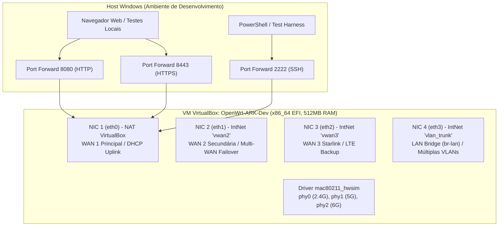

# ARK Router — Manual Oficial do Laboratório Virtual (VirtualBox)

## 1. Princípio Fundamental e Regras Obrigatórias

O ambiente principal de desenvolvimento, testes e validação contínua do **ARK Router** é uma infraestrutura isolada no VirtualBox (`OpenWrt-ARK-Dev`). Nenhuma alteração deve ser enviada para roteadores físicos sem validação completa prévia neste ambiente.

### Regras Mandatórias:
1. **Nunca instalar, publicar, atualizar ou executar alterações em roteadores físicos automaticamente.**
2. **Qualquer implantação em equipamento real depende de solicitação e confirmação manual e explícita do usuário por confirmação escrevendo SIM.**
3. **Simulação Extensiva no Ambiente Virtual**: O laboratório virtual deve reproduzir o maior número possível de cenários suportados:
   - uma, duas ou mais WANs;
   - balanceamento e failover;
   - perda e retorno de conectividade;
   - LAN, VLANs e bridges;
   - fw3/iptables e fw4/nftables;
   - opkg e apk;
   - SQM e CAKE;
   - Wi-Fi, mesh e roaming simulados via `mac80211_hwsim`;
   - perfis de hardware legado (128 MB RAM / 16 MB Flash) e moderno (512 MB+ RAM);
   - injeção de falhas de serviços e dependências.
4. **Distinção entre Simulado e Hardware Real**:
   - Wi-Fi 7 (EHT320 / MLO), rádio RF real, alcance de sinal, interferência, PPE, WED e acelerações físicas de silício são mantidos como **"simulados"** no ambiente virtual até que ocorra validação em bancada com hardware real.
5. **Credenciais Estritas por Variáveis de Ambiente**:
   - É terminantemente proibido versionar senhas ou tokens em arquivos. O laboratório utiliza a variável `$env:ARK_ROUTER_TEST_PASSWORD` no PowerShell ou `$ARK_ROUTER_TEST_PASSWORD` no shell ash/bash.

---

## 2. Topologia do Laboratório Virtual



### Especificações das Máquinas Virtuais de Teste:

| Parâmetro | Máquina Principal (Moderna) | Máquina Secundária (Legada) |
| :--- | :--- | :--- |
| **Nome da VM** | `OpenWrt-ARK-Dev` | `OpenWrt-ARK-Legacy` |
| **Versão OpenWrt** | 24.10.x / 25.x x86_64 (`ext4-combined-efi`) | 23.05.x / 21.02.x x86_64 (`ext4-combined-efi`) |
| **Firewall** | `fw4` / `nftables` | `fw3` / `iptables` |
| **Gerenciador de Pacotes** | `apk` (ou `opkg` híbrido) | `opkg` nativo |
| **Memória RAM** | 512 MB | 128 MB (simulação restrita de hardware SPI) |
| **vCPUs** | 2 vCPUs | 1 vCPU |
| **Firmware** | EFI habilitado | BIOS Legacy |

---

## 3. Scripts de Orquestração do Laboratório (`tests/lab/`)

| Script | Finalidade |
| :--- | :--- |
| `tests/lab/setup_lab_vm.ps1` | Criação e provisionamento dos 4 adaptadores de rede, redirecionamentos e snapshots no VirtualBox. |
| `tests/lab/validate_topology.sh` | Executado dentro da VM para auditar interfaces (`eth0` a `eth3`), bridge `br-lan`, tabela `inet fw4` e mwan3. |
| `tests/lab/test_persistence_reboot.sh` | Validador de persistência em duas etapas: captura estado pré-reboot e compara com pós-reboot. |
| `tests/lab/test_interference_matrix.py` | Bateria automatizada com 10 cenários de co-existência e não-interferência entre módulos. |
| `tests/setup_vm_mocks.sh` | Inicialização dos mocks emulados (Starlink Dish `192.168.100.1`, `mac80211_hwsim`, MTU 1508). |

---

## 4. Procedimentos de Snapshot, Teste e Rollback

### 4.1. Gestão de Snapshots no VirtualBox
Antes de iniciar qualquer ciclo de desenvolvimento ou teste de recurso:
```powershell
# 1. Criar snapshot base limpo
VBoxManage snapshot "OpenWrt-ARK-Dev" take "Base-Clean" --description "Sistema recém-instalado com topologia de 4 adaptadores"

# 2. Restaurar snapshot em caso de falha ou contaminação
VBoxManage controlvm "OpenWrt-ARK-Dev" poweroff
VBoxManage snapshot "OpenWrt-ARK-Dev" restore "Base-Clean"
VBoxManage startvm "OpenWrt-ARK-Dev" --type headless
```

### 4.2. Injeção de Falhas de Link e Failover
Para simular a arrancada do cabo da WAN 1 e validar o failover para a WAN 2:
```powershell
# Desconectar cabo virtual da WAN 1
VBoxManage controlvm "OpenWrt-ARK-Dev" setlinkstate1 off

# Reconectar cabo virtual da WAN 1
VBoxManage controlvm "OpenWrt-ARK-Dev" setlinkstate1 on
```

---

## 5. Matriz de Simulação vs Hardware Físico

| Funcionalidade | Validação no Laboratório Virtual | Validação em Hardware Real |
| :--- | :--- | :--- |
| **Dual-WAN / Failover / Balancing** | **Integral** via `eth0` + `eth1` e `setlinkstate` | Comportamento de latência e perda real com provedor |
| **Firewall fw3 / fw4** | **Integral** com inspeção de regras `nft` / `iptables` | Regras sob carga real de tráfego gigabit |
| **SQM / CAKE** | **Integral** com shaper em `tc` e verificação de qdisc | Medição empírica de bufferbloat com DSLReports / Waveform |
| **Wi-Fi 2.4 GHz / 5 GHz** | **Simulado** via driver `mac80211_hwsim` | Alcance RF, sensibilidade de antena e atenuação |
| **Wi-Fi 7 (MLO / 320 MHz)** | **Simulado** via flags de configuração UCI e mocks | Desempenho real do silício Filogic 880 / Atheros |
| **PPE / WED Offloading** | **Simulado** via flags de configuração de kernel | Bypass de aceleração no chip de rede físico |
| **Controle de LEDs** | **Simulado** via `/sys/class/leds` virtual | Brilho e cor real dos diodos luminosos na carcaça |
