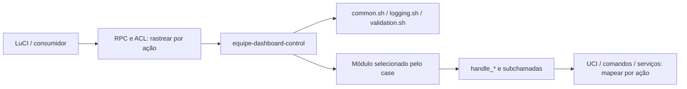

# Inventário e cadeia de execução

## Catálogo reutilizado

A fonte estruturada existente é [feature_contracts.yaml](../../tests/feature_contracts.yaml); a apresentação detalhada é [FEATURE_AUDIT_AND_REBOOT.md](../FEATURE_AUDIT_AND_REBOOT.md). Não duplique as 70 fichas neste índice.

Contagem estática em 2026-09-20, não cobertura funcional comprovada:

| Família do ID | Registros |
|---|---:|
| UI | 3 |
| WAN | 10 |
| LAN | 5 |
| IPV6 | 3 |
| FW | 6 |
| SQM | 4 |
| QOS | 1 |
| WIFI | 9 |
| HW | 5 |
| STAR | 4 |
| VPN | 7 |
| BLOCK | 2 |
| HIST | 1 |
| DIAG | 3 |
| SYS | 7 |

Estados declarados: 67 `funcional`, 1 `corrigido`, 2 `simulado`. Não são resultados de testes desta etapa. Renomear recurso preserva seu ID; novos IDs devem ser únicos; removidos mantêm histórico.

## Fluxo inicial observado

O carregamento das três bibliotecas e o dispatcher foram inspecionados. O caminho completo UI→RPC→ação permanece pendente por funcionalidade. Fonte: [equipe-dashboard-control](../../root/usr/sbin/equipe-dashboard-control).

## Ficha de execução para cada lote

| ID funcional | Entrada/símbolo | Chamadores | Subchamadas | Entradas/defaults | Saída/erro | Leituras | Escritas | Serviço/reload | Teste |
|---|---|---|---|---|---|---|---|---|---|
| Preencher por inspeção | Arquivo + função + revisão | Inclua callbacks e hooks | Inclua bibliotecas e comandos externos | Tipo/unidade | Código de retorno/JSON | Pacotes/arquivos | Seções/chaves/regras | Efeito compartilhado | Caminho + caso |

Abranger shell `.sh` e executáveis sem extensão, Python/JS/PowerShell, instalação/remoção/atualização, init.d/procd, cron, hotplug, uci-defaults, dispatchers, endpoints e funções internas. Procure chamadas dinâmicas; ausência em busca estática não autoriza remoção.

Inspecione quoting, validação, variáveis compartilhadas, diretório atual, comandos ausentes, locks, retries, timeout, processo em background, propagação de erro e sucesso anunciado antes da conclusão.

## Propriedade e interferência

| Recurso | Escritor(es) | Leitores | Limite da alteração | Coordenação compartilhada | Rollback | Testes cruzados |
|---|---|---|---|---|---|---|
| Preencher | Módulo e símbolo | Consumidores | Seção/chave/chain | Lock/ordem/transação | Preserva alterações posteriores | A→B, B→A, concorrência |

Pacote UCI compartilhado não implica propriedade exclusiva de um módulo. Um `uci commit` pode persistir mudanças de terceiros pendentes: rastreie o contexto real. Rollback de arquivo inteiro deve ser avaliado contra alterações posteriores.

## Lacunas a resolver

- Relacionar todos os pontos de entrada aos IDs; não restringir a busca à lista já documentada.
- Validar o conteúdo dos testes, não apenas a existência dos arquivos referenciados.
- Separar ciclo de vida, nível de validação e resultado executado em futura evolução compatível do contrato.
- Incluir recursos detectados fora das famílias atuais sem inventar funcionalidades pela lista de desejos.
